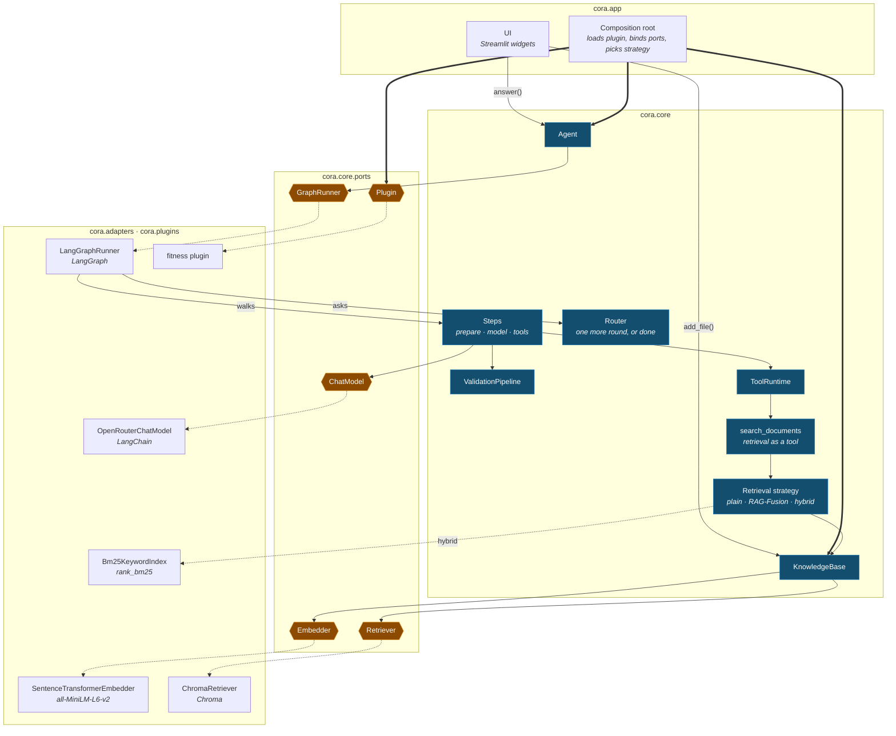

# Big picture

Read this page first. It shows the core of cora, its five ports, and the technology behind
each port. The design is called *hexagonal* (also known as *ports and adapters*).
The tests show how the code really works. The story files in `docs/sprints/` show how
the code was built, not how it works today.

## The map

Read the map from top to bottom. The shell (top) calls the core (middle). The core has five
ports. When the app starts, each port is connected to one adapter (bottom). The core does not
know which adapter it uses. The one arrow that points back up is `LangGraphRunner` driving the
core's steps: the adapter supplies the graph, the core supplies every step it walks.

| Mark | Means |
|---|---|
| blue box | A part of the core. It is plain Python, so a test can build it with fakes. |
| amber hexagon | A port — a slot in the core for one kind of technology. The five ports are the only way in and out of the core. |
| thin arrow | A call made while answering a request. |
| thick arrow | Built by the composition root when the app starts. |
| dotted arrow | The adapter behind a port. Change this one line to use a different technology. |

**Ingestion**, the **plugin registry** and the **citation numbering** are real parts of the code.
To keep the map simple, they are shown inside KnowledgeBase, the composition root, and the
search tool.

The **retrieval strategy** is the part that changes with the setting `CORA_RETRIEVAL`. There
are three options:

- `plain` — just use KnowledgeBase.
- `advanced` — use RAG-Fusion. A `QueryPlanner` writes the question in a few different ways, and RRF joins the results. (RRF, Reciprocal Rank Fusion, is a simple way to merge ranked lists.)
- `hybrid` — run two searches over the same files, one by meaning (dense) and one by keywords (BM25), and join them with the same RRF. This needs no planner and no extra model call.

A **port** is a fixed slot in the core for one kind of technology. The core has exactly five
slots: one for driving the agent, one for chat, one for embedding, one for retrieval, and one for
the plugin. You can put a different technology in a slot without changing the core.

BM25 has no slot like this. Only the `hybrid` search uses it, wired straight into that search.
So BM25 is a technology with no port. It is kept with the other adapters, and the core still has
just five ports.

## Two calls in

The shell uses the core through two main methods: `answer()` and `add_file()` (plus
`list_sources()` to show the file list in the sidebar).

**`agent.answer(question, history=()) -> ChatResult`** — `core/services/agent.py`

1. **Prepare** — check the question against the core rules (not empty, at most 4000 characters, no prompt-injection), then the plugin's rules. If a rule says no, raise `InputRejectedError`; the model never sees the question. Then lay out the messages: the plugin's system prompt together with cora's own rules (call `search_documents`, cite `[n]`), the last `CORA_HISTORY_TURNS` turns of chat (default 20; `0` means no memory), and last the question. Validation sees the question only, never the chat history.
2. **Model** — one round. The model is offered `search_documents` beside the plugin's tools. It either answers or asks for tools.
3. **Tools** — run what it asked for, in order. A result that can cite itself — a set of search hits — is numbered `[n]` continuing from the numbers this run already handed out, and comes back as a `tool` message marked *untrusted document data*. Any other result is fed back exactly as it renders.
4. **Round again, or stop** — the router reads the reply. An answer ends the run; anything else goes back to step 2, at most `CORA_MAX_TOOL_ROUNDS` times (default 8), after which `ToolLoopLimitError` apologises.
5. **Return** — the answer, the sources it really used (only the `[n]` numbers that appear in the reply, with duplicates removed), and every tool result.

**Retrieval is a decision, not a step.** A greeting is answered without touching the documents;
a question about them makes the model call `search_documents`, more than once if it needs to.
That is also why document text can never act as an instruction: it arrives in a `tool` message,
labelled as data, and cora's own rules stay in the system message.

**`kb.add_file(data, filename) -> int`** — `core/services/knowledge_base.py`

1. **Dedupe** — make a SHA-256 hash of the file. If the store already has this hash, stop and return `0`.
2. **Ingest** — the file must be `.txt`, `.md`, or `.pdf`, at most 10 MB, and not empty after cleaning. Each problem raises its own `IngestionError`.
3. **Chunk** — cut the text into pieces of 1000 characters that overlap by 150. Cut at the largest natural break that fits: paragraph, then line, then space, then single character.
4. **Embed and store** — turn each chunk into a vector (a list of numbers) and save it with its origin (source, index, offset, file hash). Return the number of chunks.

## The components

Eleven parts, each with one job. Eight are on the map; three are marked *folded* because the map
shows them inside another part.

| Component | Job | Where |
|---|---|---|
| **Agent** | The one main use case. It seeds a run from the question and the history, then turns the run's final state into a `ChatResult`. | `core/services/agent.py` |
| **Steps** | The three moves of a turn: *prepare* validates and lays out the messages, *model* takes one round with the chat model, *tools* runs what the model asked for. Each one returns only what it added to the run. | `core/services/steps.py` |
| **Router** | The one decision: an answer ends the run, no answer means run the tools, and a model still asking for tools at the round budget gets a friendly apology. | `core/services/steps.py` |
| **Citations** *(folded)* | Numbers a retrieval's passages `[n]`, continues that numbering when the same run retrieves again, and works out which sources an answer really cited. | `core/citations.py` |
| **search_documents** | Document search as a tool, so whether to use the documents is the model's decision. Its hits arrive able to number themselves. | `core/services/retrieval_tool.py` |
| **KnowledgeBase** | A simple front for ingest, embed, and store. It also does search, lists sources, and skips files already uploaded. | `core/services/knowledge_base.py` |
| **Ingestion** *(folded)* | Turns bytes into clean text, then into overlapping chunks with their origin. Rejects the wrong type, too large, or empty. | `core/services/ingestion.py`, `loaders`, `cleaning`, `chunker` |
| **Retrieval strategy** | How the search tool gets its chunks: `plain` (KnowledgeBase), `advanced`, or `hybrid`. Both wrappers merge results with RRF. | `fusion_context_source.py`, `hybrid_context_source.py`, `query_planner.py`, `rank_fusion.py` |
| **ValidationPipeline** | A list of rules run in order: core rules first, then the plugin's. To add a check, add a rule; you do not change the code. | `core/services/validation.py` |
| **ToolRuntime** | Finds the tool, checks the arguments against its JSON Schema, runs it, and turns a tool's own failure into a `ToolResult`. An infrastructure failure is not tool output, so it travels on unchanged. | `core/services/tool_runtime.py` |
| **Plugin registry** *(folded)* | Loads a plugin by its module path and checks it before the app starts: the prompt exists, tool names are unique, schemas are valid. | `core/services/plugin_registry.py` |
| **Composition root** | The only place that names a real adapter. It reads the settings, loads the plugin, picks the strategy, builds the graph, and returns an `App`. | `app/config.py`, `app/assembly.py`, `app/retrieval.py` |
| **UI shell** | Only widgets: the uploader, the chat, the sources and tool-result boxes, and error text shown exactly as the error gives it. | `app/ui/` |

## The ports

The five ports are the only outward surface of the core. Four of them are **Protocols** (the
technology). The fifth, **Plugin**, is a frozen **dataclass** (the domain — the topic the app
is about). So an adapter and a plugin work the same way: each one is chosen in one place.

| Port | Surface | Bound at startup to |
|---|---|---|
| **GraphRunner** | `run(state) -> AgentState` | `LangGraphRunner` — the only file that uses LangGraph. It wires the core's steps and router into a state graph and drives one run of it. |
| **ChatModel** | `complete(messages, tools) -> ModelReply` | `OpenRouterChatModel` — the only file that uses LangChain. It talks to OpenRouter, an OpenAI-style endpoint set by `CORA_MODEL`. |
| **Embedder** | `embed(texts) -> list[list[float]]` | `SentenceTransformerEmbedder` — the all-MiniLM-L6-v2 model. It runs on your machine and loads only when first used. |
| **Retriever** | `add(chunks, vectors, file_hash)`, `query(query_vector, k, metadata_filter=None)`, `sources()`, `contains(file_hash)` | `ChromaRetriever` — a saved, built-in database that uses cosine distance. The optional filter limits a search to matching metadata (self-query). |
| **Plugin** | data only: `system_prompt`, `tools`, `validation_rules`, `seed_docs` | `cora.plugins.fitness` — change it with `CORA_PLUGIN`. It is a frozen dataclass, not a class you subclass. |

Set `CORA_DEBUG=1` to wrap the three technology ports in a logger (`cora.adapters.port_logging`).
It prints one short line each time data crosses a port. The core, the plugins, and the UI do
not notice any change.

## Backed by tests

- **The core cannot use a framework.** A test reads every `cora.core` file. If one imports LangGraph, LangChain, Chroma, sentence-transformers, Streamlit, or any outer layer, the test fails. A fake bad import is added on purpose to prove the test catches it.
- **Streamlit is used in one folder only.** No file outside `cora/app/ui` may import it. This is why you can really replace the user interface.
- **The steps do not depend on any real helper.** They are plain callables over small Protocols (`ContextSource`, `InputValidator`, `ToolExecutor`), so a test walks a whole turn with fakes and no graph at all.
- **Document text can never act as an instruction.** A test drives a turn that retrieves and checks that the document's words appear only in a `tool` message — never in the system prompt, where cora's own rules live.
- **Retrieving is the model's decision.** A live-model test asks a document question and a greeting through the same agent: only the first comes back with sources, and only the first calls a tool.
- **A runaway agent still ends politely.** The core's round budget is set to trip before the graph's own recursion limit, and a graph that overruns anyway is turned into the same friendly apology — never a framework error.
- **A new topic needs no change to the core.** A plugin is a frozen dataclass. Point `CORA_PLUGIN` at another plugin and the topic changes. The word *fitness* never appears in the core.
- **A broken tool cannot break the chat, and users never see a stack trace.** ToolRuntime turns a tool's own failure into a `ToolResult` with an error message. Every `CoreError` has a message written for a person.
