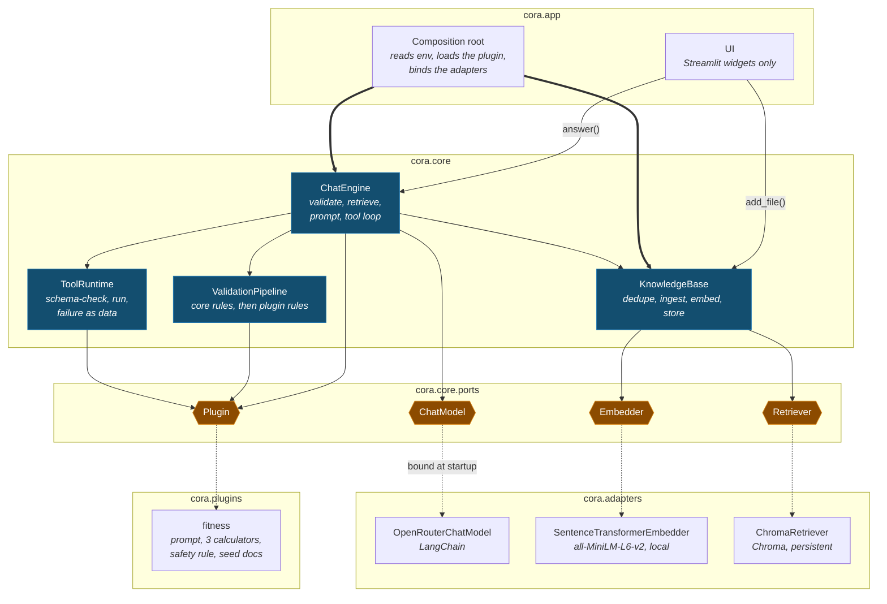

# Big picture

One map instead of five. It shows the four layers, the components that do the work, and
the four ports where the system comes apart — at the altitude you need to *explain* cora,
not to re-derive it. For the reasoning behind the design (patterns, trade-offs, risks,
roadmap) read `docs/plans/webapp-overview.md`; this page replaces its diagrams for
everyday use.

## The map

Read it top to bottom: the shell drives the core, the core owns the ports, technology
hangs off the bottom. Nothing below the amber band is named anywhere above it.

| Mark | Means |
|---|---|
| blue box | A core component — pure Python, so a unit test builds it with fakes. |
| amber hexagon | A port: a narrow interface the core owns. Four in total, and that is the whole outward surface. |
| thin arrow | Calls, at request time. |
| thick arrow | Constructed by the composition root at startup. |
| dotted arrow | The implementation this port is bound to — the one line you change to swap technology. |

Two things the map deliberately compresses. **Ingestion** and the **plugin registry** are
real components (see the table below) folded into KnowledgeBase and the composition root
to keep the picture at this altitude. And the dotted arrows point *port → adapter*, which
is the startup binding, not the import direction — adapters import the port module, but
drawing that inward arrow puts them above the seam and destroys the layering.

The symmetry at the seam is the design worth pointing at: three ports are technology and
the fourth is the domain, so an adapter and a plugin are the same kind of thing —
something that plugs in, chosen in one place.

## Two calls in

The shell knows exactly two methods. Everything the product does goes through one of
them, which is why a different frontend is a rewrite of the shell and nothing else.

**`engine.answer(question, history=()) -> ChatResult`** — `cora/core/services/chat_engine.py`

1. Validate — core rules first (empty, 4000-character cap), then the plugin's. A
   rejection raises `InputRejectedError` and never reaches the model.
2. Retrieve — embed the question, pull the top `k` chunks (`CORA_TOP_K`, default 5).
3. Prompt — the plugin's system prompt, then the chunks numbered `[1]`…`[n]` with the
   citation rule appended, then the last `CORA_HISTORY_TURNS` turns the shell passed in
   (default 20; `0` switches memory off), then the question. Validation and retrieval
   above see the question alone, never the history.
4. Tool loop, at most `CORA_MAX_TOOL_ROUNDS` (default 8) rounds — the model asks for
   tools, ToolRuntime runs each, results go back as `tool` messages, repeat until a reply
   carries no tool calls.
5. Return the answer, the deduplicated source list, and every tool result. Running the
   loop dry raises `ToolLoopLimitError`.

**`kb.add_file(data, filename) -> int`** — `cora/core/services/knowledge_base.py`

1. Hash the bytes with SHA-256. If the store already holds that hash, return `0` —
   re-uploading the same file is a no-op, not a duplicate.
2. Ingest — extension must be `.txt`, `.md` or `.pdf`; at most 10 MB; text must survive
   cleaning non-empty. Each failure raises its own `IngestionError`.
3. Chunk — 1000 characters with 150 overlap, split at the coarsest boundary that fits:
   paragraph, line, space, then bare characters.
4. Embed the chunks and store them with their provenance (source, index, offset, file
   hash). The return value is the chunk count the UI reports.

## The components

Eight, each with one job. The map draws six; the two marked *folded* live in the caller's
box.

| Component | Job | Where |
|---|---|---|
| **ChatEngine** | The single use case, and the only component that sees all four ports. | `core/services/chat_engine.py` |
| **KnowledgeBase** | Facade over ingest → embed → store, plus search and the source list. Owns the re-upload dedupe. | `core/services/knowledge_base.py` |
| **Ingestion** *(folded into KnowledgeBase)* | Bytes to clean text to overlapping chunks with provenance. Rejects the wrong type, the oversized, the empty. | `core/services/ingestion.py`, `loaders`, `cleaning`, `chunker` |
| **ValidationPipeline** | An ordered chain: core rules, then the plugin's. Adding a guard means adding a rule, not editing a component. | `core/services/validation.py` |
| **ToolRuntime** | Find the tool, JSON-Schema-check the arguments, run it, turn every outcome — including a crash — into a `ToolResult`. | `core/services/tool_runtime.py` |
| **Plugin registry** *(folded into the composition root)* | Import a plugin by module path and check the bundle before the app starts: prompt present, tool names unique, every schema valid. | `core/services/plugin_registry.py` |
| **Composition root** | The only place that names a real adapter. Reads the environment, loads the plugin, seeds its documents, hands back an `App`. | `app/config.py`, `app/assembly.py` |
| **UI shell** | Widgets only: uploader, chat thread, sources and tool-result expanders, spinners, and error text taken verbatim from the error. | `app/ui/` |

## The ports

All four are Protocols in `cora.core.ports`. Three are technology; the fourth is the
domain.

| Port | Surface | Bound at startup to |
|---|---|---|
| **ChatModel** | `complete(messages, tools) -> ModelReply` | `OpenRouterChatModel` — the one file that imports LangChain, against OpenRouter's OpenAI-compatible endpoint (`CORA_MODEL`). |
| **Embedder** | `embed(texts) -> list[list[float]]` | `SentenceTransformerEmbedder` — all-MiniLM-L6-v2, local and free, loaded lazily so the test loop stays fast. |
| **Retriever** | `add(chunks, vectors, file_hash)`, `query(vector, k)`, `sources()`, `contains(file_hash)` | `ChromaRetriever` — a persistent embedded collection with cosine distance. No server to run. |
| **Plugin** | data only: `system_prompt`, `tools`, `validation_rules`, `seed_docs` | `cora.plugins.fitness` — swap it with `CORA_PLUGIN`. A frozen dataclass, not a base class to subclass. |

With `CORA_DEBUG=1` the three technology ports are each bound to a thin logging
decorator (`cora.adapters.port_logging`) wrapping the real adapter, so one
truncated line per call shows what crossed the boundary. Nothing else changes:
the core, the plugins and the UI never learn the difference.

## Claims, and what backs them

Each of these is checked by something, not just asserted in a document.

- **The core cannot reach a framework.** `tests/cora/test_architecture.py` parses every
  module under `cora.core` and fails on an import of LangChain, Chroma,
  sentence-transformers, Streamlit, or any outer layer. A companion test plants a
  violation to prove the detector itself catches it.
- **Streamlit exists in one directory.** The same test walks the whole distribution and
  asserts nothing outside `cora/app/ui` imports it — which is what makes "replaceable
  frontend" a fact rather than an intention.
- **The engine does not depend on its own collaborators.** `chat_engine.py` declares
  three one-method Protocols of its own — `ContextSource`, `InputValidator`,
  `ToolExecutor` — and the composition root satisfies them with KnowledgeBase,
  ValidationPipeline and ToolRuntime. Every collaborator is a constructor argument.
- **A new domain needs zero core changes.** A plugin is a frozen `Plugin` dataclass: a
  prompt, some tools, some rules, optional seed documents. Point `CORA_PLUGIN` at another
  module and the app changes domain. The core never contains the word *fitness*.
- **A broken tool cannot break the chat.** ToolRuntime catches unknown names, schema
  violations, exceptions and empty returns, handing each back as a `ToolResult` carrying
  an error string. The engine passes that to the model, which gets to recover.
- **No stack trace reaches a user.** One hierarchy under `CoreError`, every instance
  carrying a `user_message` written for a person; the shell renders that string and
  nothing else. Runaway tool loops are capped and come back as a friendly apology.
