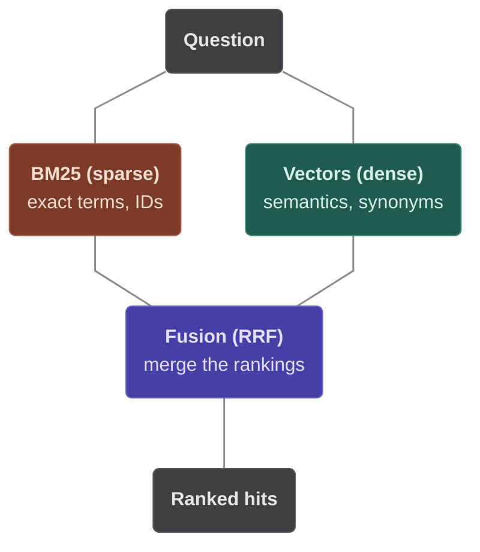

# Big picture

The one page to read first. It shows the core, the four ports where it comes apart, and the
technology bound to each — a hexagonal (ports-and-adapters) design at the altitude you need
to *explain* cora, not to re-derive it.

Past this page, **the tests are the documentation**: once a feature lands, `tests/` is its
living, executable spec — read them, not prose that drifts. The plans under `docs/plans/`
are build-time history, not maintained docs; the one kept for reference is
`docs/plans/webapp-overview.md`, the original design rationale (patterns, trade-offs,
risks, roadmap).

## The map

Read it top to bottom: the shell drives the core, the core owns its four ports at the seam,
and each port is bound at startup to one adapter below it. The core names nothing beneath the
seam — a **port** is a narrow interface the core owns, and its four are the whole outward
surface of the *core*.

| Mark | Means |
|---|---|
| blue box | A core component — pure Python, so a unit test builds it with fakes. |
| amber hexagon | A port: a narrow interface the core owns. Four in total — the whole outward surface of the *core*. |
| thin arrow | A call, at request time. |
| thick arrow | Constructed by the composition root at startup. |
| dotted arrow | The adapter this port is bound to — the one line you change to swap technology. |

The map deliberately compresses two components. **Ingestion** and the **plugin registry**
are real (see the table below), folded into KnowledgeBase and the composition root to keep
it at this altitude.

The **retrieval strategy** is the one node that shifts with configuration — it is the
engine's own `ContextSource`, and `CORA_RETRIEVAL` picks which one the composition root
binds. `plain` is KnowledgeBase itself; `advanced` wraps it in RAG-Fusion (a `QueryPlanner`
rewrites the question, RRF merges the rankings); `hybrid` fuses its dense ranking with a
BM25 keyword one. That keyword ranking is the one bit of technology bound *below* the
strategy rather than to a core port — which is why `Bm25KeywordIndex` sits outside with the
other adapters yet the four-port count still holds.

`hybrid` in one picture — the question is scored two ways over the same corpus, then the two
rankings are fused by Reciprocal Rank Fusion:

The symmetry at the seam is the design worth pointing at: three ports are technology and
the fourth is the domain, so an adapter and a plugin are the same kind of thing —
something that plugs in, chosen in one place.

## Two calls in

The shell knows exactly two methods. Everything the product does goes through one of
them, which is why a different frontend is a rewrite of the shell and nothing else.

**`engine.answer(question, history=()) -> ChatResult`** — `cora/core/services/chat_engine.py`

1. Validate — core rules first (empty, 4000-character cap, prompt-injection guard),
   then the plugin's. A rejection raises `InputRejectedError` and never reaches the
   model.
2. Retrieve — embed the question, pull the top `k` chunks (`CORA_TOP_K`, default 5).
   `CORA_RETRIEVAL=advanced` swaps this single lookup for RAG-Fusion: a
   `QueryPlanner` rewrites the question into sub-queries plus an optional source
   filter, each is retrieved, and the rankings are fused (Reciprocal Rank Fusion).
   `CORA_RETRIEVAL=hybrid` instead fuses one dense ranking with one sparse (BM25)
   ranking over the same corpus by the same Reciprocal Rank Fusion — no planner, no
   extra model call. The keyword index lives only in `cora.adapters`, rehydrated
   from Chroma at startup and kept fresh by a fan-out on upload.
3. Prompt — the plugin's system prompt, then the chunks numbered `[1]`…`[n]` with the
   citation rule appended, then the last `CORA_HISTORY_TURNS` turns the shell passed in
   (default 20; `0` switches memory off), then the question. Validation and retrieval
   above see the question alone, never the history.
4. Tool loop, at most `CORA_MAX_TOOL_ROUNDS` (default 8) rounds — the model asks for
   tools, ToolRuntime runs each, results go back as `tool` messages, repeat until a reply
   carries no tool calls.
5. Return the answer, the sources the answer actually cites — the deduplicated list,
   narrowed to the bracketed numbers that appear in the reply — and every tool result.
   Running the loop dry raises `ToolLoopLimitError`.

**`kb.add_file(data, filename) -> int`** — `cora/core/services/knowledge_base.py`

1. Hash the bytes with SHA-256. If the store already holds that hash, return `0` —
   re-uploading the same file is a no-op, not a duplicate.
2. Ingest — extension must be `.txt`, `.md` or `.pdf`; at most 10 MB; text must survive
   cleaning non-empty. Each failure raises its own `IngestionError`.
3. Chunk — 1000 characters with 150 overlap, split at the coarsest boundary that fits:
   paragraph, line, space, then bare characters.
4. Embed the chunks and store them with their provenance (source, index, offset, file
   hash). The return value is the chunk count the UI reports.

## The components

Nine, each with one job. The map draws seven; the two marked *folded* live in the caller's
box.

| Component | Job | Where |
|---|---|---|
| **ChatEngine** | The single use case, and the only component that sees all four ports. | `core/services/chat_engine.py` |
| **KnowledgeBase** | Facade over ingest → embed → store, plus search and the source list. Owns the re-upload dedupe. | `core/services/knowledge_base.py` |
| **Ingestion** *(folded into KnowledgeBase)* | Bytes to clean text to overlapping chunks with provenance. Rejects the wrong type, the oversized, the empty. | `core/services/ingestion.py`, `loaders`, `cleaning`, `chunker` |
| **Retrieval strategy** | What the engine retrieves through. `plain` is KnowledgeBase itself; `advanced` (`FusionContextSource` + `QueryPlanner`) and `hybrid` (`HybridContextSource`) wrap it, both fusing rankings by Reciprocal Rank Fusion. | `core/services/fusion_context_source.py`, `hybrid_context_source.py`, `query_planner.py`, `rank_fusion.py` |
| **ValidationPipeline** | An ordered chain: core rules, then the plugin's. Adding a guard means adding a rule, not editing a component. | `core/services/validation.py` |
| **ToolRuntime** | Find the tool, JSON-Schema-check the arguments, run it, turn every outcome — including a crash — into a `ToolResult`. | `core/services/tool_runtime.py` |
| **Plugin registry** *(folded into the composition root)* | Import a plugin by module path and check the bundle before the app starts: prompt present, tool names unique, every schema valid. | `core/services/plugin_registry.py` |
| **Composition root** | The only place that names a real adapter. Reads the environment, loads the plugin, picks the retrieval strategy, hands back an `App`. | `app/config.py`, `app/assembly.py`, `app/retrieval.py` |
| **UI shell** | Widgets only: uploader, chat thread, sources and tool-result expanders, spinners, and error text taken verbatim from the error. | `app/ui/` |

## The ports

All four are Protocols in `cora.core.ports`. Three are technology; the fourth is the
domain.

| Port | Surface | Bound at startup to |
|---|---|---|
| **ChatModel** | `complete(messages, tools) -> ModelReply` | `OpenRouterChatModel` — the one file that imports LangChain, against OpenRouter's OpenAI-compatible endpoint (`CORA_MODEL`). |
| **Embedder** | `embed(texts) -> list[list[float]]` | `SentenceTransformerEmbedder` — all-MiniLM-L6-v2, local and free, loaded lazily so the test loop stays fast. |
| **Retriever** | `add(chunks, vectors, file_hash)`, `query(vector, k, filter)`, `sources()`, `contains(file_hash)` | `ChromaRetriever` — a persistent embedded collection with cosine distance. No server to run. The optional `filter` narrows a query to matching metadata (self-query). |
| **Plugin** | data only: `system_prompt`, `tools`, `validation_rules`, `seed_docs` | `cora.plugins.fitness` — swap it with `CORA_PLUGIN`. A frozen dataclass, not a base class to subclass. |

With `CORA_DEBUG=1` the three technology ports are each bound to a thin logging
decorator (`cora.adapters.port_logging`) wrapping the real adapter, so one
truncated line per call shows what crossed the boundary. Nothing else changes:
the core, the plugins and the UI never learn the difference.

## Claims, and what backs them

Each of these is checked by something, not just asserted in a document.

- **The core cannot reach a framework.** `tests/cora/test_architecture.py` parses every
  module under `cora.core` and fails on an import of LangChain, Chroma,
  sentence-transformers, Streamlit, or any outer layer. A companion test plants a
  violation to prove the detector itself catches it.
- **Streamlit exists in one directory.** The same test walks the whole distribution and
  asserts nothing outside `cora/app/ui` imports it — which is what makes "replaceable
  frontend" a fact rather than an intention.
- **The engine does not depend on its own collaborators.** `chat_engine.py` declares
  three one-method Protocols of its own — `ContextSource`, `InputValidator`,
  `ToolExecutor` — and the composition root satisfies them with KnowledgeBase,
  ValidationPipeline and ToolRuntime. Every collaborator is a constructor argument.
- **A new domain needs zero core changes.** A plugin is a frozen `Plugin` dataclass: a
  prompt, some tools, some rules, optional seed documents. Point `CORA_PLUGIN` at another
  module and the app changes domain. The core never contains the word *fitness*.
- **A broken tool cannot break the chat.** ToolRuntime catches unknown names, schema
  violations, exceptions and empty returns, handing each back as a `ToolResult` carrying
  an error string. The engine passes that to the model, which gets to recover.
- **No stack trace reaches a user.** One hierarchy under `CoreError`, every instance
  carrying a `user_message` written for a person; the shell renders that string and
  nothing else. Runaway tool loops are capped and come back as a friendly apology.
