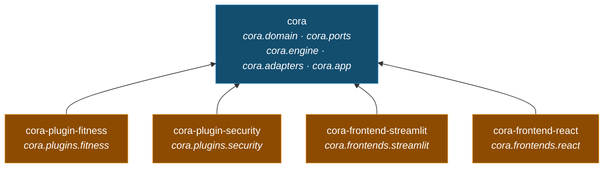

# Big picture

Read this page first. It shows cora's engine, its nine ports, and the technology behind
each port. The design is called *hexagonal* (also known as *ports and adapters*).
The tests show how the code really works. The story files in `docs/sprints/` show how
the code was built, not how it works today.

## The map

Drawn from the source by `scripts/gen_component_map.py`. `PluginSet` and the tools the model
may call are parts of the engine the map leaves out to stay readable.

**Ingestion**, the **plugin registry** and the **citation numbering** are real parts of the code.
To keep the map simple, they are shown inside KnowledgeBase, the composition root, and the
search tool.

**Searching** has one path: the tool asks KnowledgeBase, which embeds the question and reads
the same index the uploads were written to. Asking it several ways is the agent's job, and
the agent does it in the open — one search, one trace step.

A **port** is a fixed slot in the engine for one kind of technology. There are exactly nine:
one for driving the agent, one for chat, one for embedding, one for retrieval, one for reading
a file format, one for what the agent keeps about the user, one for the text of a document, one
for the turns of a conversation, and one for the plugin. Seven of the nine are arguments to
`assemble`, so a different technology goes in a slot without the engine or the composition root
changing. The other two are not: the loader registry is fixed at the composition root, and a
plugin arrives in the plugin set. `tests/guards/test_component_map.py` reads the nine off
`assemble` and fails if the drawing shows another set — or if the committed file is not what
the generator writes today.

Memory is the one optional slot. Leave it out and the agent is offered no `remember` tool and
told no rule about remembering — an app with no memory cannot quietly forget.

Two more files sit in `ports/` without being slots. `ContextSource` is the engine's own seam
between a search and the step that uses it, implemented inside the engine — a Protocol, but
not a slot a technology fills. `Pause` is a capability that travels the other way, *in*, the
way `TextSink` does: only whatever drives the graph can park a run and pick it up again, so
the engine states the decision and is handed back the label chosen. Its default declines the
moment it is raised, which is what keeps a shell with no card to draw from hanging on one.

Sixteen parts, each with one job. Eleven are on the map; five are marked *folded*
because the map shows them inside another part. What each one does, and where it lives, is in
[the components reference](reference/components.md).

## The distributions

Three kinds of package: the app, a plugin, a frontend. The layers above are modules inside
`cora` — the split that once made each of them a distribution of its own is gone, because
this is an agent, not a demonstration of packaging. What stayed separate is what a
deployment *chooses*: cora installs no plugin and loads none.

An arrow means *depends on*. `cora` itself depends on nothing of cora's — no plugin and
no way of talking to a user — which is what leaves room for a second frontend — there
are two — and for a deployment that wants no persona and no guard.

Which distribution to install for what you are writing is in
[the packages reference](reference/packages.md).

The layer boundary is no longer a fact of the install: with one distribution, nothing stops
`cora.engine` importing Chroma except `tests/guards/test_architecture.py`, which walks every
shipped file's imports and fails the build. The rule is the same, the enforcement moved
from the resolver to a test.

`cora` is a namespace, not a package: no distribution owns the name, and each contributes
a portion of it. `cora.plugins.*` and `cora.frontends.*` are the two extension points, and
a new one of either is a package to install rather than a file to edit.

## Two calls in

A frontend uses the engine through two main methods: `answer()` and `add_file()` (plus
`list_sources()` to show the file list in the sidebar, and `recall()` / `forget()` to show
and clear what is remembered). `docs/happy-path.md` draws both of them as sequence
diagrams, taken from the live test that walks one whole session.

The steps each call takes, in order, are in
[a turn, step by step](reference/a-turn.md).

**The run reports itself as it goes.** Each step records what it did — the model's decision and
the tools it asked for, then every call with its arguments and what came back. `answer()` takes
an optional `on_step`, called the moment a step lands, so the UI can show the work while it is
still happening; the finished trace comes back on the `ChatResult` and stays with the answer.

**Retrieval is a decision, not a step — but a plugin can insist on it.** A greeting is answered
without touching the documents; a question about them makes the model call `search_documents`,
more than once if it needs to. When the subject is the plugin's own, an answer the run did no work
for does not stand: it goes back once with the reminder above.
That is also why document text can never act as an instruction: it arrives in a `tool` message,
labelled as data, and cora's own rules stay in the system message.

## The ports

The nine ports are the only outward surface of the engine. Eight of them describe technology —
seven Protocols and one registry of them. The ninth, **Plugin**, is a frozen **dataclass** (the
domain — the topic the app is about). So an adapter and a plugin work the same way: each one
is chosen in one place. What each port's surface is, and what it is bound to at
startup, is in [the ports reference](reference/ports.md); every setting a deployment can
make is in [the configuration reference](reference/configuration.md).

## Backed by tests

- **The engine cannot use a framework.** A test reads every `cora.domain`, `cora.ports` and `cora.engine` file. If one imports LangGraph, LangChain, Chroma, sentence-transformers, Streamlit, or any outer layer, the test fails. A fake bad import is added on purpose to prove the test catches it.
- **A plugin needs the contract alone, proved by installing it.** `cora-plugin-fitness` is built
  into a wheel, installed into an empty environment, and imported there: the environment
  holds exactly two packages, and the engine is not one of them. Every manifest read and
  every import walked runs where all seven packages are present, so this is the only check
  that can tell a declaration from a fact.
- **A toolkit is used in one folder only.** No file outside `frontends/streamlit/` may import Streamlit, and none outside `frontends/react/` may import Starlette. This is why you can really replace the user interface — and why there are two.
- **The steps do not depend on any real helper.** They are plain callables over small Protocols (`ContextSource`, `ValidationRule`, `ToolExecutor`), so a test walks a whole turn with fakes and no graph at all.
- **One thing the engine shares with the graph on purpose.** `domain/agent_state.py` marks the keys that accumulate across a conversation (`Annotated[list[Message], operator.add]`). No engine code reads those marks — they are the convention LangGraph uses to merge each step's partial state, so this one file is written to be understood by a graph engine, without importing one. The steps and the router stay framework-free; the state's *shape* is the shared word.
- **Document text can never act as an instruction.** A test drives a turn that retrieves and checks that the document's words appear only in a `tool` message — never in the system prompt, where cora's own rules live.
- **Retrieving is the model's decision, and the brief is what asks for it.** A live-model test asks a plain training question — never saying "my documents" — and a greeting, through the same agent: only the first comes back with sources. Nothing enforces it behind the instruction, so that live test is the cover: cora tells the model to search and cite, and a model that ignores it answers ungrounded.
- **A question to the reader interrupts nothing that has already run.** A resumed step is replayed from its first line, so the step that stops to ask is walked *before* the round's tools. A test drives a round that asks and writes to memory, and the write happens once — after the answer.
- **A runaway agent still ends politely.** The engine's round budget is set to trip before the graph's own recursion limit, and a graph that overruns anyway is turned into the same friendly apology — never a framework error.
- **A new topic needs no change to the engine.** A plugin is a frozen dataclass, and cora on its own carries no domain at all: every persona, restriction and specialisation arrives as one. List them in `CORA_PLUGINS` and they compose — preamble then sections, cora's tools then theirs, every rule in order — while a deployment that names none is left a plain assistant that screens nothing. A test reads every contract and engine file to check the word *fitness* appears in none of them.
- **Nothing the agent does is hidden.** Every turn carries a trace: what the model decided, which tool ran with which arguments, and what it returned — including a call that failed. A test drives a turn that searches and calculates and reads all of it back out of the page.
- **A broken tool cannot break the chat, and users never see a stack trace.** ToolRuntime turns a tool's own failure into a `ToolResult` with an error message. Every `CoreError` has a message written for a person.
