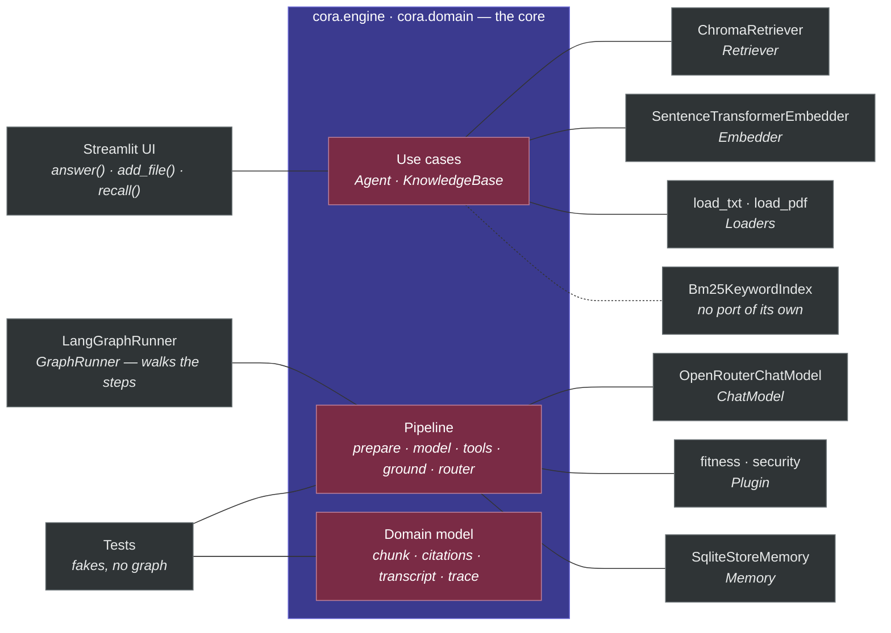
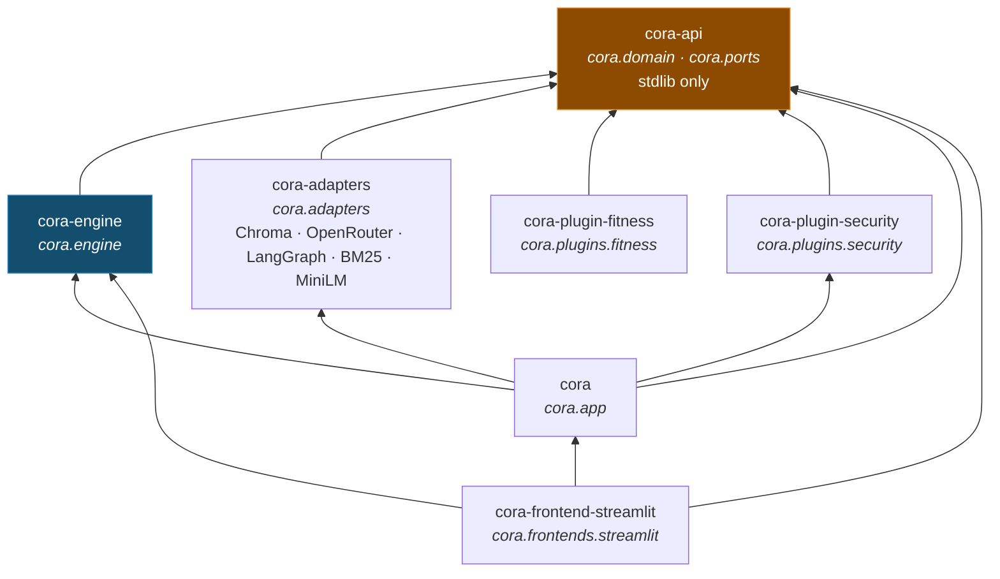

# Big picture

Read this page first. It shows cora's engine, its seven ports, and the technology behind
each port. The design is called *hexagonal* (also known as *ports and adapters*).
The tests show how the code really works. The story files in `docs/sprints/` show how
the code was built, not how it works today.

## The map

Read the map from the outside in. The core is plain Python and names no technology: use cases
on top of a pipeline on top of a domain model that touches nothing. Every grey box is outside
it, and every line is a **port** — a slot named in the box under its technology. What fills each
slot is decided once, in `cora.app`, and the core never learns which.

The left column is what **drives** cora, the right column is what cora **drives**. `GraphRunner`
is on the left because it is the one adapter that calls in: the app hands it the graph, and the
graph walks the engine's own steps. The **Tests** box is not decoration — the pipeline is
callables over small Protocols, so a whole turn runs with fakes and no graph at all, and that is
why the core can be tested without Chroma, an embedder or a model.

| Mark | Means |
|---|---|
| purple box | The core. Plain Python — no framework may be imported here, and a test proves it. |
| maroon box | A layer of the core: what it does, how a turn moves, what a turn is made of. |
| grey box | A technology, with the port it fills underneath. Swapping it is an argument to `assemble`, not an edit. |
| plain line | A port: the only way in or out of the core. |
| dotted line | A technology with no port. Only the `hybrid` setting builds BM25, and it is handed straight to the two places that use it. |

**Ingestion**, the **plugin registry**, the **retrieval strategy**, **ToolRuntime** and the two
tools the model is offered (`search_documents`, `remember`) are real parts of the code, folded
into the three core boxes to keep the map readable. The **composition root** is not on the map
at all: it is the thing that draws it, once, at startup.

The **retrieval strategy** is the part that changes with the setting `CORA_RETRIEVAL`. There
are three options:

- `plain` — just use KnowledgeBase.
- `advanced` — use RAG-Fusion. A `QueryPlanner` writes the question in a few different ways, and RRF joins the results. (RRF, Reciprocal Rank Fusion, is a simple way to merge ranked lists.)
- `hybrid` — run two searches over the same files, one by meaning (dense) and one by keywords (BM25), and join them with the same RRF. This needs no planner and no extra model call.

A **port** is a fixed slot in the engine for one kind of technology. There are exactly seven:
one for driving the agent, one for chat, one for embedding, one for retrieval, one for reading
a file format, one for what the agent keeps about the user, and one for the plugin. Six of them
are arguments to `assemble`, so a different technology goes in a slot without the engine or the
composition root changing. The seventh, Loaders, is the exception: `assemble` names
`cora.adapters.loaders.LOADERS` itself, so a deployment changes which file formats it accepts
by editing that registry rather than by passing another one in.

Memory is the one optional slot. Leave it out and the agent is offered no `remember` tool and
told no rule about remembering — an app with no memory cannot quietly forget.

BM25 has no slot like this. Only the `hybrid` setting builds one, and it is handed to the two
places that use it: to KnowledgeBase, which adds each new file's chunks to it while ingesting,
and to the hybrid search, which reads it. At startup it is rebuilt from the chunks the vector
store already holds, so an index that lives in memory still covers everything uploaded before
this run. So BM25 is a technology with no port. It is kept with the other adapters, and there
are still just seven ports.

One more file sits in `ports/` without being a slot: `ContextSource` is the engine's own seam
between a search and the step that uses it, implemented inside the engine — a Protocol, but
not a slot a technology fills.

## The distributions

Seven packages, one per audience. Which one you install is decided by what you are writing,
not by which layer you happen to be reading — and what a package may depend on is written
in its own manifest, so the boundary is a fact of the install rather than a rule a test
polices.

An arrow means *depends on*, so the contract sits at the top: everything is written against
it and it is written against nothing. Two of the arrows are worth reading twice. `cora`
depends on `cora-plugin-security` because its default set names that plugin, and a wheel
naming a plugin it does not bring is an app that cannot start — so the box ships a guard
without shipping a domain. And the shell names the layers whose types cross its screen
(`ChatResult`, the trace, the errors) rather than leaning on what the app happens to pull
in for it.

These arrows are what each package **declares**. What its modules actually **import** is
[`docs/diagrams.md`](diagrams.md#the-packages-read-off-the-imports), written by `make diagram`.
Reading the two together is how the guard above shows up: the declared arrow from `cora` to `cora-plugin-security` has no
import behind it, and must not.

A diagram about one package alone lives with that package rather than here: the domain's
classes are drawn in [`packages/api/diagrams.md`](../packages/api/diagrams.md), by the same
command.

| If you are writing | You install | You do not get |
|---|---|---|
| a plugin, domain or guard | `cora-api` | the engine, the adapters, any framework — the fitness bundle uses four names from it |
| a second frontend | `cora` | Streamlit, or any other way of talking to a user |
| an adapter for a port | `cora-api` | the engine, so the binding outlives any version of the use cases |
| the app you can run today | `cora-frontend-streamlit` | nothing — it is the whole stack |

`cora` is a namespace, not a package: no distribution owns the name, and each contributes
a portion of it. `cora.plugins.*` and `cora.frontends.*` are the two extension
points, and a new one of either is a package to install rather than a file to edit.

## Two calls in

A frontend uses the engine through two main methods: `answer()` and `add_file()` (plus
`list_sources()` to show the file list in the sidebar, and `recall()` / `forget()` /
`clear()` to show what is remembered and drop one fact or all of them).

One answered turn, drawn from the trace it produced, is
[`docs/diagrams.md`](diagrams.md#one-turn).

**`agent.answer(question, thread_id) -> ChatResult`** — `engine/agent.py`

The conversation belongs to the thread, not to the caller: a turn is seeded with the
question alone, and the graph's checkpointer supplies everything said before it. The
frontend keeps one thread id per browser session.

1. **Prepare** — check the question against one ordered tuple of rules: cora's own first (not empty, at most 4000 characters), then every loaded plugin's, in the order they were named. If a rule says no, raise `InputRejectedError`; the model never sees the question. Screening for prompt injection is one of those plugin rules — `cora-plugin-security`, in the default set — and not the engine's, so an app asked for no plugins screens nothing. Then add the question to the thread's transcript and write this turn's **brief**: cora's preamble, cora's own rules (call `search_documents`, cite `[n]`, call `remember` when the user asks to be remembered), one section per plugin under its `name`, and whatever is already remembered about the user — labelled as notes rather than rules, and stated last, because a fact is kept user input. The brief is rewritten each turn, so a ten-turn thread carries one, and a fact learned mid-conversation is in hand the next turn. A memory that cannot be read costs the brief its facts and nothing else — the question is still answered, and the trace says the notes were missing. Rules see the question only.
2. **Model** — one round. The model is offered `search_documents` and `remember` beside the plugin's tools. It is sent the brief, then the previous turns' words — the last `CORA_HISTORY_TURNS` messages of them (default 20; `0` means no history) — then this turn verbatim. Old tool calls and their results stay in the thread but out of the prompt. It either answers or asks for tools.
3. **Tools** — run what it asked for, in order. A result that can cite itself — a set of search hits — is numbered `[n]` continuing from the numbers the *conversation* has already handed out, so `[1]` means one document for as long as the thread lives, and comes back as a `tool` message marked *untrusted document data*. Any other result is fed back exactly as it renders.
4. **Round again, or stop** — the router reads the model's last reply. A reply asking for tools goes back to step 2, at most `CORA_MAX_TOOL_ROUNDS` times (default 8), after which `ToolLoopLimitError` apologises. A reply that answers ends the run. Rounds are counted from where this turn began in the transcript, so the budget is the turn's and a long conversation cannot exhaust it.
5. **Grounding** — a plugin that names a `scope` will not take an answer the run did no work for. If the model answers without having called a single tool, the gate searches the question *itself* and hands the passages back with cora's reminder — worded once, naming every loaded plugin's scope — and the model gets one more go at step 2 — weighing evidence in front of it rather than being told to go and fetch some, which a model is free to ignore and, asked "Hi there!", once did by searching for `"Hi there!"`. An answer a tool already worked for stands: a calculation grounds it as well as a document does. Only passages near enough to the question are offered: top-k always returns something, so without a floor a greeting is handed whatever sits closest and invited to cite it. Small talk therefore still costs one vector lookup, but nothing is offered for it to cite. The gate fires at most once per run, and only when the budget has room for the **one** model call that reads the evidence. If the look comes back with nothing — the model unreachable — the answer it was second-guessing is returned rather than lost, and the trace says so; a store that is down is the gate's own failure now, absorbed so it costs the answer nothing, and marked failed in the trace.

The cost is a second model call on every turn that answers without using a tool, greetings included. That is the price of the guarantee, and it is why the gate is a plugin's choice rather than the core's.
6. **Return** — the answer, the sources it really used (only the `[n]` numbers that appear in the reply, with duplicates removed, resolved against every source the conversation has registered), and this turn's trace — the thread arrives carrying every step of every earlier turn, and replaying those would show work this turn never did.

**The run reports itself as it goes.** Each step records what it did — the model's decision and
the tools it asked for, then every call with its arguments and what came back. `answer()` takes
an optional `on_step`, called the moment a step lands, so the UI can show the work while it is
still happening; the finished trace comes back on the `ChatResult` and stays with the answer.

**Retrieval is a decision, not a step — but a plugin can insist on it.** A greeting is answered
without touching the documents; a question about them makes the model call `search_documents`,
more than once if it needs to. When the subject is the plugin's own, an answer the run did no work
for does not stand: it goes back once with the reminder above.
That is also why document text can never act as an instruction: it arrives in a `tool` message,
labelled as data, and cora's own rules stay in the system message.

**`kb.add_file(data, filename) -> int`** — `engine/knowledge_base.py`

1. **Dedupe** — make a SHA-256 hash of the file. If the store already has this hash, stop and return `0`.
2. **Ingest** — the file must be `.txt`, `.md`, or `.pdf`, at most 10 MB, and not empty after cleaning. Each problem raises its own `IngestionError`.
3. **Chunk** — cut the text into pieces of 1000 characters that overlap by 150. Cut at the largest natural break that fits: paragraph, then line, then space, then single character.
4. **Embed and store** — turn each chunk into a vector (a list of numbers) and save it with its origin (source, index, offset, file hash). Return the number of chunks.

## The components

Sixteen parts, each with one job. Eleven are on the map; five are marked *folded*
because the map shows them inside another part.

| Component | Job | Where |
|---|---|---|
| **Agent** | The one main use case. It seeds a turn with the question, names the thread it belongs to, and turns the run's final state into a `ChatResult`. | `engine/agent.py` |
| **Steps** | The moves of a turn: *prepare* validates, adds the question to the transcript and writes the brief, *model* takes one round with the chat model, *tools* runs what the model asked for, and *ground* looks in the documents itself and puts what it found to the model when the plugin asks. Each one returns only what it added to the run. | `engine/steps.py` |
| **Router** | The one decision, read off the model's last reply: asking for tools runs them (a friendly apology at the round budget), answering ends the run — or is sent back once when the plugin wants its subject worked for and no tool was used. | `engine/steps.py` |
| **Trace** *(folded)* | What the user reads afterwards: one step per model decision, per tool call, per send-back by the grounding gate, and per thing that went wrong without costing the answer — the notes that could not be read, the second look that never came back. Each carries a one-line summary and the evidence behind it, and says whether it failed. A new kind of step is a new class, not a new branch. | `domain/trace.py` |
| **Citations** *(folded)* | Numbers a retrieval's passages `[n]`, continues that numbering for the life of the conversation, and works out which sources an answer really cited. | `domain/citations.py` |
| **Transcript** *(folded)* | Projects the thread into one turn's prompt: the brief, the previous turns' words within the cap, then this turn as it stands. The thread keeps everything; the prompt is a view of it. | `domain/transcript.py` |
| **search_documents** | Document search as a tool, so whether to use the documents is the model's decision. Its hits arrive able to number themselves. | `engine/retrieval_tool.py` |
| **remember** | Keeping a fact about the user as a tool, called when the user asks to be remembered rather than on the model's own judgement. The tool guards its own input — nothing blank, nothing over 300 characters reaches the store, and a fact already kept is not kept twice — but the question's rules do not run over a fact: screening is a plugin's now, and the engine cannot import one. What stands behind a kept fact is the notice it travels under, which says the notes are data and not instructions. A store that cannot be written refuses the call rather than ending the turn. Every save shows up in the trace. | `engine/memory_tool.py` |
| **KnowledgeBase** | A simple front for ingest, embed, and store. It also does search, lists sources, and skips files already uploaded. When a keyword index is wired in — the `hybrid` setting — each new file's chunks go into it too, so one ingest feeds both searches. | `engine/knowledge_base.py` |
| **Ingestion** *(folded)* | Turns bytes into clean text, then into overlapping chunks with their origin. Rejects the wrong type, too large, or empty. | `engine/ingestion.py`, `engine/cleaning.py`, `engine/chunker.py` — and the loaders themselves in `adapters/loaders.py`, since which file formats can be read is a technology's business |
| **Retrieval strategy** | How the search tool gets its chunks: `plain` (KnowledgeBase), `advanced`, or `hybrid`. Both wrappers merge results with RRF. | `engine/fusion_context_source.py`, `engine/hybrid_context_source.py`, `engine/query_planner.py`, `engine/rank_fusion.py` |
| **PluginSet** | The plugins cora was asked for, composed in the order they were named: prompt sections under their names, their tools in the order they were named — cora's own go in front at assembly — cora's rules then every plugin's, and one reminder over every scope. It is also what refuses a bad *combination* — a module named twice, a tool name of cora's own, one name offered by two plugins — so the composition root wires an already-valid set. | `engine/plugin_set.py`, and cora's own rules in `engine/validation.py` |
| **ToolRuntime** | Finds the tool, checks the arguments against its JSON Schema, runs it, and turns a tool's own failure into a `ToolResult`. An infrastructure failure is not tool output, so it travels on unchanged. | `engine/tool_runtime.py` |
| **Plugin registry** *(folded)* | Loads plugins by their module paths and checks each one before the app starts: the name is not blank, tool names are unique, schemas are valid. Everything but the name is optional, so a bundle of rules alone is as legitimate as a bundle of tools. | `engine/plugin_registry.py` |
| **Composition root** | The only place that names a real adapter. It reads the settings, loads the plugins it was named, picks the strategy, asks the graph slot for a runner, and returns an `App`. It also turns the debug logs on. | `app/config.py`, `app/assembly.py`, `app/retrieval.py`, `app/log_config.py` |
| **UI shell** | Only widgets: the uploader, the chat, the sources box, the *What I remember* panel with a ✕ per fact and a *Forget everything* button, the *How I got there* trace — rendered as text, because a step names the tool the model asked for, and shown in red when a step failed — and error text exactly as the error gives it. Memory's own failures stay in the sidebar, where memory is shown, and never reach the chat. | `frontends/streamlit/` |

## The ports

The seven ports are the only outward surface of the engine. Six of them describe technology —
five Protocols and one registry of them. The seventh, **Plugin**, is a frozen **dataclass** (the
domain — the topic the app is about). So an adapter and a plugin work the same way: each one
is chosen in one place.

| Port | Surface | Bound at startup to |
|---|---|---|
| **GraphRunner** | `run(state, thread_id) -> Iterator[AgentState]` | `LangGraphRunner` — it wires the core's steps and router into a state graph, keeps each thread in a checkpointer, and streams one turn of it: the thread as the turn found it, then the state after every step. The checkpointer is in memory, so a conversation is one sitting at the app; what outlives the process is what the agent was told about the user, behind the memory port. It names the types a checkpoint may hold, because LangGraph's default is to deserialise anything and log a warning that it will one day refuse — the kinds of trace step are found by walking the subclasses, so a new one is checkpointable without anyone editing this file. |
| **ChatModel** | `complete(messages, tools) -> ModelReply` | `OpenRouterChatModel` — the only file that uses LangChain. It talks to OpenRouter, an OpenAI-style endpoint set by `CORA_MODEL`. |
| **Embedder** | `embed(texts) -> list[list[float]]` | `SentenceTransformerEmbedder` — the all-MiniLM-L6-v2 model. It runs on your machine and loads only when first used. |
| **Retriever** | `add(chunks, vectors, file_hash)`, `query(query_vector, k, metadata_filter=None)`, `sources()`, `contains(file_hash)` | `ChromaRetriever` — a saved, built-in database that uses cosine distance. The optional filter limits a search to matching metadata (self-query). |
| **Loaders** | `Mapping[str, Loader]`, each `Loader` a `(data, filename) -> str` | `cora.adapters.loaders.LOADERS` — `.txt` and `.md` read directly, `.pdf` through pypdf. Which formats a deployment accepts is an entry in the registry, not an edit inside ingestion. The one slot `assemble` fills itself rather than taking as an argument. |
| **Memory** | `remember(text)`, `recall() -> tuple[Fact, ...]`, `forget(key)`, `clear()` | `SqliteStoreMemory` — LangGraph's SQLite-backed store (the second adapter to use LangGraph, behind a port of its own), one namespace per user, at `CORA_MEMORY_PATH`. `recall()` hands back the newest 100 facts, oldest first. The only optional slot: with nothing bound, the agent is offered no `remember` tool. |
| **Plugin** | data only: `name`, and any of `instructions`, `tools`, `validation_rules`, `scope` | `cora.plugins.security` by default — `CORA_PLUGINS` names the set, in order, and takes as many as you like. It is a frozen dataclass, not a class you subclass. |

Set `CORA_DEBUG=1` to wrap the chat, embedding and retrieval ports in a logger
(`cora.engine.port_logging` — a decorator over ports, so it ships with the engine and imports
no technology of its own). It writes one short line each time data crosses a port, to the
console and to `.cora/logs/cora.log`; the handlers are the composition root's business, in
`app/log_config.py`, because where a log goes is a deployment's choice. The engine, the
plugins, and the UI do not notice any change.

## Backed by tests

- **The engine cannot use a framework.** A test reads every `cora.domain`, `cora.ports` and `cora.engine` file. If one imports LangGraph, LangChain, Chroma, sentence-transformers, Streamlit, or any outer layer, the test fails. Every other layer has a reach rule of its own in the same table — an adapter may not know the engine, the app may not name a frontend or import a plugin, a frontend may not name an adapter — and each rule carries the reason it exists into the failure message. A rogue module with a planted bad import proves the walkers are not passing by finding nothing.
- **A plugin needs the contract alone, proved by installing it.** Every plugin in the
  workspace is built into a wheel, installed into an empty environment, and imported
  there: the environment holds exactly two packages, and the engine is not one of them.
  Every manifest read and every import walked runs where all seven packages are present,
  so this is the only check that can tell a declaration from a fact.
- **The box starts, and it starts with a guard.** `cora` is asserted to install exactly the
  plugins `DEFAULT_PLUGINS` names — derived from that tuple, not pinned to today's answer.
  A wheel naming a plugin it does not bring cannot answer a first question; a wheel bringing
  one its default set does not name has chosen a domain for every deployment.
- **Streamlit is used in one folder only.** No file outside `frontends/streamlit/` may import it. This is why you can really replace the user interface.
- **The steps do not depend on any real helper.** They are plain callables over small Protocols (`ContextSource`, `ValidationRule`, `ToolExecutor`), so a test walks a whole turn with fakes and no graph at all.
- **One thing the engine shares with the graph on purpose.** `domain/agent_state.py` marks the keys that accumulate across a conversation (`Annotated[list[Message], operator.add]`). No engine code reads those marks — they are the convention LangGraph uses to merge each step's partial state, so this one file is written to be understood by a graph engine, without importing one. The steps and the router stay framework-free; the state's *shape* is the shared word.
- **Document text can never act as an instruction.** A test drives a turn that retrieves and checks that the document's words appear only in a `tool` message — never in the system prompt, where cora's own rules live.
- **Retrieving is the model's decision, but the documents get the first claim on it.** A live-model test asks a plain training question — never saying "my documents" — and a greeting, through the same agent: only the first comes back with sources. A first answer the run did no work for is sent back once, so what a plugin claims as its subject is answered from the user's material — or at least from its tools — and not from what the model happens to know.
- **A runaway agent still ends politely.** The engine's round budget is set to trip before the graph's own recursion limit, and a graph that overruns anyway is turned into the same friendly apology — never a framework error.
- **A new topic needs no change to the engine.** A plugin is a frozen dataclass, and cora on its own carries no domain at all: every persona, restriction and specialisation arrives as one. List them in `CORA_PLUGINS` and they compose — preamble then sections, cora's tools then theirs, every rule in order, one reminder over every scope — while `CORA_PLUGINS=` leaves a plain assistant that screens nothing. A test reads every contract and engine file to check the word *fitness* appears in none of them.
- **What it was told last session briefs it the next.** One session tells cora something and a fresh app over the same store finds it in the brief — with a real model too, which is the only way to prove it calls `remember` because it was asked to rather than because a script said so. Clearing the panel empties the store and the next brief with it.
- **Nothing the agent does is hidden.** Every turn carries a trace: what the model decided, which tool ran with which arguments, and what it returned — including a call that failed. A test drives a turn that searches and calculates and reads all of it back out of the page.
- **A broken tool cannot break the chat, and users never see a stack trace.** ToolRuntime turns a tool's own failure into a `ToolResult` with an error message. Every `CoreError` has a message written for a person.
