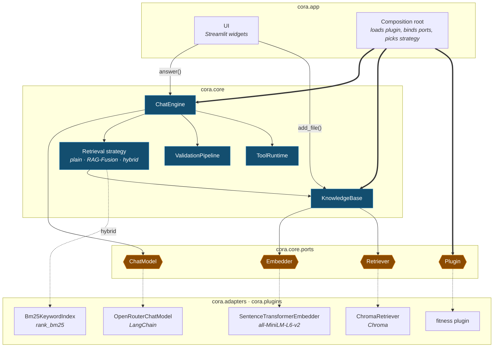

# Big picture

The one page to read first: the core, the four ports where it comes apart, and the technology
bound to each — a hexagonal (ports-and-adapters) design at the altitude to *explain* cora, not
re-derive it. Past this page **the tests are the spec**; the plans under `docs/plans/` are
build history, bar `docs/plans/webapp-overview.md`, the original design rationale.

## The map

Read top to bottom: the shell drives the core, the core owns its four ports at the seam, and
each is bound at startup to one adapter below it. The core names nothing beneath the seam.

| Mark | Means |
|---|---|
| blue box | A core component — pure Python, unit-tested with fakes. |
| amber hexagon | A port — the core's whole outward surface. Four in total. |
| thin arrow | A call at request time. |
| thick arrow | Constructed by the composition root at startup. |
| dotted arrow | The adapter a port is bound to — the one line you change to swap technology. |

**Ingestion** and the **plugin registry** are real components, folded into KnowledgeBase and
the composition root. The **retrieval strategy** is the one node `CORA_RETRIEVAL` picks:
`plain` is KnowledgeBase itself; `advanced` wraps it in RAG-Fusion (a `QueryPlanner` rewrites
the question, RRF merges the rankings); `hybrid` fuses its dense ranking with a BM25 keyword
one by the same RRF — no planner, no extra model call. That BM25 index is the one bit of
technology bound *below* the strategy rather than to a core port, so it sits with the adapters
while the four-port count still holds.

## Two calls in

The shell drives the core through `answer()` and `add_file()` (plus `list_sources()` for the
sidebar) — a surface this small is why a different frontend is a rewrite of the shell and
nothing else.

**`engine.answer(question, history=()) -> ChatResult`** — `core/services/chat_engine.py`

1. **Validate** — core rules (empty, 4000-char cap, prompt-injection guard) then the plugin's; a rejection raises `InputRejectedError` before the model.
2. **Retrieve** — the top `k` chunks (`CORA_TOP_K`, default 5) through the retrieval strategy above.
3. **Prompt** — plugin system prompt, chunks numbered `[1]`…`[n]` with the citation rule, the last `CORA_HISTORY_TURNS` turns (default 20; `0` = no memory), then the question. Validation and retrieval see the question alone, never the history.
4. **Tool loop** — at most `CORA_MAX_TOOL_ROUNDS` rounds (default 8); running dry raises `ToolLoopLimitError`.
5. **Return** — the answer, the sources it actually cites (deduped, narrowed to the bracket numbers in the reply), and every tool result.

**`kb.add_file(data, filename) -> int`** — `core/services/knowledge_base.py`

1. **Dedupe** — SHA-256 the bytes; a hash already in the store returns `0`.
2. **Ingest** — extension `.txt`/`.md`/`.pdf`, at most 10 MB, non-empty after cleaning; each failure raises its own `IngestionError`.
3. **Chunk** — 1000 chars, 150 overlap, split at the coarsest boundary that fits (paragraph, line, space, char).
4. **Embed & store** — with provenance (source, index, offset, file hash); returns the chunk count.

## The components

Nine, each with one job — seven drawn on the map, two *folded* into the caller's box.

| Component | Job | Where |
|---|---|---|
| **ChatEngine** | The single use case; orchestrates validate → retrieve → prompt → tool loop through injected collaborators. | `core/services/chat_engine.py` |
| **KnowledgeBase** | Facade over ingest → embed → store, plus search, sources, and the re-upload dedupe. | `core/services/knowledge_base.py` |
| **Ingestion** *(folded)* | Bytes → clean text → overlapping chunks with provenance; rejects wrong type, oversized, empty. | `core/services/ingestion.py`, `loaders`, `cleaning`, `chunker` |
| **Retrieval strategy** | What the engine retrieves through: `plain` (KnowledgeBase), `advanced`, `hybrid` — both wrappers fuse rankings by RRF. | `fusion_context_source.py`, `hybrid_context_source.py`, `query_planner.py`, `rank_fusion.py` |
| **ValidationPipeline** | Ordered chain: core rules then the plugin's — a new guard is a new rule, not an edit. | `core/services/validation.py` |
| **ToolRuntime** | Find the tool, JSON-Schema-check the args, run it, turn every outcome (including a crash) into a `ToolResult`. | `core/services/tool_runtime.py` |
| **Plugin registry** *(folded)* | Import a plugin by module path and check the bundle before startup: prompt present, tool names unique, schemas valid. | `core/services/plugin_registry.py` |
| **Composition root** | The only place that names a real adapter: reads env, loads the plugin, picks the strategy, returns an `App`. | `app/config.py`, `app/assembly.py`, `app/retrieval.py` |
| **UI shell** | Widgets only: uploader, chat thread, sources/tool-result expanders, error text taken verbatim from the error. | `app/ui/` |

## The ports

Four ports are the core's whole outward surface. Three are **Protocols** (technology); the
fourth, **Plugin**, is a frozen **dataclass** (the domain) — so an adapter and a plugin are the
same kind of thing, each chosen in one place.

| Port | Surface | Bound at startup to |
|---|---|---|
| **ChatModel** | `complete(messages, tools) -> ModelReply` | `OpenRouterChatModel` — the one file that imports LangChain, against OpenRouter's OpenAI-compatible endpoint (`CORA_MODEL`). |
| **Embedder** | `embed(texts) -> list[list[float]]` | `SentenceTransformerEmbedder` — all-MiniLM-L6-v2, local and lazy-loaded. |
| **Retriever** | `add(chunks, vectors, file_hash)`, `query(query_vector, k, metadata_filter=None)`, `sources()`, `contains(file_hash)` | `ChromaRetriever` — persistent embedded collection, cosine distance; the optional filter narrows a query by metadata (self-query). |
| **Plugin** | data only: `system_prompt`, `tools`, `validation_rules`, `seed_docs` | `cora.plugins.fitness` — swap with `CORA_PLUGIN`. A frozen dataclass, not a base class. |

With `CORA_DEBUG=1` the three technology ports are wrapped in a logging decorator
(`cora.adapters.port_logging`) — one truncated line per boundary crossing; core, plugins and
UI never learn the difference.

## Backed by tests

Each claim is checked, not just asserted (`tests/cora/test_architecture.py` covers the first two).

- **The core cannot reach a framework.** Every `cora.core` module is parsed; an import of LangChain, Chroma, sentence-transformers, Streamlit or any outer layer fails the test — and a planted violation proves the detector bites.
- **Streamlit lives in one directory.** Nothing outside `cora/app/ui` may import it — which makes the frontend replaceable in fact, not intention.
- **The engine depends on no concrete collaborator.** It declares its own one-method Protocols (`ContextSource`, `InputValidator`, `ToolExecutor`); every collaborator is a constructor argument.
- **A new domain needs zero core changes.** A plugin is a frozen dataclass; point `CORA_PLUGIN` elsewhere and the domain changes — the core never contains the word *fitness*.
- **A broken tool can't break the chat, and no stack trace reaches a user.** ToolRuntime turns every tool failure into a `ToolResult` error string; every `CoreError` carries a user-facing message, and a runaway tool loop comes back as a friendly apology.
