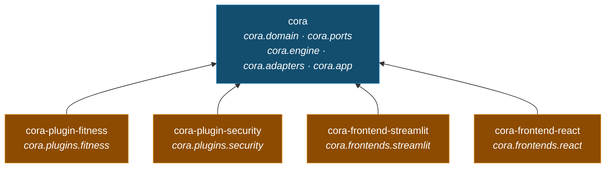

# Big picture

Read this page first. It shows cora's engine, its nine ports, and the technology behind
each port. The design is called *hexagonal* (also known as *ports and adapters*).
The tests show how the code really works. The story files in `docs/sprints/` show how
the code was built, not how it works today.

## The map

Read the map from the outside in. The outer hexagon is one installed deployment; the inner one
is the engine and the ports on its edge. **Left** is who calls cora — a frontend, holding the
engine's own classes, because cora has no driving port: a screen depends on `Agent` and
`KnowledgeBase` directly. **Right** is what cora calls: every port on the engine's boundary
has one adapter behind it, and the engine does not know which. **Below** is what a deployment
adds, arriving through the one port a plugin fills. `cora.app` is the composition root: it
builds the engine and binds each port once, at startup.

| Mark | Means |
|---|---|
| green box | A part of the engine. Plain Python, so a test can build it with fakes. |
| grey box on the engine's edge | A port — a slot for one kind of technology. The nine ports are the only way in and out of the engine. |
| orange box | A frontend. It calls the engine; nothing calls it. |
| blue box | The technology behind a port. |
| yellow box | A plugin: the domain, or a guard, that a deployment names. |
| solid arrow | A call made while answering a request, or a binding made at startup. |
| dashed arrow | The adapter behind a port. |

One arrow runs against the grain: `LangGraphRunner` drives the engine's steps, so the
adapter supplies the graph and the engine supplies every step it walks.

The map is an overview; the detail is in the tables below. `PluginSet`, `ToolRuntime` and the
two tools the model may call are parts of the engine the map leaves out to stay readable.

**Ingestion**, the **plugin registry** and the **citation numbering** are real parts of the code.
To keep the map simple, they are shown inside KnowledgeBase, the composition root, and the
search tool.

**Searching** has one path: the tool asks KnowledgeBase, which embeds the question and reads
the same index the uploads were written to. Asking it several ways is the agent's job, and
the agent does it in the open — one search, one trace step.

A **port** is a fixed slot in the engine for one kind of technology. There are exactly nine:
one for driving the agent, one for chat, one for embedding, one for retrieval, one for reading
a file format, one for what the agent keeps about the user, one for the text of a document, one
for the turns of a conversation, and one for the plugin. Seven of the nine are arguments to
`assemble`, so a different technology goes in a slot without the engine or the composition root
changing. The other two are not: the loader registry is fixed at the composition root, and a
plugin arrives in the plugin set. `tests/guards/test_hexagon_map.py` reads the nine off
`assemble` and fails if the map draws a different set.

Memory is the one optional slot. Leave it out and the agent is offered no `remember` tool and
told no rule about remembering — an app with no memory cannot quietly forget.

Two more files sit in `ports/` without being slots. `ContextSource` is the engine's own seam
between a search and the step that uses it, implemented inside the engine — a Protocol, but
not a slot a technology fills. `Pause` is a capability that travels the other way, *in*, the
way `TextSink` does: only whatever drives the graph can park a run and pick it up again, so
the engine states the decision and is handed back the label chosen. Its default declines the
moment it is raised, which is what keeps a shell with no card to draw from hanging on one.

## The distributions

Three kinds of package: the app, a plugin, a frontend. The layers above are modules inside
`cora` — the split that once made each of them a distribution of its own is gone, because
this is an agent, not a demonstration of packaging. What stayed separate is what a
deployment *chooses*: cora installs no plugin and loads none.

An arrow means *depends on*. `cora` itself depends on nothing of cora's — no plugin and
no way of talking to a user — which is what leaves room for a second frontend — there
are two — and for a deployment that wants no persona and no guard.

| If you are writing | You install | You do not get |
|---|---|---|
| a plugin, domain or guard | `cora` | it uses four names from `cora.ports` and `cora.domain`; the rest comes along |
| the app with a domain and a screen | `cora-plugin-fitness` · `cora-plugin-security` | nothing is loaded until `CORA_PLUGINS` names it |
| a third frontend | `cora` | Streamlit, Starlette, or any other way of talking to a user |
| the app you can run today | `cora-frontend-streamlit` | the plugins — it depends on `cora` and Streamlit, so a domain and a guard are installed and named separately |
| the same app in a browser page | `cora-frontend-react` | the widgets — it serves the engine over HTTP and a React build draws it |

The layer boundary is no longer a fact of the install: with one distribution, nothing stops
`cora.engine` importing Chroma except `tests/guards/test_architecture.py`, which walks every
shipped file's imports and fails the build. The rule is the same, the enforcement moved
from the resolver to a test.

`cora` is a namespace, not a package: no distribution owns the name, and each contributes
a portion of it. `cora.plugins.*` and `cora.frontends.*` are the two extension points, and
a new one of either is a package to install rather than a file to edit.

## Two calls in

A frontend uses the engine through two main methods: `answer()` and `add_file()` (plus
`list_sources()` to show the file list in the sidebar, and `recall()` / `forget()` to show
and clear what is remembered). `docs/happy-path.md` draws both of them as sequence
diagrams, taken from the live test that walks one whole session.

**`agent.answer(question, thread_id) -> ChatResult`** — `engine/agent.py`, returning `domain/chat_result.py`

The conversation belongs to the thread, not to the caller: a turn is seeded with the
question alone, and the graph's checkpointer supplies everything said before it. The
frontend names the thread: it opens on one and mints another when the reader starts a new
session, so the conversation on screen is the conversation cora is answering in.

1. **Prepare** — check the question against one ordered tuple of rules: cora's own first (not empty, at most 4000 characters), then every loaded plugin's, in the order they were named. If a rule says no, raise `InputRejectedError`; the model never sees the question. Screening for prompt injection is one of those plugin rules — `cora.plugins.security` — and not the engine's, so cora as installed screens nothing until a deployment names it. Then add the question to the thread's transcript and write this turn's **brief**: cora's preamble, cora's own rules (call `search_documents`, cite `[n]`, call `remember` when the user asks to be remembered, call `ask_user` when what is remembered holds one fact at two values and nothing says which is current), one section per plugin under its `name`, and whatever is already remembered about the user — labelled as notes rather than rules, and stated last, because a fact is kept user input. The brief is rewritten each turn, so a ten-turn thread carries one, and a fact learned mid-conversation is in hand the next turn. Rules see the question only.
2. **Model** — one round. The model is offered `search_documents`, `remember` and `ask_user` beside the plugin's tools. It is sent the brief, then the previous turns' words — the last `CORA_HISTORY_TURNS` of them (default 20; `0` means no history) — then this turn verbatim. Old tool calls and their results stay in the thread but out of the prompt. It either answers or asks for tools.
3. **Ask, if it asked** — a round that called `ask_user` stops here. The model states the question and the ways out of it in its own words; the run is parked in the checkpointer and the turn ends with no answer, raising `TurnPaused` rather than returning one. `agent.resume(chosen, thread_id)` picks it up on the label the reader chose — or on nothing, if they declined — and `agent.pending(thread_id)` is how a page that arrived after the pause finds the question. This runs *before* the round's tools, and that order is load-bearing: a resumed step is replayed from its first line, so a tool that had already run would run a second time on the way back.
4. **Tools** — run what it asked for, in order. A result that can cite itself — a set of search hits — is numbered `[n]` continuing from the numbers the *conversation* has already handed out, so `[1]` means one document for as long as the thread lives, and comes back as a `tool` message marked *untrusted document data*. Any other result is fed back exactly as it renders.
5. **Round again, or stop** — the router reads the model's last reply. A reply asking for tools goes back to step 2, at most `CORA_MAX_TOOL_ROUNDS` times (default 8), after which `ToolLoopLimitError` apologises. A reply that answers ends the run. Rounds are counted from where this turn began in the transcript, so the budget is the turn's and a long conversation cannot exhaust it.
6. **Return** — the answer, the passages it really cited (only the `[n]` numbers that appear in the reply, with duplicates removed, resolved against every source the conversation has registered), and this turn's trace — the thread arrives carrying every step of every earlier turn, and replaying those would show work this turn never did.

**The run reports itself as it goes.** Each step records what it did — the model's decision and
the tools it asked for, then every call with its arguments and what came back. `answer()` takes
an optional `on_step`, called the moment a step lands, so the UI can show the work while it is
still happening; the finished trace comes back on the `ChatResult` and stays with the answer.

**Retrieval is a decision, not a step — but a plugin can insist on it.** A greeting is answered
without touching the documents; a question about them makes the model call `search_documents`,
more than once if it needs to. When the subject is the plugin's own, an answer the run did no work
for does not stand: it goes back once with the reminder above.
That is also why document text can never act as an instruction: it arrives in a `tool` message,
labelled as data, and cora's own rules stay in the system message.

**`kb.add_file(data, filename) -> int`** — `engine/knowledge_base.py`

1. **Dedupe** — make a SHA-256 hash of the file. If the store already has this hash, stop and return `0`.
2. **Ingest** — the file must be `.txt`, `.md`, or `.pdf`, at most 10 MB, and not empty after cleaning. Each problem raises its own `IngestionError`.
3. **Chunk** — cut the text into pieces of 1000 characters that overlap by 150. Cut at the largest natural break that fits: paragraph, then line, then space, then single character.
4. **Embed and store** — turn each chunk into a vector (a list of numbers) and save it with its origin (source, index, offset, file hash). Return the number of chunks.

## The components

Sixteen parts, each with one job. Eleven are on the map; five are marked *folded*
because the map shows them inside another part.

| Component | Job | Where |
|---|---|---|
| **Agent** | The one main use case. It seeds a turn with the question, names the thread it belongs to, and turns the run's final state into a `ChatResult` — the one value object that crosses to a frontend, so it lives in the domain. | `engine/agent.py`, `domain/chat_result.py` |
| **Steps** | The moves of a turn: *prepare* validates, adds the question to the transcript and writes the brief, *model* takes one round with the chat model, and *tools* runs what the model asked for. Each one returns only what it added to the run. | `engine/steps.py` |
| **Router** | The one decision, read off the model's last reply: asking for tools runs them (a friendly apology at the round budget), answering ends the run. | `engine/steps.py` |
| **Trace** *(folded)* | What the user reads afterwards: one step per model decision and per tool call, each with a one-line summary and the evidence behind it. A new kind of step is a new class, not a new branch. | `domain/trace.py` |
| **Citations** *(folded)* | Numbers a retrieval's passages `[n]` — one number per passage, so two passages of one document are `[1]` and `[2]` — continues that numbering for the life of the conversation, and works out which passages an answer really cited. A `Citation` carries the document and the span it occupies, which is what makes a number openable. | `domain/citations.py` |
| **Transcript** *(folded)* | Projects the thread into one turn's prompt: the brief, the previous turns' words within the cap, then this turn as it stands. The thread keeps everything; the prompt is a view of it. | `domain/transcript.py` |
| **search_documents** | Document search as a tool, so whether to use the documents is the model's decision. Its hits arrive able to number themselves. | `engine/retrieval_tool.py` |
| **remember** | Keeping a fact about the user as a tool, called when the user asks to be remembered rather than on the model's own judgement. The tool guards its own input — nothing blank, nothing over 300 characters reaches the store — but the question's rules do not run over a fact: screening is a plugin's now, and the engine cannot import one. What stands behind a kept fact is the notice it travels under, which says the notes are data and not instructions. Every save shows up in the trace. | `engine/memory_tool.py` |
| **KnowledgeBase** | A simple front for ingest, embed, and store. It also does search, lists sources, keeps each document's cleaned text for the citation pane to read back, and skips files already uploaded. | `engine/knowledge_base.py` |
| **Ingestion** *(folded)* | Turns bytes into clean text, then into overlapping chunks with their origin. Rejects the wrong type, too large, or empty. | `engine/ingestion.py`, `engine/cleaning.py`, `engine/chunker.py` — and the loaders themselves in `adapters/loaders.py`, since which file formats can be read is a technology's business |
| **PluginSet** | The plugins cora was asked for, composed in the order they were named: prompt sections under their names, their tools in the order they were named — cora's own go in front at assembly — and cora's rules then every plugin's. It is also what refuses a bad *combination* — a module named twice, a tool name of cora's own, one name offered by two plugins — so the composition root wires an already-valid set. | `engine/plugin_set.py` |
| **ToolRuntime** | Finds the tool, checks the arguments against its JSON Schema, runs it, and turns a tool's own failure into a `ToolResult`. An infrastructure failure is not tool output, so it travels on unchanged. | `engine/tool_runtime.py` |
| **Plugin registry** *(folded)* | Loads plugins by their module paths and checks each one before the app starts: the name is not blank, tool names are unique, schemas are valid. Everything but the name is optional, so a bundle of rules alone is as legitimate as a bundle of tools. | `engine/plugin_registry.py` |
| **Composition root** | The only place that names a real adapter. It reads the settings, loads the plugins it was named, asks the graph slot for a runner, and returns an `App`. | `app/config.py`, `app/assembly.py` |
| **UI shell** | Only widgets: the uploader, the chat, the *How I got there* trace — rendered as text, because a step names the tool the model asked for — and error text shown exactly as the error gives it. An answer is drawn by a custom component so each `[n]` in it is a button: clicking one opens that passage's document beside the chat, marked and scrolled to. | `frontends/streamlit/` |
| **HTTP shell** | The same screen for a browser: one route per thing the page shows, domain objects rendered as JSON, and a turn streamed as it happens — the steps as the agent takes them, then the answer. A failure crosses as its own message under a status code, never a traceback. | `frontends/react/` |

## The ports

The nine ports are the only outward surface of the engine. Eight of them describe technology —
seven Protocols and one registry of them. The ninth, **Plugin**, is a frozen **dataclass** (the
domain — the topic the app is about). So an adapter and a plugin work the same way: each one
is chosen in one place.

| Port | Surface | Bound at startup to |
|---|---|---|
| **GraphRunner** | `run(state, thread_id, on_text) -> Iterator[AgentState]`, `resume(answer, thread_id, on_text)`, `pending(thread_id) -> Pending \| None` | `LangGraphRunner` — it wires the core's steps and router into a state graph, keeps each thread in a checkpointer, and streams one turn of it: the thread as the turn found it, then the state after every step. `on_text` travels the other way — *in* — because the answer is written inside a step and a graph yields only between them; the runner builds its graph per run and binds the model step to that turn's reader. It names the types a checkpoint may hold, because LangGraph's default is to deserialise anything and log a warning that it will one day refuse. A run that stops to ask simply stops yielding, so `pending` reads what it stopped on off the checkpoint — there is nothing for a caller to see go past — and `resume` hands the answer back into the step that asked. |
| **ChatModel** | `complete(messages, tools, on_text) -> ModelReply` | `OpenRouterChatModel` — the only file that uses LangChain. It talks to OpenRouter, an OpenAI-style endpoint set by `CORA_MODEL`, and streams the reply: each piece reaches `on_text` as it lands, and the whole is what it returns. A tool call whose arguments never parsed reaches it in `invalid_tool_calls`, which would otherwise arrive as a round asking for nothing beside prose that reads as an answer — so it raises, the way it already does for a reply the provider cut short. |
| **Embedder** | `embed(texts) -> list[list[float]]` | `SentenceTransformerEmbedder` — the all-MiniLM-L6-v2 model. It runs on your machine and loads only when first used. |
| **Retriever** | `add(chunks, vectors, file_hash)`, `query(query_vector, k)`, `sources()`, `contains(file_hash)` | `ChromaRetriever` — a saved, built-in database that uses cosine distance. A query is a vector and a count: there is nothing to narrow it by, because there is one way to search. |
| **Loaders** | `Mapping[str, Loader]`, each `Loader` a `(data, filename) -> str` | `cora.adapters.loaders.LOADERS` — `.txt` and `.md` read directly, `.pdf` through pypdf. Which formats a deployment accepts is an entry in the registry, not an edit inside ingestion. |
| **Memory** | `remember(text)`, `recall() -> tuple[Fact, ...]`, `forget(key)`, `clear()` | `SqliteStoreMemory` — LangGraph's SQLite-backed store (the second adapter to use LangGraph, behind a port of its own), one namespace per user, at `CORA_MEMORY_PATH`. `recall()` hands back the newest 100 facts, oldest first. The only optional slot: with nothing bound, the agent is offered no `remember` tool. |
| **Documents** | `keep(upload, text)`, `read(upload) -> str \| None` | `SqliteDocuments` — one row per upload at `CORA_DOCUMENTS_PATH`, keyed by the hash of the bytes it arrived as, holding the *cleaned* text ingestion chunked. Keyed by the upload rather than the filename because a filename is not a promise: the same name uploaded twice is two documents, and a span measured in the first would read the second. A citation is a span of that text, so the pane can open `[n]` and show the passage in place; without it a number would name a document nobody could read. |
| **Conversations** | `record(thread_id, turn)`, `turns(thread_id) -> tuple[Turn, ...]`, `sessions() -> tuple[Session, ...]` | `SqliteConversations` — every turn of every conversation, so one can be reopened after the process that ran it has gone. This is not the agent's memory of a thread, which is the runner's checkpointer: it is what a reader comes back to — what was asked, what was answered, and what that answer rested on. `turns` is ordered as the conversation was taken, oldest first; `sessions` newest first, because a list of conversations is read from the top. Optional, like memory: leave it out and a turn is answered and not kept. |
| **Plugin** | data only: `name`, and any of `instructions`, `tools`, `validation_rules` | none by default — `CORA_PLUGINS` names the set, in order, and takes as many as you like. It is a frozen dataclass, not a class you subclass. |

Set `CORA_DEBUG=1` to wrap the chat, embedding and retrieval ports in a logger
(`cora.engine.port_logging` — a decorator over ports, so it ships with the engine and imports
no technology of its own). It prints one short line each time data crosses a port. The engine,
the plugins, and the UI do not notice any change.

## Backed by tests

- **The engine cannot use a framework.** A test reads every `cora.domain`, `cora.ports` and `cora.engine` file. If one imports LangGraph, LangChain, Chroma, sentence-transformers, Streamlit, or any outer layer, the test fails. A fake bad import is added on purpose to prove the test catches it.
- **A plugin needs the contract alone, proved by installing it.** `cora-plugin-fitness` is built
  into a wheel, installed into an empty environment, and imported there: the environment
  holds exactly two packages, and the engine is not one of them. Every manifest read and
  every import walked runs where all seven packages are present, so this is the only check
  that can tell a declaration from a fact.
- **A toolkit is used in one folder only.** No file outside `frontends/streamlit/` may import Streamlit, and none outside `frontends/react/` may import Starlette. This is why you can really replace the user interface — and why there are two.
- **The steps do not depend on any real helper.** They are plain callables over small Protocols (`ContextSource`, `ValidationRule`, `ToolExecutor`), so a test walks a whole turn with fakes and no graph at all.
- **One thing the engine shares with the graph on purpose.** `domain/agent_state.py` marks the keys that accumulate across a conversation (`Annotated[list[Message], operator.add]`). No engine code reads those marks — they are the convention LangGraph uses to merge each step's partial state, so this one file is written to be understood by a graph engine, without importing one. The steps and the router stay framework-free; the state's *shape* is the shared word.
- **Document text can never act as an instruction.** A test drives a turn that retrieves and checks that the document's words appear only in a `tool` message — never in the system prompt, where cora's own rules live.
- **Retrieving is the model's decision, and the brief is what asks for it.** A live-model test asks a plain training question — never saying "my documents" — and a greeting, through the same agent: only the first comes back with sources. Nothing enforces it behind the instruction, so that live test is the cover: cora tells the model to search and cite, and a model that ignores it answers ungrounded.
- **A question to the reader interrupts nothing that has already run.** A resumed step is replayed from its first line, so the step that stops to ask is walked *before* the round's tools. A test drives a round that asks and writes to memory, and the write happens once — after the answer.
- **A runaway agent still ends politely.** The engine's round budget is set to trip before the graph's own recursion limit, and a graph that overruns anyway is turned into the same friendly apology — never a framework error.
- **A new topic needs no change to the engine.** A plugin is a frozen dataclass, and cora on its own carries no domain at all: every persona, restriction and specialisation arrives as one. List them in `CORA_PLUGINS` and they compose — preamble then sections, cora's tools then theirs, every rule in order — while `CORA_PLUGINS=` leaves a plain assistant that screens nothing. A test reads every contract and engine file to check the word *fitness* appears in none of them.
- **Nothing the agent does is hidden.** Every turn carries a trace: what the model decided, which tool ran with which arguments, and what it returned — including a call that failed. A test drives a turn that searches and calculates and reads all of it back out of the page.
- **A broken tool cannot break the chat, and users never see a stack trace.** ToolRuntime turns a tool's own failure into a `ToolResult` with an error message. Every `CoreError` has a message written for a person.
