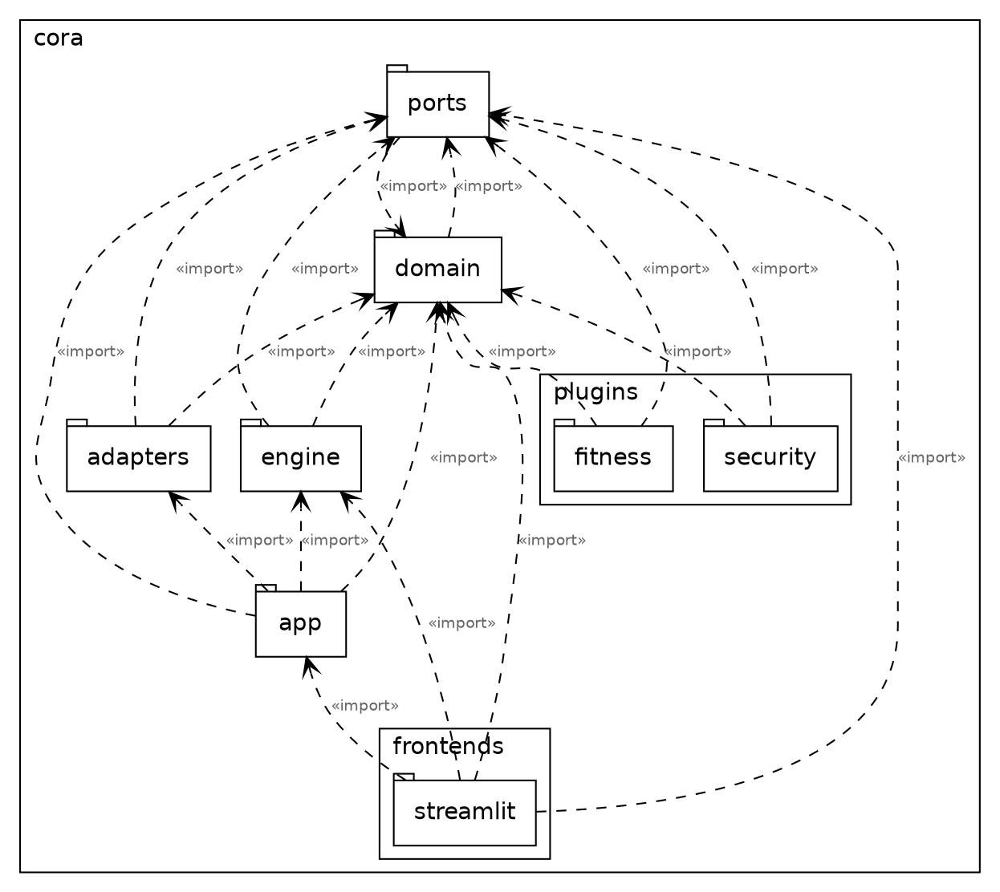
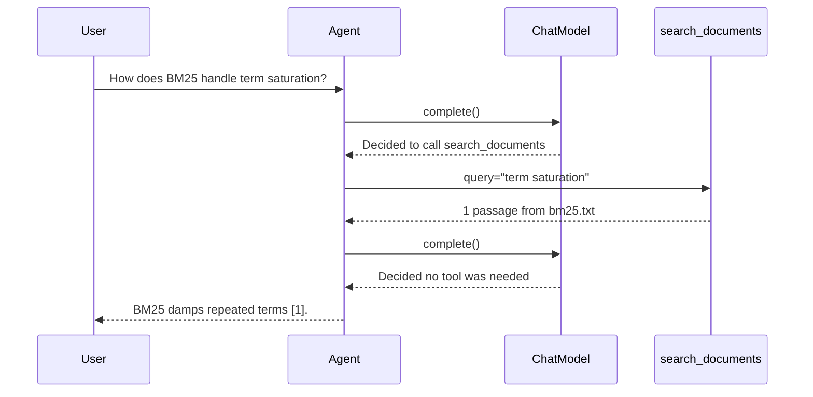

# Diagrams

## The packages, read off the imports

`make diagram` draws this into `packages.svg` beside this page — open that for the laid-out picture. It is not committed; graphviz draws it again whenever you ask.

## One turn

