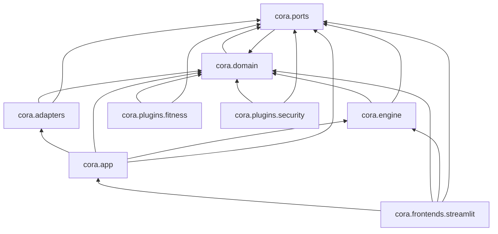
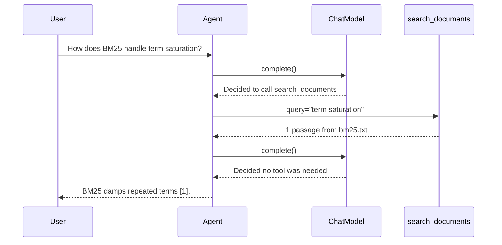

# Diagrams

## The packages, read off the imports

```mermaid
%%{init: {"flowchart": {"nodeSpacing": 40, "rankSpacing": 50, "curve": "basis"}}}%%
flowchart BT
  cora.adapters --> cora.domain
  cora.adapters --> cora.ports
  cora.app --> cora.adapters
  cora.app --> cora.domain
  cora.app --> cora.engine
  cora.app --> cora.ports
  cora.domain --> cora.ports
  cora.engine --> cora.domain
  cora.engine --> cora.ports
  cora.frontends.streamlit --> cora.app
  cora.frontends.streamlit --> cora.domain
  cora.frontends.streamlit --> cora.engine
  cora.frontends.streamlit --> cora.ports
  cora.plugins.fitness --> cora.domain
  cora.plugins.fitness --> cora.ports
  cora.plugins.security --> cora.domain
  cora.plugins.security --> cora.ports
  cora.ports --> cora.domain
```

## One turn

```mermaid
sequenceDiagram
  User->>Agent: How does BM25 handle term saturation?
  Agent->>ChatModel: complete()
  ChatModel-->>Agent: Decided to call search_documents
  Agent->>search_documents: query="term saturation"
  search_documents-->>Agent: 1 passage from bm25.txt
  Agent->>ChatModel: complete()
  ChatModel-->>Agent: Decided no tool was needed
  Agent-->>User: BM25 damps repeated terms [1].
```
