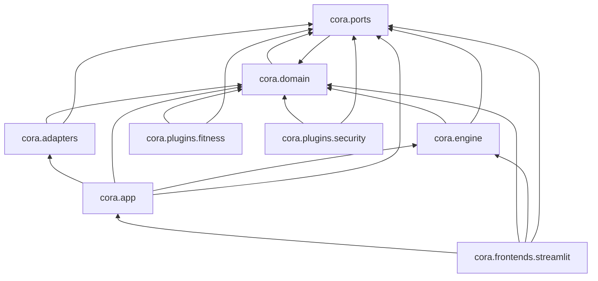

# The packages, read off the imports

One box per package, one arrow per boundary an import crosses. Nobody draws this page:
`make diagram` rewrites the block below from the source, and `tests/test_package_diagram.py`
fails when the committed one is stale — so it is the import graph as it is today, not as
someone last remembered it.

Read an arrow as *depends on*. The contract sits at the top, as it does in
[the distributions diagram](../big-picture.md#the-distributions) — but that one's arrows are
what each package **declares** in its manifest, and these are what its modules **import**. The
two differ on purpose: `cora` depends on `cora-plugin-security` to ship the guard its default
set names, and imports it nowhere.

`cora.domain` and `cora.ports` point at each other: the state a graph runner drives names the
model's message type, and the port that drives it names the state. Both ship in `cora-api`, so
the cycle costs no install anything — but it is in the source, so it is in the picture.

`cora.plugins` and `cora.frontends` are the two extension points, so their children are the
boxes and neither appears itself. A second frontend is a box here the day it is installed,
with no edit to the generator.
