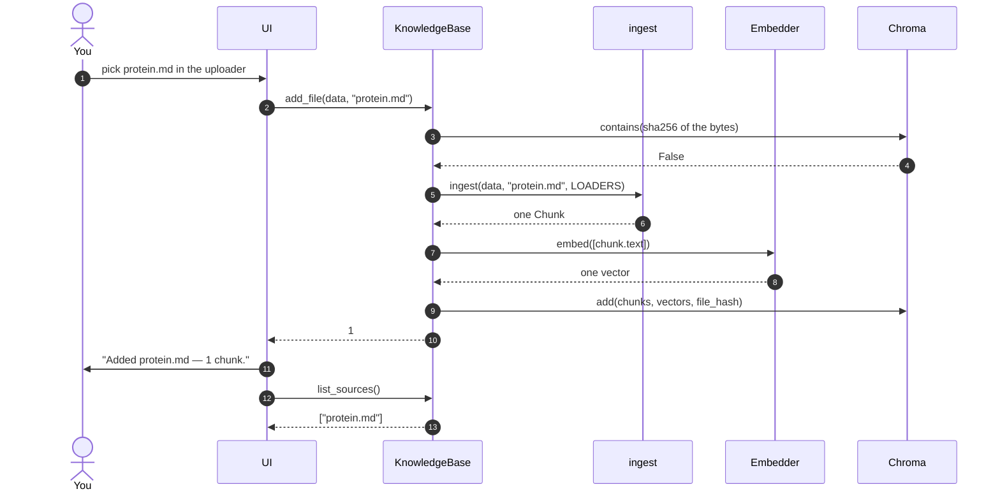
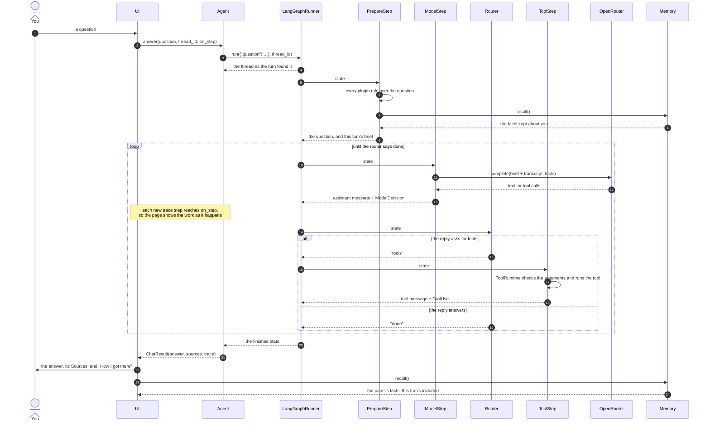
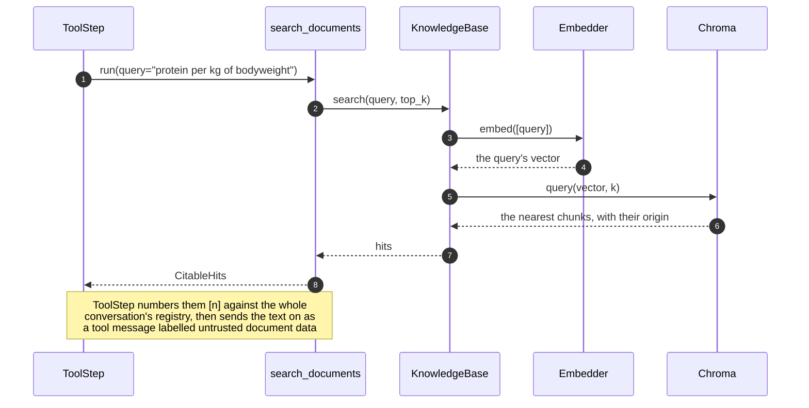

# One session, drawn from the test

The pictures on this page are one test: `test_a_whole_session_uploads_asks_calculates_and_remembers`
in `tests/acceptance/test_llm_acceptance.py`. It runs the shipped composition root against
a real model, so every arrow below is a call that really happens on the `llm` tier —
nothing here is drawn from a library's documentation or from how the code once worked.

Run it and watch: `uv run --env-file .env pytest -m llm -k whole_session`.

The session has four acts. A document goes in, a question is answered from it, a
calculation goes to a plugin's tool, and a fact the user asks to be kept is kept.

## Act 1 — a document goes in

The hash comes first, so the same bytes under a second filename cost nothing but the
lookup. `ingest` is where a file is rejected — wrong type, over 10 MB, empty after
cleaning — and where text becomes overlapping chunks.

## Acts 2 to 4 — a turn

Every one of the three questions takes the same shape. The engine supplies the steps and
the one decision; the adapter supplies the graph that walks them.

The brief is written once per turn and the thread carries everything said before it, so a
tenth turn is seeded with its question alone. The last two arrows are why the sidebar is
drawn after the turn: a fact kept during the turn belongs in the panel that same run.

## The three tools the session uses

`ToolStep` never knows which tool it ran. It asks `ToolRuntime` for the name the model
gave, and hands back whatever came out — numbered `[n]` first if the result can cite
itself.

| The model asks for | Which really runs | The trace line the test reads |
|---|---|---|
| `search_documents(query=…)` | `engine/retrieval_tool.py` → `KnowledgeBase.search` | `search_documents(query="…") → n passages from protein.md` |
| `calculate_daily_energy(…)` | `plugins/fitness/tools.py` — Mifflin-St Jeor, scaled by an activity factor | `calculate_daily_energy(sex="male", …) → {"bmr": …, "tdee": …}` |
| `remember(fact=…)` | `engine/memory_tool.py` → the `Memory` port → `adapters/sqlite_store_memory.py` | `remember(fact="is vegetarian") → Remembered: is vegetarian` |

Only the first of the three reaches the documents:

`KnowledgeBase` stands here because it *is* the `ContextSource` the tool holds: there is
one way to search, and nothing sits between the tool and the index the uploads were
written to. Asking the question several ways is the agent's job, and it shows as another
pass through this same diagram — one search, one trace step.

## What the session does not show

**A turn that answers without searching.** Every turn of this session calls a tool, and
nothing searches on the model's behalf: whether the documents are read is the model's
decision, asked for in the brief and enforced nowhere. To see that decision made both
ways, read `test_a_real_model_answers_from_the_documents_but_greets_without_them` in the
same file — a plain domain question and a greeting through one agent, where only the first
comes back with sources.

**Nothing fails.** Every friendly failure — a provider that is down, a tool that raises, a
round budget spent, a store that cannot be reached — is covered at the unit and
integration tiers, where a fake can be made to break on demand.
