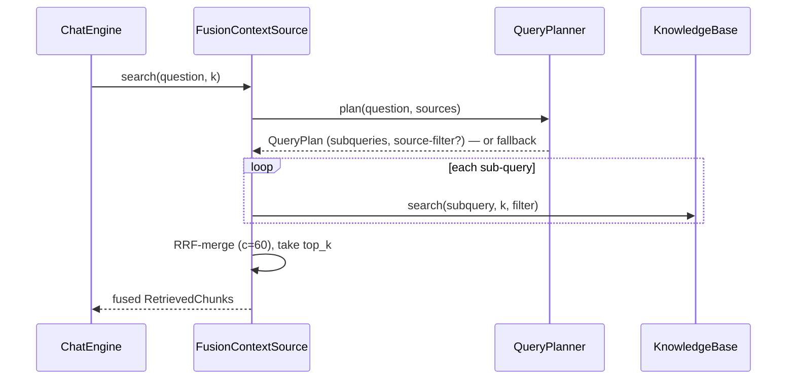

# Feature Plan: Advanced RAG — query translation + structured retrieval

> **Branch** `feature/advanced-rag` · **Builds on** knowledge-base (retrieval) + chat-engine (context source)

---

## Requirements

- **Query translation (RAG-Fusion).** A `QueryPlanner` rewrites the question into
  N sub-queries, each is retrieved, and the rankings are fused (Reciprocal Rank
  Fusion). One standalone question in, better recall out — no history.
- **Structured retrieval (self-query).** The same planning call may emit an
  optional filter over the `source` document, narrowing retrieval to that file.
  Must tolerate no filter (the common case).
- **Off by default, one switch.** `CORA_RETRIEVAL=plain|advanced` selects the
  context source at the composition root; plain mode is today's behaviour
  bit-for-bit. `CORA_FUSION_QUERIES` sizes the fan-out.
- **No invariant regressions.** Core stays framework-free (`MetadataFilter` is a
  core value object; only `ChromaRetriever` speaks Chroma's `where`-dict). All new
  logic tested against the in-memory fakes — no network, no downloads.

**Acceptance** — advanced mode on: a question retrieves source-filtered, rank-fused
chunks; a malformed plan silently falls back to a plain single-query search; plain
mode and all existing tests unchanged; gates green.

---

## Design (architecture level)

Patterns: **Strategy** (context-source swap), **Facade** (`FusionContextSource` over
planner + KB), **Value Object** (`MetadataFilter`, `QueryPlan`), **Adapter**
(filter → `where`-dict), **Composition Root** (mode wiring).

- **`MetadataFilter`** (`cora.core`) — frozen single field/value equality
  (`source`), framework-free. `None` means unfiltered.
- **`QueryPlan`** — frozen: sub-queries tuple + optional `MetadataFilter`.
- **`QueryPlanner`** (core service, `ChatModel`-backed) — owns the fan-out size N
  and the planning prompt; calls `complete(messages, ())` with the known source
  names. A **pure `parse_plan(text, sources) → QueryPlan | None` helper** does the
  `json.loads` + structural check in isolation (SRP — the malformed-input tests
  target it directly). Any failure → **fallback** `([question], no filter)`.
- **Reciprocal Rank Fusion** — pure function; fusion constant `c=60`, named
  distinctly from `top_k`.
- **`FusionContextSource`** (core service) — satisfies the **unchanged**
  `ContextSource.search(query, k)`; composes `QueryPlanner` + `KnowledgeBase`
  (uses `KB.list_sources()` to tell the planner which documents exist, then one
  `KB.search` per sub-query carrying the plan's filter) → RRF-merge → top_k.
  `ChatEngine` is untouched. **Declares a narrow local protocol** for the
  `search` + `list_sources` it needs (DIP), as `ChatEngine` does for
  `ContextSource`; holds exactly those two collaborators (planner + KB).
- **Widened seams (two only)** — `Retriever.query(vector, k, filter=None)` and
  `KnowledgeBase.search(query, k, filter=None)`. Both ripple to the in-memory
  retriever fakes *and* the production `LoggingRetriever` decorator (ty verifies
  conformance). No-filter path reproduces today bit-for-bit. The port *must*
  carry the filter — metadata filtering happens inside the store query, so
  post-filtering or a parallel method would be worse (OCP bent deliberately).
- **Filter → `where`** (in `ChromaRetriever`) — a single-field filter renders as a
  bare one-key `where`-dict (valid in chromadb 1.5.9); `None` renders as no filter.

---

## TDD checklist (red → green → refactor; commit per green)

**Legend:** **(int)** = `@pytest.mark.integration`. Everything else is unit tier.

#### MetadataFilter + widened retriever path
- [x] `MetadataFilter` is a frozen core value object over one field/value equality, equal by content, imports no framework
- [x] the fake retriever's `query` returns only filter-matching chunks, and all chunks when the filter is `None`
- [x] `KnowledgeBase.search` threads an optional filter to `retriever.query`; no filter reproduces today's result bit-for-bit
- [x] `ChromaRetriever.query` accepts an optional filter and renders it as a one-key `where`-dict (no filter → no `where`)
- [x] **(int)** `ChromaRetriever.query` with a `source` filter returns only that document's chunks; without one, unchanged

#### QueryPlanner (translation + self-query)
- [x] `QueryPlan` is frozen: sub-queries tuple + optional `MetadataFilter`
- [x] the planner parses N sub-queries from a scripted `ModelReply.text` JSON (fake ChatModel)
- [x] the planner extracts an optional `source` filter from the same reply when present, drawn from the known sources it was given
- [x] malformed JSON falls back to `([question], no filter)`
- [x] a model failure / empty text falls back too

#### Reciprocal Rank Fusion (pure)
- [x] RRF merges two ranked lists by summed reciprocal rank (`c=60`), best first
- [x] a chunk appearing in several lists outranks one appearing once
- [x] RRF caps output at `top_k`; the constant is separate from `top_k` (guards conflation)

#### FusionContextSource
- [x] `search` plans, fans out one `KB.search` per sub-query, RRF-merges, returns top_k (fake planner + fake KB) — satisfies `ContextSource`
- [x] the plan's filter is passed into each `KB.search` (self-query path)
- [x] on planner fallback it degrades to a plain top_k search — no crash, no filter

#### Config + composition root
- [ ] `Config` exposes `CORA_RETRIEVAL` (plain string, default `plain`) and `CORA_FUSION_QUERIES` (int, minimum 1)
- [ ] an unknown `CORA_RETRIEVAL` value raises `ConfigurationError` (fail fast — no silent degrade to plain)
- [ ] `assemble` wires the context source per mode — plain: `KnowledgeBase`; advanced: `FusionContextSource` over KB + a `QueryPlanner` on the chat model
- [ ] **(int)** advanced mode end-to-end over real Chroma: a question retrieves source-filtered, fused chunks

#### Invariants + docs
- [ ] the new core modules import no framework — architecture test still green (`MetadataFilter`, `QueryPlanner`, `FusionContextSource`, RRF all under `cora.core`)
- [ ] `big-picture.md`: retrieve step notes the plain/advanced swap; ports table notes the widened `Retriever.query(filter)`
- [ ] `README`: `CORA_RETRIEVAL` + `CORA_FUSION_QUERIES` alongside the other `CORA_*` overrides

---

## Non-goals / YAGNI

- No history-aware retrieval — query translation works on the standalone question;
  the conversation-memory follow-up gap stays open (a separate feature).
- No section/heading metadata — self-query filters on the existing `source` field,
  so `Chunk`, the chunker and ingestion are untouched.
- No filter operators beyond a single equality (no multi-field `$and`, ranges,
  `$or`, negation) — add when a plugin needs one.
- No planner re-rank, no native structured-output port, no async fan-out.
- No new port: `QueryPlanner` reuses the existing `ChatModel` port.

## Risks

- **Self-query over-narrows.** A `source` filter excludes every other document; the
  planner must emit one only when the question clearly names a doc, and the plan
  keeps filters optional with a filter-free fallback.
- **Second model call per question.** Latency and cost roughly double in advanced
  mode; it is off by default and switched at the root.
- **Prompt-and-parse fragility.** Model text may drift from the shape; the
  structural-check fallback branch is the safety net and is itself tested.
- **Protocol widening ripples.** Every `Retriever` implementer — the in-memory
  fakes and the production `LoggingRetriever` decorator — must adopt the new
  `query(filter=None)` signature in the same increment; ty flags a miss.
