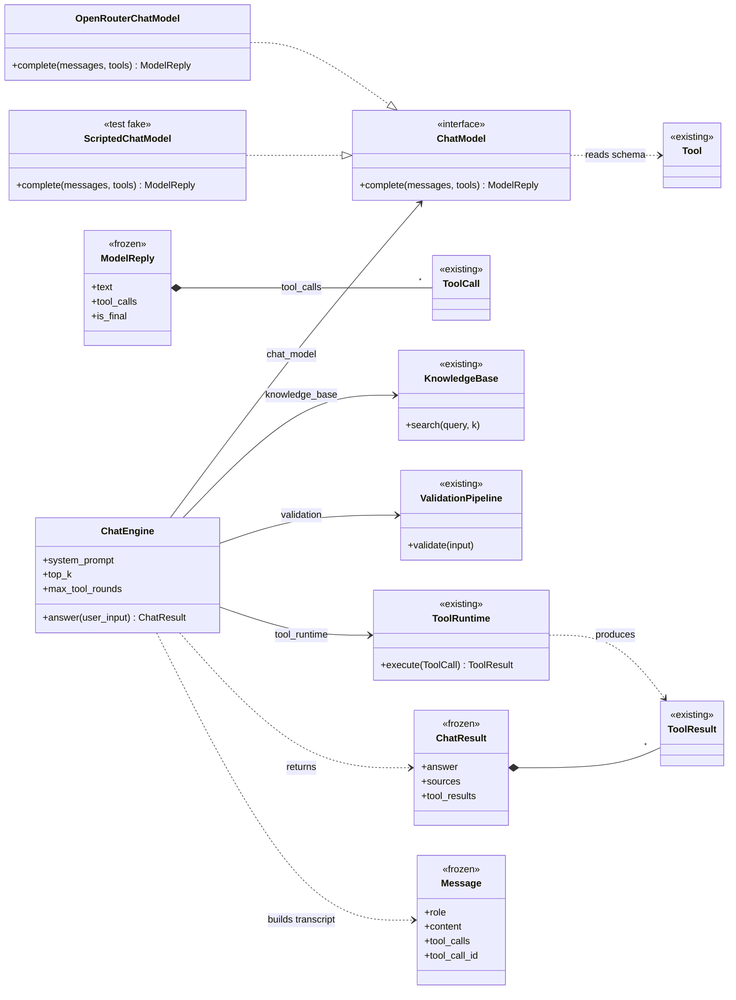
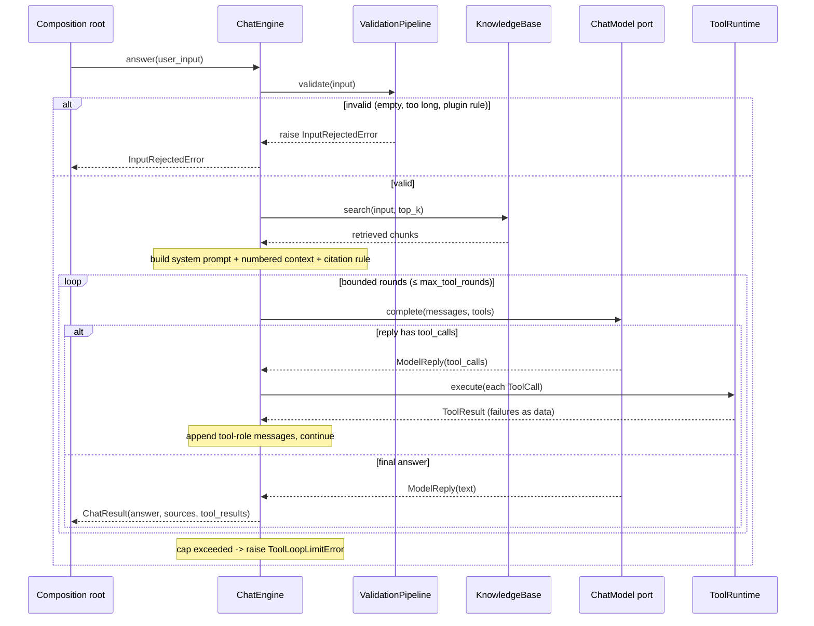

# Feature Plan: Chat Engine

> **Roadmap** item 6 (`webapp-overview.md` §10) · **Branch** `feature/chat-engine` · **Builds on** tools & plugin contract (item 4) + knowledge base (item 3), both done

---

## Requirements

From the architecture plan (§4 component roles, §6 chat flow, §10 roadmap) and the brainstorming decisions:

- Build the **conversational half**: an LLM port, the chat orchestrator, a scripted fake LLM, the OpenRouter adapter, and the composition root. Increments 1–5 finished the retrieval half; nothing here can drive a model yet.
- **Scope = chat engine only.** The Streamlit UI is item 7 and out of scope. No progress/observer callback this round (additive, deferred to 7).
- **Native function-calling** LLM port: the model returns structured tool calls mapping straight onto the existing `ToolCall`/`ToolRuntime` — no text/ReAct parsing layer.
- LangChain stays confined to the **one** OpenRouter adapter (CLAUDE.md). Secrets flow through config; the adapter never reads env.
- **Zero behavioural change to core domain purity** — orchestrator is framework-free; the adapter lazy-imports LangChain like the existing adapters.
- **Acceptance** — every checklist item ticked, all quality gates green; the tool-calling loop is deterministically tested via the scripted fake (happy path, unknown tool, malformed args, runaway cap).

---

## Design (architecture level)

**Types & collaborators** — new types (`ChatModel`, `Message`, `ModelReply`, `ChatEngine`,
`ChatResult`, the adapter, the fake) and how they reuse the existing contract (`Tool`,
`ToolCall`, `ToolResult`, `ToolRuntime`, `ValidationPipeline`, `KnowledgeBase`, marked
`<<existing>>`):

**LLM port** — `src/core/chat_model.py` (`typing.Protocol`, Strategy, model-agnostic):
`ChatModel.complete(messages, tools) -> ModelReply`.
- Value objects: `Message(role, content, tool_calls=(), tool_call_id=None)` where
  `role: Literal["system","user","assistant","tool"]` (ty-enforced, no invalid roles, keeps the
  adapter's role dispatch exhaustive — avoids a bare-string switch); `ModelReply(text: str | None,
  tool_calls=())` with an `is_final` predicate (`not tool_calls`) so the loop reads intent-first
  (Tell-Don't-Ask) rather than inspecting the tuple.
- **Reuses** `Tool`/`ToolCall`/`ToolResult` from `core/plugin.py`. The adapter reads a Tool's
  `name`/`description`/`parameter_schema` only — never calls `run`. Provider tool-call →
  `ToolCall(name, arguments, call_id)`; each `ToolResult` → a `tool`-role `Message` (content =
  payload or error string) appended for the next `complete`.
- No Protocol-conformance test (ports are verified by `ty`) — only value objects + behaviour.

**Orchestrator** — `src/core/chat_engine.py`: `ChatEngine.answer(user_input) -> ChatResult`
(single use-case driver, §4). Fields: `chat_model`, `knowledge_base`, `validation`
(`ValidationPipeline`), `tool_runtime`, `system_prompt`, `tools`, `top_k`, `max_tool_rounds`.
`ChatResult(answer, sources, tool_results)`. Context/citation formatting is a **separate reason
to change** from orchestration, so it lives in a named, independently-tested pure function
`build_context_block(chunks) -> str` (module-level in `chat_engine.py`) — not an inline private
method. This keeps `ChatEngine` a pure Coordinator (SRP).

**Adapter** — `src/core/openrouter_chat_model.py`: `OpenRouterChatModel` implements `ChatModel`
via LangChain `ChatOpenAI` (OpenRouter `base_url`). It **imports LangChain at module top**,
matching `chroma_retriever.py` (which imports `chromadb` directly): adapters physically live in
`src/core/` and may import their framework — the architectural rule ("core imports no framework")
binds the *pure* modules (the `ChatModel` port and the `ChatEngine` orchestrator), not the
adapter files. (The lazy import in `sentence_transformer_embedder.py` exists only to defer a heavy
model download, not for purity, so it does not apply here.) Translates `Message`↔LangChain both
ways, `bind_tools` from tool schemas, wraps provider/auth/rate/parse failures → `LlmError`.
Monkeypatch `core.openrouter_chat_model.ChatOpenAI` in unit tests — no network.

**Fake** — `tests/fakes.py::ScriptedChatModel`: deterministic queue of `ModelReply`s; records
the messages + tools it last received, for assertions.

**Composition root** — new `src/cora/` app package (app/driver layer; item 7 imports it):
- `cora/config.py::Config.from_env` — model, base_url, plugin module path, top_k,
  max_tool_rounds, api key; missing api key → `ConfigurationError`.
- `cora/composition.py`, split for testability:
  - `assemble(plugin, embedder, retriever, chat_model, *, top_k, max_tool_rounds, core_rules)
    -> ChatEngine` — **pure wiring**: seeds `plugin.seed_docs` into the KB, chains core +
    plugin validation rules, builds `ToolRuntime(plugin.tools)`. Unit-tested with fakes + a
    fixture plugin (no network / model download — unit tier).
  - `build_engine(config) -> ChatEngine` — constructs real adapters, resolves the plugin via the
    existing `plugin_registry.load_plugin(config.plugin_module)` (dynamic import → no static
    plugin import; **UI → Core ← Plugins** holds), delegates to `assemble`. Thin glue; verified
    at integration/acceptance, not the unit tier.

### Chat flow (§6)

Core-scoped view of the §6 flow (no UI; the caller is the composition root):

1. `validation.validate(input)` → raises `InputRejectedError` (empty / too long / plugin safety
   rule) **before any KB or LLM work**.
2. `chunks = knowledge_base.search(input, top_k)` (may raise `EmbeddingError`/`RetrievalError`).
3. Build transcript: system (prompt + numbered context + citation rule) + user.
4. Bounded loop, ≤ `max_tool_rounds`:
   a. `reply = chat_model.complete(messages, tools)` (adapter failure → `LlmError`).
   b. `reply.is_final` → return `ChatResult(reply.text, sources, tool_results)`.
   c. else append the assistant tool-call `Message`; per `ToolCall` run `tool_runtime.execute` →
      append the `tool`-role `Message` (payload or error); collect results; loop.
5. Cap exceeded → raise `ToolLoopLimitError` (bounded autonomy, §9).

### Error handling (typed errors + failures-as-data)
- validation rejection → `InputRejectedError` propagates (engine does not catch).
- unknown tool / malformed args / tool crash → `ToolResult.error` fed back to the model as
  **data**; never raises (`ToolRuntime` already guarantees this — reuse it).
- loop cap → `ToolLoopLimitError` (new).
- LLM/adapter failure (auth 401, 402/429, network, malformed tool JSON) → `LlmError` (new).
- KB failures → existing `EmbeddingError`/`RetrievalError`.

New errors in `src/core/errors.py`:
- `LlmError(AdapterError)` — "The assistant is temporarily unavailable. Please try again."
- `ToolLoopLimitError(CoreError)` — friendly "couldn't complete the request" message.
- `ConfigurationError(CoreError)` — missing `OPENROUTER_API_KEY` etc.

---

## Files
- `src/core/chat_model.py` (new) — `ChatModel` port + `Message`, `ModelReply`.
- `src/core/chat_engine.py` (new) — `ChatEngine` + `ChatResult`.
- `src/core/openrouter_chat_model.py` (new) — LangChain/OpenRouter adapter (lazy import).
- `src/core/errors.py` (changed) — `LlmError`, `ToolLoopLimitError`, `ConfigurationError`.
- `src/cora/__init__.py`, `src/cora/config.py`, `src/cora/composition.py` (new).
- `tests/fakes.py` (changed) — `ScriptedChatModel`; `tests/test_fakes.py` (changed).
- `tests/core/test_chat_model.py`, `test_chat_engine.py`, `test_openrouter_chat_model.py`,
  `test_errors.py` (changed); `tests/cora/test_config.py`, `tests/cora/test_composition.py` (new).
- `pyproject.toml` (changed) — `uv add langchain-openai` (pin minor); add `"cora"` to build `module-name`.
- `CLAUDE.md` (changed) — note the third import package (`cora`, composition root).

---

## TDD checklist (red → green → refactor; commit per green; bottom-up)

Ports, value objects & fake
- [ ] `ModelReply().is_final` is `True` with no tool_calls, `False` with tool_calls; `Message` is frozen/immutable and `role` rejects non-`Literal` values (ty).
- [ ] `ScriptedChatModel` returns queued `ModelReply`s in order and records last messages+tools seen.

Errors
- [ ] `LlmError` is an `AdapterError`/`CoreError` with a user-presentable `user_message`.
- [ ] `ToolLoopLimitError` is a `CoreError` with a friendly `user_message`.

Orchestrator (fakes + fixture plugin)
- [ ] scripted final-text reply → `ChatResult.answer == text`, no tools invoked.
- [ ] engine searches KB (top_k); `ChatResult.sources` are the unique retrieved sources.
- [ ] `build_context_block(chunks)` renders numbered context + citation rule (tested standalone).
- [ ] system message sent to the model embeds that context block.
- [ ] one-tool reply runs via `ToolRuntime`, feeds `ToolResult` back as a tool message, and
      `ChatResult.tool_results` includes it.
- [ ] unknown-tool request → `ToolResult.error` fed back as data (no exception), loop finishes.
- [ ] malformed-arguments request → `ToolResult.error` fed back as data (no exception).
- [ ] looping past `max_tool_rounds` → raises `ToolLoopLimitError`.
- [ ] invalid input (empty / too long / plugin safety) → `InputRejectedError` before any KB/LLM call.
- [ ] `LlmError` from the chat model propagates unchanged out of `answer`.

OpenRouter adapter (unit, `ChatOpenAI` monkeypatched — no network)
- [ ] transcript `Message`s map to the right LangChain message types (system/user/assistant-with-tool-calls/tool).
- [ ] provider reply with tool calls → `ModelReply.tool_calls` as `ToolCall(name, arguments, call_id)`.
- [ ] provider text reply → `ModelReply(text=..., tool_calls=())`.
- [ ] tool schemas bound onto the client (`bind_tools`) from name/description/parameter_schema.
- [ ] provider exception wrapped as `LlmError`.

Config & composition root
- [ ] `Config.from_env` reads model/base_url/plugin module/top_k/max_tool_rounds/api key;
      missing api key → `ConfigurationError`.
- [ ] `assemble(...)` wires a fixture plugin + fakes into a `ChatEngine` that answers a
      happy-path question, seeds `plugin.seed_docs` into the KB, and chains core + plugin rules.

---

## Open questions / risks
- LangChain v1 churn / `ChatOpenAI` surface (§11): pin minor, confine to the one adapter,
  unit-test translation both ways.
- OpenRouter tool-call support & malformed tool JSON: defensive parsing in the adapter →
  `LlmError`; a real round-trip stays an `llm`-marked manual test (not in this unit checklist).
- Multiple tool calls per round: supported (loop over `reply.tool_calls`); tool-result size
  capping deferred.
- Optional OpenRouter `default_headers` (HTTP-Referer / X-Title): config-only, deferred.
- `build_engine` real-adapter glue is intentionally not unit-tested (needs network/model);
  verified at integration/acceptance.

---

## Verification (end-to-end)
- Unit tier (default): `uv run pytest` — all new tests green; no network, no model download, no UI.
- Gates: `uv run ruff format --check`, `uv run ruff check`, `uv run ty`.
- Manual LLM smoke (outside unit tier, real key): wire `build_engine(Config.from_env())`, ingest a
  doc, ask a question, confirm a cited answer and that a fitness tool (e.g. TDEE) runs and appears in
  `tool_results`; confirm a medication question triggers the safety redirect.
