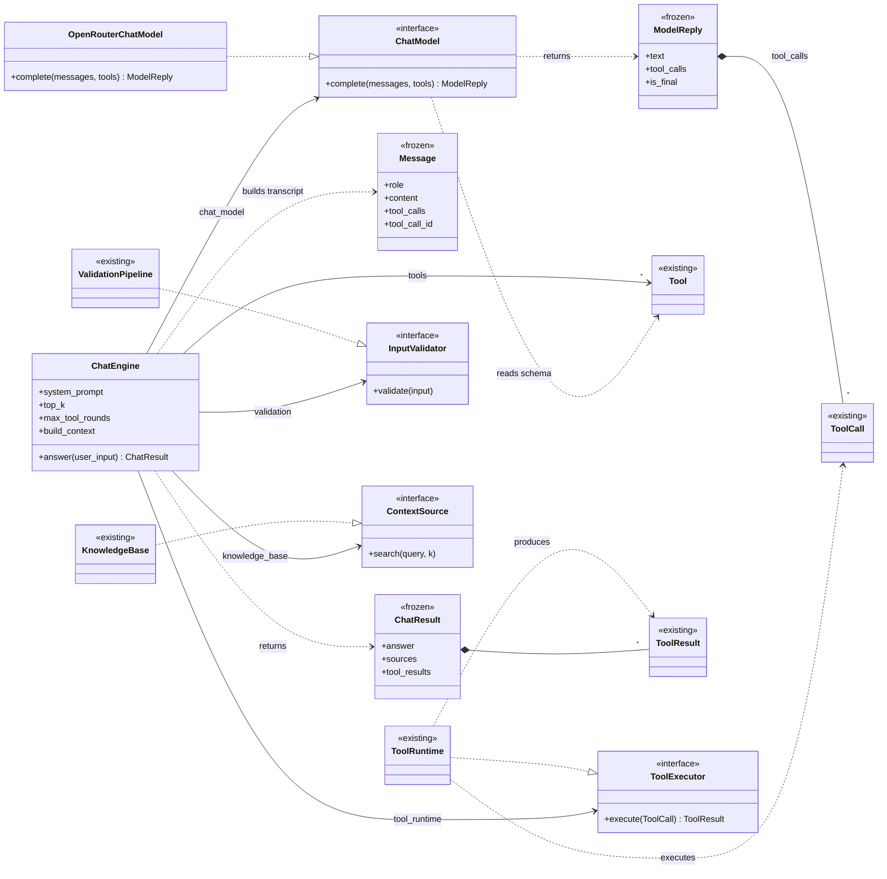
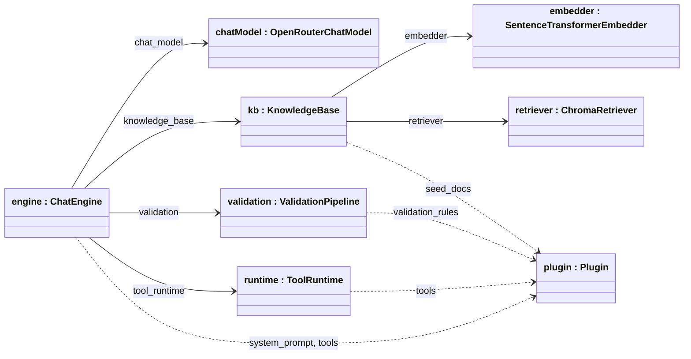
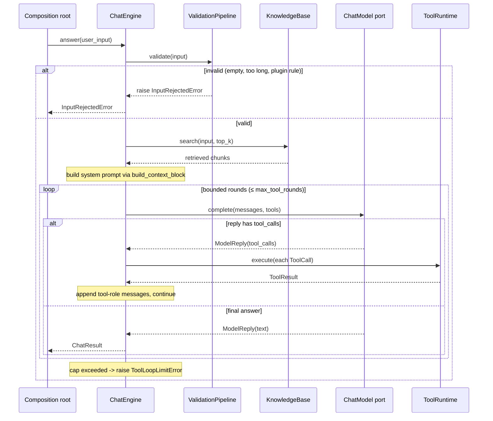

# Feature Plan: Chat Engine

> **Roadmap** item 6 (`webapp-overview.md` §10) · **Branch** `feature/chat-engine` · **Builds on** tools & plugin contract (item 4) + knowledge base (item 3), both done

---

## Requirements

From the architecture plan (§4 component roles, §6 chat flow, §10 roadmap) and the brainstorming decisions:

- Build the **conversational half**: an LLM port, the chat orchestrator, a scripted fake LLM, the OpenRouter adapter, and the composition root.
- **Scope = chat engine only.** The Streamlit UI is item 7 and out of scope. No progress/observer callback this round (additive, deferred to 7).
- **Native function-calling** LLM port: the model returns structured tool calls mapping straight onto the existing `ToolCall`/`ToolRuntime` — no text/ReAct parsing layer.
- LangChain stays confined to the **one** OpenRouter adapter (CLAUDE.md). Secrets flow through config; the adapter never reads env.
- **Core domain purity** — the port and orchestrator are framework-free; LangChain is confined to the one adapter file (imported at module top, like `chroma_retriever.py`'s `chromadb`).
- **Acceptance** — every checklist item ticked, all quality gates green; the tool-calling loop is deterministically tested via the scripted fake (happy path, unknown tool, malformed args, runaway cap).

---

## Design (architecture level)

**Types & collaborators** (`<<existing>>` = reused unchanged from the current core):

**LLM port** — `src/core/chat_model.py`: `ChatModel` is a `typing.Protocol` (Strategy,
model-agnostic). Value-object details the diagram can't carry:

- `Message.role` is a `Literal["system","user","assistant","tool"]` (ty-enforced; keeps the
  adapter's role dispatch exhaustive, no bare-string switch). `content` optional; `tool_calls`
  defaults `()`; `tool_call_id` defaults `None`.
- `ModelReply.text` is `str | None`; `is_final ≡ not tool_calls`, so the loop reads intent-first
  (Tell-Don't-Ask).
- `Tool`/`ToolCall`/`ToolResult` originate in `core/plugin.py`. The adapter reads a Tool's
  `name`/`description`/`parameter_schema` only — never calls `run`. Provider tool-call →
  `ToolCall(name, arguments, call_id)`; each `ToolResult` → a `tool`-role `Message` (content =
  payload or error string) fed to the next `complete`.
- No Protocol-conformance test (ports verified by `ty`) — only value objects + behaviour.

**Orchestrator** — `src/core/chat_engine.py`: `ChatEngine` is the single use-case driver (§4), a
pure Coordinator.

- **Client-owned ports (DIP):** the engine depends on nothing concrete. It defines three narrow
  Protocols in its own module — `ContextSource.search`, `InputValidator.validate`,
  `ToolExecutor.execute` — which `KnowledgeBase`/`ValidationPipeline`/`ToolRuntime` satisfy
  structurally, unchanged (ty-verified, no adapter code). Swapping retrieval (e.g. no-RAG mode)
  never touches the engine.
- **Prompt policy is a strategy (OCP):** context/citation formatting is a separate reason to
  change, so the engine takes `build_context: Callable[[list[RetrievedChunk]], str]`, default =
  module-level `build_context_block(chunks) -> str` (independently tested). A different citation
  style is injected at assembly — no core edit. (Plugin-supplied builders: deferred, YAGNI.)

**Adapter** — `src/core/openrouter_chat_model.py`: `OpenRouterChatModel` implements `ChatModel`
via LangChain `ChatOpenAI` (OpenRouter `base_url`). It **imports LangChain at module top**,
matching `chroma_retriever.py` (which imports `chromadb` directly): adapters physically live in
`src/core/` and may import their framework — the architectural rule ("core imports no framework")
binds the *pure* modules (the `ChatModel` port and the `ChatEngine` orchestrator), not the
adapter files. (The lazy import in `sentence_transformer_embedder.py` exists only to defer a heavy
model download, not for purity, so it does not apply here.) Translates `Message`↔LangChain both
ways, `bind_tools` from tool schemas, wraps provider/auth/rate/parse failures → `LlmError`.
Monkeypatch `core.openrouter_chat_model.ChatOpenAI` in unit tests — no network.

**Fake** — `tests/fakes.py::ScriptedChatModel`: deterministic queue of `ModelReply`s; records
the messages + tools it last received, for assertions.

**Composition root** — new `src/cora/` app package (app/driver layer; item 7 imports it): files
`cora/config.py` (`Config.from_env`) and `cora/composition.py` (`assemble` + `build_engine`).
The object graph `assemble` wires (instances : types, links labelled by the field each fills):

Rationale the diagram can't hold — the split exists for testability:

- `assemble` is **pure wiring** (the object graph above) — unit-tested with fakes + a fixture plugin, no network / model download (unit tier).
- `build_engine` is thin glue — constructs the real adapters, resolves the plugin, passes `Config`'s `top_k`/`max_tool_rounds` to the engine, then delegates to `assemble`. Verified at integration/acceptance, not the unit tier.
- Plugin resolved dynamically via `load_plugin(config.plugin_module)` → no static plugin import, so **UI → Core ← Plugins** holds.
- `Config.from_env` raises `ConfigurationError` on a missing `OPENROUTER_API_KEY`.

### Chat flow (§6)

Core-scoped view of the §6 flow (no UI; the caller is the composition root):

### Error handling (typed errors + failures-as-data)

Tool failures (unknown tool / malformed args / tool crash) are **data, not exceptions**:
`ToolRuntime` already returns them as `ToolResult.error` and the loop feeds them back to the
model — reuse it, add nothing. Every other failure is a typed `CoreError` surfacing its
`user_message`. New errors in `src/core/errors.py`, each with the condition that raises it:

- `LlmError(AdapterError)` — adapter/provider failure (auth 401, 402/429, network, malformed
  tool JSON): "The assistant is temporarily unavailable. Please try again."
- `ToolLoopLimitError(CoreError)` — `max_tool_rounds` exceeded; friendly "couldn't complete the request".
- `ConfigurationError(CoreError)` — missing `OPENROUTER_API_KEY` etc.

Reused as-is: `InputRejectedError` (validation), `EmbeddingError`/`RetrievalError` (KB).

---

## Files

- `src/core/chat_model.py` (new) — `ChatModel` port + `Message`, `ModelReply`.
- `src/core/chat_engine.py` (new) — `ChatEngine` + `ChatResult`.
- `src/core/openrouter_chat_model.py` (new) — LangChain/OpenRouter adapter (top-level LangChain import).
- `src/core/errors.py` (changed) — `LlmError`, `ToolLoopLimitError`, `ConfigurationError`.
- `src/cora/__init__.py`, `src/cora/config.py`, `src/cora/composition.py` (new).
- `tests/fakes.py` (changed) — `ScriptedChatModel`; `tests/test_fakes.py` (changed).
- `tests/core/test_chat_model.py`, `test_chat_engine.py`, `test_openrouter_chat_model.py`,
  `test_errors.py` (changed); `tests/cora/test_config.py`, `tests/cora/test_composition.py` (new).
- `pyproject.toml` (changed) — `uv add langchain-openai` (pin minor); add `"cora"` to build `module-name`.
- `CLAUDE.md` (changed) — note the third import package (`cora`, composition root).

---

## TDD checklist (red → green → refactor; commit per green; bottom-up)

Ports, value objects & fake

- [ ] `ModelReply().is_final` is `True` with no tool_calls, `False` with tool_calls; `Message` is frozen/immutable and `role` rejects non-`Literal` values (ty).
- [ ] `ScriptedChatModel` returns queued `ModelReply`s in order and records last messages+tools seen.

Errors

- [ ] `LlmError` is an `AdapterError`/`CoreError` with a user-presentable `user_message`.
- [ ] `ToolLoopLimitError` is a `CoreError` with a friendly `user_message`.

Orchestrator (fakes + fixture plugin)

- [ ] scripted final-text reply → `ChatResult.answer == text`, no tools invoked.
- [ ] engine searches KB (top_k); `ChatResult.sources` are the unique retrieved sources.
- [ ] `build_context_block(chunks)` renders numbered context + citation rule (tested standalone).
- [ ] system message sent to the model embeds the context block; an injected `build_context` replaces the default.
- [ ] one-tool reply runs via `ToolRuntime`, feeds `ToolResult` back as a tool message, and
      `ChatResult.tool_results` includes it.
- [ ] unknown-tool request → `ToolResult.error` fed back as data (no exception), loop finishes.
- [ ] malformed-arguments request → `ToolResult.error` fed back as data (no exception).
- [ ] looping past `max_tool_rounds` → raises `ToolLoopLimitError`.
- [ ] invalid input (empty / too long / plugin safety) → `InputRejectedError` before any KB/LLM call.
- [ ] `LlmError` from the chat model propagates unchanged out of `answer`.

OpenRouter adapter (unit, `ChatOpenAI` monkeypatched — no network)

- [ ] transcript `Message`s map to the right LangChain message types (system/user/assistant-with-tool-calls/tool).
- [ ] provider reply with tool calls → `ModelReply.tool_calls` as `ToolCall(name, arguments, call_id)`.
- [ ] provider text reply → `ModelReply(text=..., tool_calls=())`.
- [ ] tool schemas bound onto the client (`bind_tools`) from name/description/parameter_schema.
- [ ] provider exception wrapped as `LlmError`.

Config & composition root

- [ ] `Config.from_env` reads model/base_url/plugin module/top_k/max_tool_rounds/api key;
      missing api key → `ConfigurationError`.
- [ ] `assemble(...)` wires a fixture plugin + fakes into a `ChatEngine` that answers a
      happy-path question, seeds `plugin.seed_docs` into the KB, and chains core + plugin rules.

---

## Open questions / risks

- LangChain v1 churn / `ChatOpenAI` surface (§11): pin minor, confine to the one adapter,
  unit-test translation both ways.
- OpenRouter tool-call support & malformed tool JSON: defensive parsing in the adapter →
  `LlmError`; a real round-trip stays an `llm`-marked manual test (not in this unit checklist).
- Multiple tool calls per round: supported (loop over `reply.tool_calls`); tool-result size
  capping deferred.
- Optional OpenRouter `default_headers` (HTTP-Referer / X-Title): config-only, deferred.
- `build_engine` real-adapter glue is intentionally not unit-tested (needs network/model);
  verified at integration/acceptance.

---

## Verification (end-to-end)

- Unit tier (default): `uv run pytest` — all new tests green; no network, no model download, no UI.
- Gates: `uv run ruff format --check`, `uv run ruff check`, `uv run ty`.
- Manual LLM smoke (outside unit tier, real key): wire `build_engine(Config.from_env())`, ingest a
  doc, ask a question, confirm a cited answer and that a fitness tool (e.g. TDEE) runs and appears in
  `tool_results`; confirm a medication question triggers the safety redirect.
