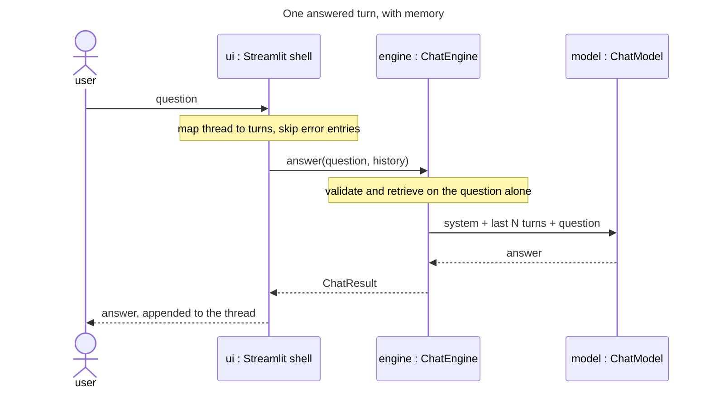

# Feature Plan: Conversation memory

> **Source** `docs/manual-test-findings.md` finding 1 (high) · **Branch** `feature/conversation-memory` · **Builds on** UI error handling (findings 2/3/9), merged
>
> Design spec (brainstorming) + TDD checklist. First branch since the shell
> rewrite to change `cora.core`.

---

## Requirements

- **The model sees prior turns.** `ChatEngine.answer` builds `[system, user]`
  fresh per call, so the app asks "what do you weigh?" and is structurally
  unable to hear the answer. Acceptance: "I weigh 80 kg" → "What did I say my
  weight was?" answers correctly.
- **Failed turns are not sent.** A question blocked by a validation rule never
  reaches the model — otherwise it sees an unanswered question in the
  transcript and may answer it next turn, defeating the rule that blocked it.
- **Bounded context.** Send the last N exchanges, configurable like
  `CORA_TOP_K`; long conversations forget the oldest turns rather than growing
  cost without limit or hitting the model's window.
- **No shared state.** `streamlit_app.py` caches one `App` for every browser
  session (`@st.cache_resource`) and `ChatEngine` is frozen, so the transcript
  cannot live in the engine — one user's memory would be everyone's.

---

## Design (architecture level)

`<<existing>>` = reused unchanged.

- **`Turn`** (`cora.core.turn`) — frozen `{role, text}`, a root value object
  beside `chunk.py`. What the UI hands inward: plain conversational facts, not
  the chat-model port's vocabulary. The engine owns the translation into
  `Message`, so tool-call plumbing never reaches the shell.
- **`ChatEngine.answer(user_input, history=())`** — the only signature change.
  Validation and retrieval still see the current question alone; the history
  lands between the system prompt and the current user message in
  `_initial_messages`. Defaulting to `()` keeps every existing caller and test
  valid, and keeps the engine a pure function of its arguments.
- **Truncation in the engine** — a `max_history_turns` field (defaulted, so
  existing constructions stay valid — same argument as `history=()`), fed from
  a new `CORA_HISTORY_TURNS`. Prompt assembly is the engine's job, so the cap
  belongs next to it rather than in the caller. The unit is *turns* (single
  messages), matching the name; an odd cap may leave history starting with an
  orphaned assistant turn — accepted over pairing logic.
- **UI derives, does not store** — a pure helper maps the existing
  `session_state.messages` to `Turn`s, dropping failed exchanges: a user turn
  counts only when a successful assistant answer follows it, so an error entry
  removes *both* itself and the question that caused it (skipping the error
  alone would still send the blocked question). One source of truth, no second
  transcript to drift. `_answer` appends the prompt to the thread *before*
  calling the engine, so history is mapped from the thread as it was before
  that append — otherwise the current question appears twice.

---

## Testing (§8 tiers)

Unit tier carries this feature — the engine is pure and the mapper is
framework-free, so both test without `AppTest`. `ScriptedChatModel`
`<<existing>>` already records `last_messages`, which is the assertion surface
for what the model received. One integration test for the acceptance case.

---

## TDD checklist (red → green → refactor; commit per green)

Core

- [x] `Turn(role, text)` is frozen; `answer` accepts `history` and places it
      between the system prompt and the current question (assert on
      `ScriptedChatModel.last_messages`).
- [x] `answer` with no history sends exactly what it sends today — the
      default keeps existing behaviour bit-for-bit.
- [x] history longer than `max_history_turns` is truncated to the most recent
      turns (single messages, not pairs), oldest dropped first.
- [x] `max_history_turns=0` sends no history at all — memory can be switched
      off (guards the slice against the `[-0:]` sends-everything trap).
- [x] history shorter than (and exactly at) the cap is sent in full — review
      finding: the unclamped slice start went negative and silently dropped
      most of the history for any conversation shorter than twice the cap.
- [x] retrieval and validation still receive the current question alone, not
      the history (guards the "don't poison the query" decision).

Composition

- [x] `Config` exposes `CORA_HISTORY_TURNS` with a default; `assemble` passes
      it to `ChatEngine`.

UI

- [x] the thread-to-turns mapper keeps answered user/assistant pairs in order,
      drops an error entry *and* the user turn that caused it, and maps an
      empty thread to `()`.
- [x] `_answer` maps history from the thread before appending the current
      prompt, so the question is sent once, not twice.
- [x] acceptance (`AppTest`): state a fact, then ask about it, and the second
      call receives the first exchange.

Docs

- [x] README: `CORA_HISTORY_TURNS` alongside the other `CORA_*` overrides.

---

## Open questions / risks

- **Retrieval is still single-turn.** "What about for women?" carries the
  conversation but retrieves on those five words alone, so the *documents*
  will not follow the thread. Fixing it means query rewriting — a second model
  call and its own feature. Logged, not smuggled in; expect it to be the first
  "memory still feels broken" report.
- **`Turn` vs `Message` look alike.** Accepted duplication: a `Message` is one
  round-trip's plumbing, a `Turn` is a conversational fact that outlives it and
  gets counted and truncated. Revisit if they stay identical once tool calls
  are involved.
- **Thread as source of truth.** Deriving history from render state means any
  future entry variant must be classified as conversational or not. The
  alternative — a parallel transcript — trades that for drift.

---

## Verification (end-to-end)

- `uv run pytest` and `uv run pytest -m integration` green; gates clean.
- Manual (real key, headless over the real `streamlit_app.py`): the finding's
  own transcript — "I weigh 80 kg. Remember that." then "What did I just tell
  you my weight was?" — plus a rejected question followed by a normal one, to
  confirm the refusal never reaches the model.
