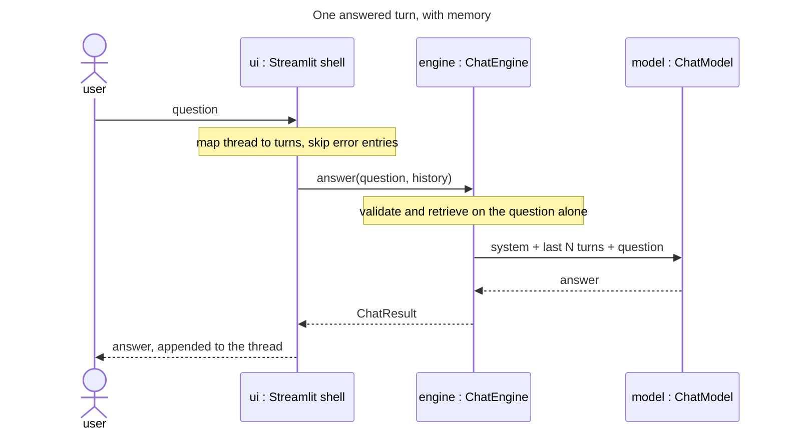

# Feature Plan: Conversation memory

> **Source** `docs/manual-test-findings.md` finding 1 (high) · **Branch** `feature/conversation-memory` · **Builds on** UI error handling (findings 2/3/9), merged
>
> Design spec (brainstorming) + TDD checklist. First branch since the shell
> rewrite to change `cora.core`.

---

## Requirements

- **The model sees prior turns.** `ChatEngine.answer` builds `[system, user]`
  fresh per call, so the app asks "what do you weigh?" and is structurally
  unable to hear the answer. Acceptance: "I weigh 80 kg" → "What did I say my
  weight was?" answers correctly.
- **Failed turns are not sent.** A question blocked by a validation rule never
  reaches the model — otherwise it sees an unanswered question in the
  transcript and may answer it next turn, defeating the rule that blocked it.
- **Bounded context.** Send the last N turns — single messages, so N counts
  roughly half that many exchanges — configurable like `CORA_TOP_K`; long
  conversations forget the oldest turns rather than growing cost without limit
  or hitting the model's window.
- **No shared state.** `streamlit_app.py` caches one `App` for every browser
  session (`@st.cache_resource`) and `ChatEngine` is frozen, so the transcript
  cannot live in the engine — one user's memory would be everyone's.

---

## Design (architecture level)

`<<existing>>` = reused unchanged.

- **`Turn`** (`cora.core.turn`) — frozen `{role, text}`, a root value object
  beside `chunk.py`. What the UI hands inward: plain conversational facts, not
  the chat-model port's vocabulary. The engine owns the translation into
  `Message`, so tool-call plumbing never reaches the shell.
- **`ChatEngine.answer(user_input, history=())`** — the only signature change.
  Validation and retrieval still see the current question alone; the history
  lands between the system prompt and the current user message in
  `_initial_messages`. Defaulting to `()` keeps every existing caller and test
  valid, and keeps the engine a pure function of its arguments.
- **Truncation in the engine** — a `max_history_turns` field (defaulted, so
  existing constructions stay valid — same argument as `history=()`), fed from
  a new `CORA_HISTORY_TURNS`. Prompt assembly is the engine's job, so the cap
  belongs next to it rather than in the caller. The unit is *turns* (single
  messages), matching the name; an odd cap may leave history starting with an
  orphaned assistant turn — accepted over pairing logic.
- **UI derives, does not store** — a pure helper maps the existing
  `session_state.messages` to `Turn`s, dropping failed exchanges: a user turn
  counts only when a successful assistant answer follows it, so an error entry
  removes *both* itself and the question that caused it (skipping the error
  alone would still send the blocked question). One source of truth, no second
  transcript to drift. `_answer` appends the prompt to the thread *before*
  calling the engine, so history is mapped from the thread as it was before
  that append — otherwise the current question appears twice.

---

## Testing (§8 tiers)

Unit tier carries this feature — the engine is pure and the mapper is
framework-free, so both test without `AppTest`. `ScriptedChatModel`
`<<existing>>` already records `last_messages`, which is the assertion surface
for what the model received. One integration test for the acceptance case.

---

## TDD checklist (red → green → refactor; commit per green)

Core

- [x] `Turn(role, text)` is frozen; `answer` accepts `history` and places it
      between the system prompt and the current question (assert on
      `ScriptedChatModel.last_messages`).
- [x] `answer` with no history sends exactly what it sends today — the
      default keeps existing behaviour bit-for-bit.
- [x] history longer than `max_history_turns` is truncated to the most recent
      turns (single messages, not pairs), oldest dropped first.
- [x] `max_history_turns=0` sends no history at all — memory can be switched
      off (guards the slice against the `[-0:]` sends-everything trap).
- [x] history shorter than (and exactly at) the cap is sent in full — review
      finding: the unclamped slice start went negative and silently dropped
      most of the history whenever `cap/2 < len(history) < cap` (11-19 turns at
      the default 20). Shorter conversations were unaffected, because Python
      clamps a negative slice start — `history[-18:]` on a 2-turn tuple is the
      whole tuple.
- [x] retrieval and validation still receive the current question alone, not
      the history (guards the "don't poison the query" decision).

Composition

- [x] `Config` exposes `CORA_HISTORY_TURNS` with a default; `assemble` passes
      it to `ChatEngine`.

UI

- [x] the thread-to-turns mapper keeps answered user/assistant pairs in order,
      drops an error entry *and* the user turn that caused it, and maps an
      empty thread to `()`.
- [x] `_answer` maps history from the thread before appending the current
      prompt. No test can fail for this: mapping *after* the append is
      behaviourally identical, because the mapper already drops a trailing
      unanswered user entry. Defensive redundancy, not a guard — the duplicate
      question is prevented by the mapper, and the acceptance item below is what
      actually pins "sent once".
- [x] acceptance (`AppTest`): state a fact, then ask about it, and the second
      call receives the first exchange.

Docs

- [x] README: `CORA_HISTORY_TURNS` alongside the other `CORA_*` overrides.

## Review findings (PR #6, `ai-code-reviewer` + mutation testing)

Two mutants survived the suite; both are recorded here as items rather than
carried into `main`.

- [x] CI runs the integration tier. Reverting `_answer` to `engine.answer(prompt)`
      — manual-test finding 1 itself — left `pytest -q` at 275 passed, so the
      feature's whole UI-to-engine wiring was invisible to the pipeline while
      `pyproject.toml` already advertised the marker as "run in CI". New
      `integration-tier` job, with the embedding model cached. No test: a
      workflow file has no assertion surface.
- [x] `max_history_turns` becomes a required field like `top_k` and
      `max_tool_rounds`. Mutating the engine's `= 20` default to `0` left all
      307 tests green — every construction passes the value, so the default is
      unpinned dead code, and a future caller that omits it would get memory
      silently off instead of a `TypeError`. `DEFAULT_HISTORY_TURNS` stays the
      one default. Guarded by `ty` (`missing-argument`) rather than a test, per
      the same reasoning as the port Protocols: a construction that omits the
      field no longer type-checks.
- [x] `_int` enforces a per-key minimum. `CORA_HISTORY_TURNS=-1` — a plausible
      "unlimited" guess — yields an empty slice and silently disables memory;
      same hole for `CORA_TOP_K` and `CORA_MAX_TOOL_ROUNDS`, so the guard belongs
      in `_int`. Not the review's "reject non-positive": `0` history turns is a
      documented way to switch memory off, so the floor is 0 there and 1 for the
      other two, where `max_tool_rounds=0` would make `range(0)` raise
      `ToolLoopLimitError` on every question. A test pins the `0` case as
      allowed so the guard cannot over-reach later.
- [x] correct the `_answer`-ordering item above: no test can fail for it. Mapping
      *after* the append keeps all 20 UI tests green, because the mapper already
      drops a trailing unanswered user entry. The ordering is defensive
      redundancy, not a guard — say so, or fold it into the acceptance item.
- [x] log the citation-collision risk under Open questions: history carries the
      previous answer's `[1]` while each turn rebuilds the context block with a
      freshly numbered `[1]`, so a prior claim can cite a different document
      than the one now numbered that way.
- [x] `docs/manual-test-findings.md` still lists finding 1 as the highest
      remaining; update the status note as PR #5 did for findings 2/3/9.
- [x] `thread_to_turns` and `ThreadEntry` have outgrown `ui/formatting.py` —
      moved to `ui/thread.py`, tests split 8/4 to match.
- [x] nits: the clamp note above says "shorter than twice the cap" — the real
      window was `cap/2 < len < cap` (11-19 turns at the default), since Python
      clamps `history[-18:]` on a 2-turn tuple; README omits the default `20`.

## Second review (after the seven above were fixed)

- [x] the integration job restates the `llm` exclusion. A bare `-m integration`
      *replaces* the `addopts` selector instead of narrowing it: a probe test
      marked both was collected **and run** by the job's own command. Latent
      today (no `llm` test exists) but `tests/test_end_to_end.py` is module-wide
      `integration`, so the first real round-trip test there would have made a
      paid API call in CI. Now `-m 'integration and not llm'`.
- [x] pin the odd-cap orphan. The plan accepts that an odd cap can start history
      on an assistant turn whose question was dropped, but every truncation test
      used an even-length history, so pairing logic could be added or removed
      with nothing failing. Cap 3 over 4 turns now asserts the leading turn is
      the assistant's — verified by mutation: rounding the cap down to even
      breaks this test and only this test.
- [x] state the unit of `CORA_HISTORY_TURNS` once. Requirements said "exchanges",
      the design note said "turns (single messages)", the README said neither —
      and `20` turns is only ten exchanges, half what the name suggests.

Deferred, each needing its own red test rather than a squeeze into this branch:

- [ ] **`ChatEngine` owns its own range invariants.** `assemble()`'s defaulted
      parameters bypass `Config`, so `assemble(history_turns=-1)` still reaches
      the engine as an empty slice — memory silently off, exactly what `_int`
      closed, one layer up. Not live: `build(config)` is the only production
      caller. A `__post_init__` rejecting `max_history_turns < 0`, `top_k < 1`
      and `max_tool_rounds < 1` puts the invariant where the field lives.
- [ ] **`ThreadEntry` stops being `dict[str, Any]`.** The alias makes the mapper
      untypeable: `Turn.role`'s `Literal` goes unchecked, and an entry variant
      without `content` would raise `KeyError` into a Streamlit traceback, which
      `CLAUDE.md` forbids. A `TypedDict` pair (answered / failed) or a small
      frozen entry type would make ty flag an unclassified variant at the seam —
      the enforcement the "thread as source of truth" risk below currently lacks.

---

## Open questions / risks

- **Retrieval is still single-turn.** "What about for women?" carries the
  conversation but retrieves on those five words alone, so the *documents*
  will not follow the thread. Fixing it means query rewriting — a second model
  call and its own feature. Logged, not smuggled in; expect it to be the first
  "memory still feels broken" report.
- **`Turn` vs `Message` look alike.** Accepted duplication: a `Message` is one
  round-trip's plumbing, a `Turn` is a conversational fact that outlives it and
  gets counted and truncated. Revisit if they stay identical once tool calls
  are involved.
- **Thread as source of truth.** Deriving history from render state means any
  future entry variant must be classified as conversational or not. The
  alternative — a parallel transcript — trades that for drift.
- **Citation numbers collide across turns.** Each turn rebuilds the system
  message with a freshly numbered context block, while history carries the
  previous answer's `[1]`/`[2]` verbatim. Turn 1 cites `protein.md` as `[1]`;
  turn 2 retrieves `deadlift-form-guide.pdf` as `[1]`, so the model sees a prior
  claim citing a number that now means a different document — and the sources
  panel for turn 2 lists only the new ones. Needs stable per-conversation
  citation identity to fix properly; logged with the retrieval issue above.

---

## Verification (end-to-end)

- `uv run pytest` and `uv run pytest -m integration` green; gates clean.
- Manual (real key, headless over the real `streamlit_app.py`): the finding's
  own transcript — "I weigh 80 kg. Remember that." then "What did I just tell
  you my weight was?" — plus a rejected question followed by a normal one, to
  confirm the refusal never reaches the model.
