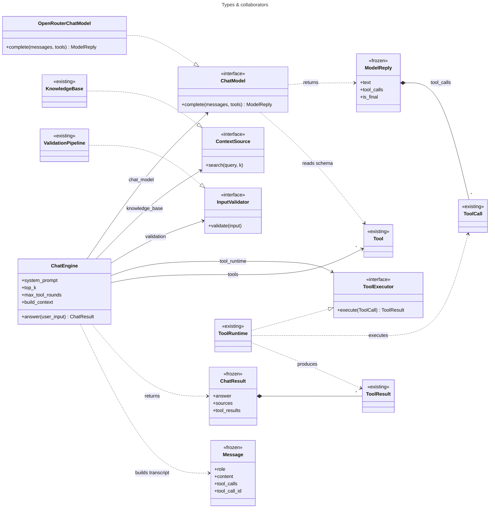
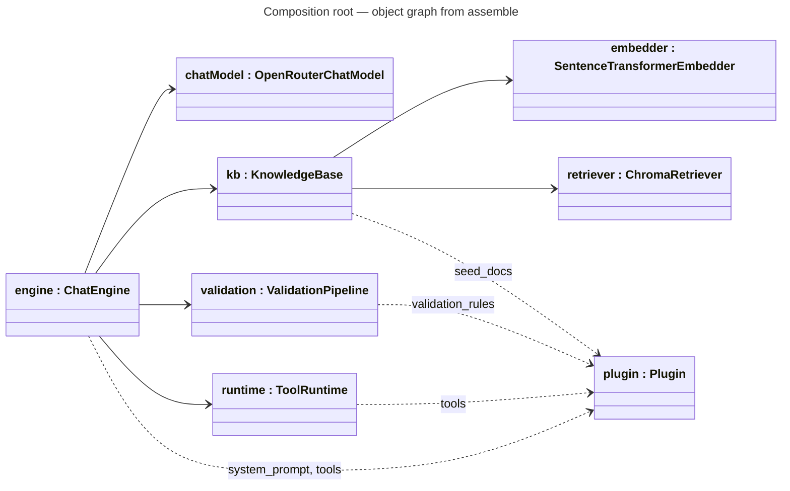
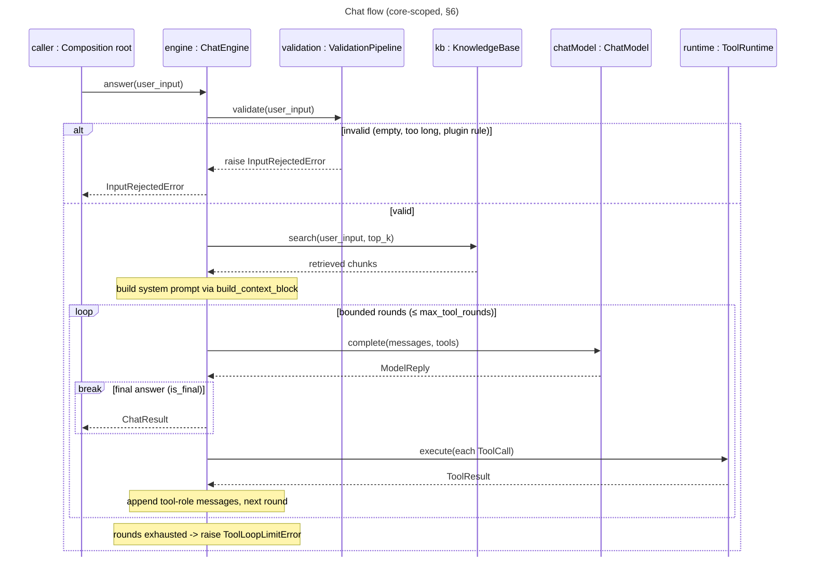

# Feature Plan: Chat Engine

> **Roadmap** item 6 (`webapp-overview.md` §10) · **Branch** `feature/chat-engine` · **Builds on** tools & plugin contract (item 4) + knowledge base (item 3), both done
>
> **Note:** `src/core/…` paths below predate the package-layout refactor; those modules now live under `src/cora/` (`cora.core.ports`, `cora.core.services`, `cora.adapters`, `cora.app`) — see `docs/plans/done/package-layout-refactor.md`.

---

## Requirements

From the architecture plan (§4 component roles, §6 chat flow, §10 roadmap) and the brainstorming decisions:

- Build the **conversational half**: an LLM port, the chat orchestrator, a scripted fake LLM, the OpenRouter adapter, and the composition root.
- **Scope = chat engine only.** The Streamlit UI is item 7 and out of scope. No progress/observer callback this round (additive, deferred to 7).
- **Native function-calling** LLM port: the model returns structured tool calls mapping straight onto the existing `ToolCall`/`ToolRuntime` — no text/ReAct parsing layer.
- **Core domain purity** — the port and orchestrator are framework-free; LangChain lives in the **one** OpenRouter adapter (CLAUDE.md). Secrets flow through config; the adapter never reads env.
- **Acceptance** — every checklist item ticked, all quality gates green; the tool-calling loop is deterministically tested via the scripted fake (happy path, unknown tool, malformed args, runaway cap).

---

## Design (architecture level)

`<<existing>>` = reused unchanged from the current core.

**LLM port** — `src/core/chat_model.py`: `ChatModel` is a `typing.Protocol`; `role` is a `Literal`
(ty-enforced, exhaustive dispatch); `is_final ≡ not tool_calls`; `Tool`/`ToolCall`/`ToolResult`
come from `core/plugin.py`; ports verified by `ty`, no conformance test.

**Orchestrator** — `src/core/chat_engine.py`: the three ports it defines are satisfied
structurally by the existing classes with zero changes, so each mirrors the existing signature
exactly — names and return types included (`validate(user_input: str) -> str`,
`search(query: str, k: int)`); `build_context` is
injectable, defaulting to `build_context_block`; `answer()` composes named steps;
`ChatResult.tool_results` stays typed end-to-end, only the model-facing message flattens to a string.

**Adapter** — `src/core/openrouter_chat_model.py`: wraps LangChain `ChatOpenAI`, imported at module
top (like `chroma_retriever.py`'s `chromadb`); `Message`↔LangChain translation lives in pure,
standalone-tested functions; errors wrap to `LlmError`.

**Fake** — `tests/fakes.py::ScriptedChatModel`: replays a scripted queue of `ModelReply`s,
recording the transcript it received.

**Composition root** — new `src/cora/` package (`config.py`, `composition.py`): `assemble` wires
fakes into a `ChatEngine`, `build_engine` swaps in real adapters + plugin resolution. Packaging:
add `cora` to `[tool.uv.build-backend] module-name` in `pyproject.toml` (else it neither builds nor
imports), update CLAUDE.md's "two import packages" sentence, delete the stale `src/docchat/`.

`assemble` is unit-tested (fakes, unit tier); `build_engine` is integration/acceptance-only
(real adapters); plugin resolution is dynamic (`load_plugin`), so no static plugin import breaks
**UI → Core ← Plugins**.

### Chat flow (§6)

### Error handling (typed errors + failures-as-data)

Tool failures are data, not exceptions (`ToolRuntime` returns `ToolResult.error`, reused as-is);
every other failure is a typed `CoreError`. New, in `src/core/errors.py`:

- `LlmError(AdapterError)` — adapter/provider failure (auth 401, 402/429, network, malformed
  tool JSON): "The assistant is temporarily unavailable. Please try again."
- `ToolLoopLimitError(CoreError)` — `max_tool_rounds` exceeded; friendly "couldn't complete the request".
- `ConfigurationError(CoreError)` — missing `OPENROUTER_API_KEY` etc.

Reused as-is: `InputRejectedError` (validation), `EmbeddingError`/`RetrievalError` (KB).

---

## TDD checklist (red → green → refactor; commit per green; bottom-up)

Ports, value objects & fake

- [x] `ModelReply().is_final` is `True` with no tool_calls, `False` with tool_calls; `Message` is frozen/immutable and `role` rejects non-`Literal` values (ty).
- [x] `ScriptedChatModel` returns queued `ModelReply`s in order and records last messages+tools seen.

Errors

- [x] `LlmError` is an `AdapterError`/`CoreError` with a user-presentable `user_message`.
- [x] `ToolLoopLimitError` is a `CoreError` with a friendly `user_message`.

Orchestrator (fakes + fixture plugin)

- [x] scripted final-text reply → `ChatResult.answer == text`, no tools invoked.
- [x] engine searches KB (top_k); `ChatResult.sources` are the unique retrieved sources.
- [x] `build_context_block(chunks)` renders numbered context + citation rule (tested standalone).
- [x] system message sent to the model embeds the context block; an injected `build_context` replaces the default.
- [x] one-tool reply runs via `ToolRuntime`, feeds `ToolResult` back as a tool message, and
      `ChatResult.tool_results` includes it.
- [x] unknown-tool request → `ToolResult.error` fed back as data (no exception), loop finishes.
- [x] malformed-arguments request → `ToolResult.error` fed back as data (no exception).
- [x] looping past `max_tool_rounds` → raises `ToolLoopLimitError`.
- [x] invalid input (empty / too long / plugin safety) → `InputRejectedError` before any KB/LLM call.
- [x] `LlmError` from the chat model propagates unchanged out of `answer`.

OpenRouter adapter (unit, `ChatOpenAI` monkeypatched — no network)

- [x] transcript `Message`s map to the right LangChain message types (system/user/assistant-with-tool-calls/tool).
- [x] provider reply with tool calls → `ModelReply.tool_calls` as `ToolCall(name, arguments, call_id)`.
- [x] provider text reply → `ModelReply(text=..., tool_calls=())`.
- [x] tool schemas bound onto the client (`bind_tools`) from name/description/parameter_schema.
- [x] provider exception wrapped as `LlmError`.

Config & composition root

- [x] `Config.from_env` reads model/base_url/plugin module/top_k/max_tool_rounds/api key;
      missing api key → `ConfigurationError`.
- [x] `assemble(...)` wires a fixture plugin + fakes into a `ChatEngine` that answers a
      happy-path question, seeds `plugin.seed_docs` into the KB, and chains core + plugin rules.
- [x] `build_engine(Config)` wires real adapters + dynamic `load_plugin` into a `ChatEngine`
      (integration tier — real Chroma, not the default unit tier).
- [x] packaging chore (no test): `cora` in `module-name`, CLAUDE.md package list updated,
      stale `src/docchat/` removed.

---

## Open questions / risks

- LangChain v1 churn / `ChatOpenAI` surface (§11): pin minor, confine to the one adapter,
  unit-test translation both ways.
- OpenRouter tool-call support & malformed tool JSON: defensive parsing in the adapter →
  `LlmError`; a real round-trip stays an `llm`-marked manual test (not in this unit checklist).
- Multiple tool calls per round: supported (loop over `reply.tool_calls`); tool-result size
  capping deferred.
- Optional OpenRouter `default_headers` (HTTP-Referer / X-Title): config-only, deferred.

---

## Verification (end-to-end)

- Unit tier (default): `uv run pytest` — all new tests green; no network, no model download, no UI.
- Gates: `uv run ruff format --check`, `uv run ruff check`, `uv run ty`.
- Manual LLM smoke (outside unit tier, real key): wire `build_engine(Config.from_env())`, ingest a
  doc, ask a question, confirm a cited answer and that a fitness tool (e.g. TDEE) runs and appears in
  `tool_results`; confirm a medication question triggers the safety redirect.
