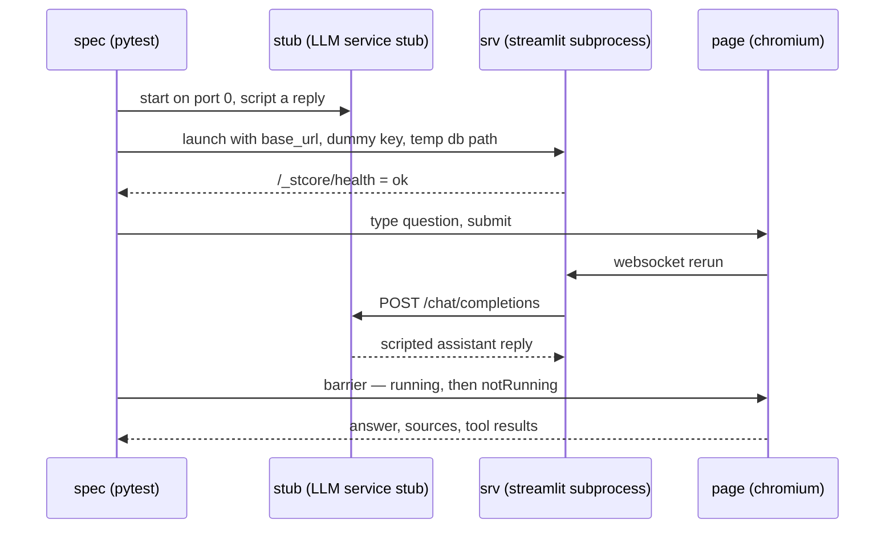

# Feature Plan: Browser end-to-end tests (Playwright)

> **Source** `docs/sprints/3/manual-test-findings.md` — automates the manual exploratory loop ·
> **Branch** `feature/e2e-playwright` · **Builds on** conversation memory (PR #6)
>
> Adds a **fourth** test tier. The only `src/` change is one config knob, which also
> narrows open finding 10 — the Chroma path becomes configurable, though its default
> stays CWD-relative.

---

## Requirements

- **The real app under test.** `streamlit run src/cora/app/ui/streamlit_app.py` in a
  subprocess with the real `Config.from_env`, Chroma, sentence-transformers and
  LangChain adapter. Only the LLM is faked, by pointing `OPENROUTER_BASE_URL` at a
  local stub server. Rejected: a test-only entrypoint wired with in-memory fakes —
  `AppTest` already covers the shell, and every manual finding came from the real stack.
- **Live-ready specs.** One fixture yields `(base_url, api_key)`; retargeting it at real
  OpenRouter must run the *same* specs. Consequence: assertions are **structural** — an
  answer appeared, each `[n]` resolves to a listed source, a tool expander holds a
  plausible number — never exact model prose.
  *As built, that flip is a source edit, not a capability:* there is no `--live` option, no
  parametrisation hook, and no `llm`-marked variant, so `-m llm` selects nothing. Two
  consequences worth stating rather than glossing: `credentials` depends on `stub`, so a
  live run would still start the stub server; and the stub-only assertions would then hold
  **vacuously** — `stub.requests == []` is trivially true for a stub nobody calls. Making
  the flip real means breaking that dependency and skipping the recorder assertions live.
- **Stub-only where scripting is adversarial.** Loop cap, provider failure, missing key.
  These take the stub fixture explicitly, which makes stub-only-ness *visible in the
  signature* — nothing checks it, so it is a convention, not a machine-checked property.
- **Deterministic and key-free.** `uv run pytest -m e2e` passes with no
  `OPENROUTER_API_KEY` and no network beyond loopback.
- **Isolated.** A run must not touch the developer's `.cora/chroma`.

### Acceptance ("done")

- `uv run pytest -m e2e` green and deterministic without a real API key.
- The same specs run live by editing the one credentials fixture — a source edit, and one
  that needs the `stub` dependency broken first (see above); not a flag.
- CI green with a separate `e2e` job (chromium only), artifacts retained on failure.
- Unit tier unchanged in scope and speed; `uv run pytest` behaviour untouched.
- Nothing under `src/` imports playwright; `tests/cora/test_architecture.py` needs no change.

---

## Design

- **Stub LLM as a Service Stub at the *network* seam, not the object seam.** The openai
  client lives in the Streamlit subprocess, so in-process doubles (`respx`, `responses`)
  cannot reach it. A stdlib `ThreadingHTTPServer` on port 0 in a daemon thread answers the
  one call the adapter makes (`POST {base_url}/chat/completions`) — no new runtime
  dependency, and the stub stays the only test-side thing that knows the OpenAI wire
  shape, mirroring the one-file confinement the adapters get. It does **not** inspect
  `self.path`: any POST gets a chat completion, so a wrong-route or wrong-base-URL
  regression in the adapter cannot be caught here.
- **Scripted on conversation state, not call count.** The client retries three times by
  default, so identical requests repeat; the stub decides from the request body (does it
  already carry a `tool` message?). It also **records** requests — that recorder is the
  assertion surface for "what the model was actually sent", one layer out from the unit
  tier's `ScriptedChatModel`.
- **Credentials fixture as the live/stub strategy.** Every other fixture depends on
  `(base_url, api_key)` alone, so retargeting the suite is a one-fixture change — with the
  caveat recorded under Requirements: that fixture still depends on `stub` itself.
- **Server fixture, function-scoped** (revised from module-scoped once measured).
  A fresh process per spec costs ~11s of cold init — embedder load plus seed-doc ingest —
  and buys full isolation: fresh Chroma, fresh `st.cache_resource`, fresh stub script. It
  also dissolves the reason module scope was proposed, since the config-error spec needs a
  fresh process and now every spec gets one. Revisit only if CI time bites.
  Mechanics: free port by binding port 0 and reading back `getsockname` — which leaves a
  race, since the port is free when probed and not necessarily when Streamlit claims it;
  CLI flags rather than env so a developer's `~/.streamlit/config.toml` cannot alter the
  SUT; readiness by polling `/_stcore/health` for `ok`; output captured to a temporary file
  (not `PIPE`, which deadlocks) and dumped on teardown — the only window into server-side
  tracebacks; teardown `terminate → wait → kill`.
- **Locators in one module.** No `data-testid` is documented by Streamlit and they do
  churn (`stFileUploaderFile*` → `stFileChip*` in 1.60), so an upgrade must be one file
  to fix. Prefer user-visible locators (placeholder, role, text) wherever equally robust.
- **Sync barrier plus auto-retrying assertions.** The barrier waits for `running` **then**
  `notRunning` on `stApp`; a bare wait-for-`notRunning` passes stalely inside a measured
  ~30-40 ms window. Real waiting lives in `expect(...)` with generous timeouts. Counts use
  `to_have_count`, with one deliberate exception: the barrier's own self-test needs
  `.count()`, because a retrying assertion would paper over a barrier that returned early.
  Spinners are never asserted — they render only after 500 ms.
- **Isolated store via `CORA_DB_PATH`.** `Config.from_env` gains a sixth knob and
  `build` reads it, so `streamlit_app.py` needs no change and `build`'s own `db_path`
  parameter goes away rather than becoming a second source of truth. A subprocess can only
  be configured by environment, and the hardcoded CWD-relative path is already recorded as
  finding 10 — so this is a product fix that stands without the tests, though it only
  *narrows* that finding: the default is still relative, so launching from another
  directory still starts an empty DB unless the knob is set. *Rejected:* launching with
  `cwd=tmp_path`, which leans on the accident that the default is relative. The
  collection name needs no knob: a temp store isolates everything.

## Testing tiers

A fourth tier alongside `webapp-overview.md` §8's three: browser + real adapters + stub
LLM. Slower than integration (chromium install, embedder warm-up) but deterministic, so it
gets its own marker, its own CI job, and a third exclusion in the default `addopts`
selector. The `llm` tier stays manual and paid, but these specs become its vehicle rather
than a hand-driven session.

Two scoping decisions taken while landing the scaffolding:

- **The stub-server tests are `integration`, not `e2e`.** They exercise the real adapter
  over real TCP but need no browser and no subprocess, so they belong in the CI job that
  already exists — the `e2e` marker stays strictly browser work, and its chromium job
  stays as small as possible.
- **`pytest-timeout` is applied per spec, not globally.** A hung websocket must not run to
  the CI job limit, but a global timeout would also cover a first-run
  sentence-transformers download in the integration tier, where it would fire as a false
  failure. The e2e specs carry it in their shared `pytestmark` beside the `e2e` marker, so
  the guard travels with the specs that need it.

---

## TDD checklist

Scaffolding (no assertion surface — minimal, lands first)

- [x] dev deps via `uv add --dev`: `pytest-playwright`, pinned `playwright`,
      `pytest-timeout`; register the `e2e` marker and exclude it from the default selector.
> The CI job moved out of scaffolding to the end of the fixtures group: `pytest` exits **5**
> on an empty selection, so a job added before the first `e2e`-marked spec exists is a job
> that fails by construction.

Stub LLM server (no browser, no subprocess)

- [x] write a test that shows the real `OpenRouterChatModel` pointed at the stub returns
      a scripted plain answer as its final text.
- [x] write a test that shows the stub replies with a tool call while the request carries
      no tool result, and with a final answer once it does.
- [x] write a test that shows repeating the *same* request does not advance the script —
      the client retries, so state and not call count drives the reply.
- [x] write a test that shows a scripted 429 surfaces as `LlmError` through the real
      adapter (one representative status; per-status mapping is already unit-tested), and
      that the retries are recorded — merged in review, since a separate retry test
      repeated the same script. The count is not pinned: three attempts is the openai
      client's default, not our behaviour.
- [x] write a test that shows the stub records each request, so a spec can assert what the
      model was sent — system prompt, prior turns, tool result.
- [x] write a test that shows two overlapping requests are both served, and that the next
      request is not stalled by the barrier they tripped (merged in the same review pass).

Config knob

- [x] write a test that shows `Config.from_env` reads `CORA_DB_PATH` and defaults to
      today's value, and that `build` stores into that path.

Harness fixtures (each proved by the smallest spec that can fail)

- [x] write a test that shows the port helper returns a port that can actually be bound.
      Landed with the server fixture in `d10e78b` as
      `test_find_free_port_returns_a_port_the_caller_can_bind`. This box was briefly marked
      "skipped, covered by the fixture" — wrong on the facts, since the test was already
      there; the checkbox was just stale.
- [x] write a test that shows the launched app answers `/_stcore/health` with `ok` inside
      the readiness budget, and that the subprocess is gone after teardown.
- [x] write a test that shows the run wrote its store under the temp path — **health does
      not imply the script ran.** `/_stcore/health` goes `ok` once the runtime accepts browser
      connections, and Streamlit executes the script per session, on websocket connect. So
      the fixture is ready in ~1.5s with `st.cache_resource` not yet built and no seed docs
      ingested; only a page load proves where the store lands.
- [x] write a test that shows the barrier returns only after the rerun finished — an
      assertion made immediately after it sees the new content. Verified by planting the
      naive wait-for-`notRunning`, which returns with 0 messages instead of 2.
- [x] write a test that shows the page loads with the chat input visible, sidebar content
      visible at the pinned wide viewport, and no `stException`. The pin arrived late — see
      the review-findings group; until then the spec leaned on pytest-playwright's 1280×720
      default and a `--device` run would have failed it.
- [x] CI `e2e` job (scaffolding, lands here because it needs one spec to select):
      `playwright install --with-deps chromium`, `-m 'e2e and not llm'` — a bare `-m`
      replaces the `addopts` selector rather than narrowing it, so the `llm` exclusion must
      be restated as the integration job already does. Screenshot/video/trace retained on
      failure; browser caching is a later optimisation. Its exact pytest invocation is
      verified locally, but the job itself is unverified until the branch is first pushed.

App specs (live-ready unless marked stub-only)

- [x] write a test that shows uploading a `samples/` file surfaces the file chip, then a
      success alert, then the document in the sidebar list.
- [x] write a test that shows re-uploading the same file reports the dedupe outcome rather
      than ingesting twice — needs the chip cleared first, since `_ingest_once`
      short-circuits an unchanged selection.
- [x] write a test that shows asking a question renders an assistant message whose every
      `[n]` resolves to an entry of the Sources expander.
- [x] write a test that shows a calculator question renders a Tool results expander
      holding a plausible number.
- [x] write a test that shows a second question reaches the model with the first exchange
      included (**stub-only**, recorder assertion) — green on arrival, since conversation
      memory already landed in PR #6, so red was proved by planting `engine.answer(prompt)`
      without history and watching the recorder see one message instead of three.
- [x] write a test that shows a medical-safety question is refused with the plugin's
      message and never reaches the model — **stub-only** after all: the "never reaches"
      half is a recorder assertion, so only the alert half could run live. Green on
      arrival like the memory spec; red proved by planting a `MedicalSafetyRule` that
      does not raise, once per assertion since the first failure masks the second.
- [x] write a test that shows a provider failure renders one friendly error alert, no
      traceback, and the user's question still on screen (**stub-only**). Two plants, since
      the three assertions guard different regressions — and the first was instructive:
      with the `except CoreError` handler removed, **the alert assertions still passed**.
      Streamlit renders an uncaught exception inside an `stAlertContentError` whose text is
      `LlmError`'s own message, so "one friendly alert" cannot by itself tell a handled
      error from a traceback; the `stException` count is the load-bearing assertion. The
      question-on-screen assertion needed its own plant (append the user turn *after* the
      call), which no error-shape assertion catches.
- [x] write a test that shows exceeding the tool-round cap ends in a friendly error rather
      than a hang (**stub-only**). The first item here with real red: the stub could only
      answer a tool call while no tool result was present, so it gained
      `script_endless_tool_calls` — the one script a well-behaved model never produces.
      The paired `stException` count is what stops the alert assertion passing on a
      traceback, as the provider-failure spec found.
- [x] write a test that shows a fresh server started without `OPENROUTER_API_KEY` renders
      the friendly startup message and no chat input (**stub-only**, own process) — its own
      `test_startup.py`, driving `running_app` directly since the `app` fixture always
      supplies a key. Genuine red: `running_app` had no way to express *no* key. It now
      takes `api_key: str | None`, where `None` **pops** the variable — blanking it would
      pass today (`not api_key` reads both alike) but would survive a change to
      `is None`, and popping also stops a developer's own key leaking in via `os.environ`.
      Cheapest spec in the tier at ~5s: the app fails config before loading the embedder.

Docs (Phase 4, no test)

- [x] `webapp-overview.md` §8: the fourth tier, what it may touch, why `llm` now reuses
      these specs.
- [x] `README.md`: `uv run pytest -m e2e`, the one-off chromium install, and
      `CORA_DB_PATH` beside the other `CORA_*` overrides.
- [x] `docs/sprints/3/manual-test-findings.md`: status note that this loop is now automated, and
      which findings the specs cover — including what it does *not* cover (malformed
      uploads, over-long input, warm start), so the file stays honest about the gap.

Review findings (PR #9, `ai-code-reviewer`) — behavioural ones each need their red planted

- [x] correct the claims this plan and `webapp-overview.md` made that the code does not
      implement: `connect_ex`, a pinned viewport, route checking in the stub, a stale
      "module scope" sentence, `.count()` stated as never-used, the live flip described as
      a capability, and the stale "skipped" box above. Plus `manual-test-findings.md`
      claiming finding 10 *fixed* when the default is still CWD-relative.
- [x] strip inherited `CORA_*` from the launched app's environment, so a developer's
      exported `CORA_HISTORY_TURNS=0` cannot silently break the memory spec. `_env` became
      `app_env` to be a tested seam. *Every* `CORA_*` is dropped rather than the four named
      ones, and what the harness does not pin falls to the app's own defaults, so
      `config.py` stays the single source. Confirmed both ways: with the fix stashed,
      `CORA_HISTORY_TURNS=0 uv run pytest -k second_question` fails exactly as predicted;
      with it, that run passes.
- [x] make the seed-doc spec fail when the ingest loop is removed — `PersistentClient`
      creates the directory on construction, so `iterdir()` proves only that Chroma opened.
      Now asserts the sidebar lists `protein.md`; the path assertion stays, because the app
      has exactly one store and it is the temp one. Both halves of the finding were proved
      by planting `for filename, data in ():` — the new assertion fails, and with it
      removed the old one **passes with no ingest at all**.
- [x] make the tool-result spec reject tool-*error* text: `\d` matches
      `invalid arguments: 180 is greater than the maximum of 2.5`. Proved by scripting
      `height_m: 180` — the spec passed green while the tool rejected its arguments and
      never ran. Now also asserts the panel text matches none of the four `ToolRuntime`
      error phrasings, which stays fix-compatible with labelling and rounding. There is no
      structural marker to match instead: `format_tool_result` renders an error as bare
      text, so the regex **copies core prose** and silently stops guarding if those
      messages are reworded — closable once tool results are labelled (manual finding 5).
      Dropped the redundant visibility assertion `open_expander` had already made.
- [x] make the provider-failure spec prove the stub was actually reached — a `RetrievalError`
      carries the same user-facing message and satisfied all four assertions. Two fixes,
      each with its own plant: the alert must now contain the phrase that distinguishes
      `LlmError` from its siblings — "The assistant is …", not just "temporarily unavailable"
      (planting `raise RetrievalError` in `ChromaRetriever.query` passed the old spec and
      fails the new one), and `stub.requests` must be non-empty (planting `raise LlmError`
      before the HTTP call leaves the text identical and fails only that assertion).
- [x] pin the viewport, so the sidebar assertions cannot be flipped by a `--device` run.
      Red was literal, no plant needed: `--device="Pixel 5"` rendered the sidebar
      `aria-expanded="false"`, hidden. A session-scoped `browser_context_args` override
      wins over the device preset, and the same command now passes. The earlier "pinned
      wide viewport" claim is finally true.
- [x] hygiene: anchor `samples/` off `__file__` (verified by running the upload specs from
      another cwd, where the old relative path raised `FileNotFoundError`); clear the
      overlap `Barrier` once met; loosen the retry-count assertion off the openai client's
      default and fold the now-subsumed rate-limit test into it; mark the socket-binding
      test `integration`, since the unit tier promises no sockets; rename
      `test_end_to_end.py` → `test_ingest_and_search.py` now that `e2e` means the browser
      tier. The stub also raises if its server thread outlives teardown instead of leaking
      it silently.
      The barrier fix earned its own red: a third request hit the tripped barrier, blocked
      for the full 10s timeout and died with `BrokenBarrierError` inside the handler, so the
      client got no response at all. My first fix cleared the barrier *before* waiting,
      which races — the second party can read `None`, skip the wait and strand the first;
      clearing after it trips is the correct order.

Second review pass (PR #9) — the first pass's fixes set a standard the harness then missed

- [x] strip `STREAMLIT_*` alongside `CORA_*`. The CLI flags pin five options; every other
      one has a `STREAMLIT_*` env var and was inherited, so an exported
      `STREAMLIT_SERVER_MAX_UPLOAD_SIZE=0` silently broke the upload specs — verified both
      ways, failing without the fix and passing with it.
- [x] assert a key-free launch drops an exported `OPENROUTER_API_KEY`. The pop already did
      this, but nothing proved it: the only cover was the browser spec, which in CI has no
      key to leak and so passed vacuously. Red proved by planting a blank instead of a pop.
- [x] fold the barrier-release test into the overlap test, the way the rate-limit pair was
      folded — same setup, and the copy discarded its replies. Verified the merged test
      still catches the bug by replanting the uncleared barrier.
- [x] guard the acceptance criterion "nothing under `src/` imports playwright", which was
      ticked but unchecked: `FORBIDDEN_FRAMEWORKS` is consulted only for `cora.core`, so an
      import in `cora.app` or `cora.adapters` passed CI. A `PACKAGE_FILES`-wide test now
      covers `playwright` and `pytest`, following the streamlit pattern already there —
      synthetic rogue file for the detector, and proved on a real one by planting the import
      into `app/ui/chat.py`.
- [x] **accept** the barrier's residual race rather than close it. A request arriving in
      the window between the trip and the clear still waits alone for the 10s timeout. The
      reviewer could not reproduce it in 60 trials, no spec sends a third *concurrent*
      request, and this is a single-developer repo, so the counter-based claim-a-slot fix
      buys little. If a spec ever needs three concurrent requests, that is the fix — and
      the note lives here rather than in a comment, since no edit can silently break it.

---

## Discovered, out of scope

- **Invalid tool-call JSON is silently dropped.** When a model returns
  `tool_calls[].function.arguments` containing invalid JSON, langchain-openai puts it in
  `AIMessage.invalid_tool_calls`, which `adapters/openrouter_chat_model.py` ignores —
  `tool_calls` comes back empty, the engine treats the reply as final, and the user gets an
  empty assistant message. Found while researching the stub. Its own branch: adapter unit
  test first, then a spec here.
- **Three branches are queued behind this one** — prompt-injection protection, hybrid
  search, logging & monitoring — and each will add its own specs. So fixtures must compose:
  no central script registry, no spec-count assumptions, scripting supplied per spec.
- Findings 4-8 stay open, and two are now visible in browser output: an answer citing
  only `[1]` still lists `[1] protein.md` and `[2] energy_balance.md` (finding 4), and a
  tool result renders as the bare `24.691358024691358` (finding 5). Both chat assertions
  were chosen to be **fix-compatible** rather than to pin the wart: `cited ⊆ listed` still
  holds once sources are narrowed to cited ones, and "the panel holds a number" still holds
  once results are labelled and rounded. The citation spec also fails loudly if the answer
  cites nothing, so a live run cannot pass it vacuously.

## Risks

- **Selector churn** — mitigated by the pinned Streamlit minor and one locator module; an
  upgrade is expected to touch exactly that file.
- **CI cost** — chromium is a multi-hundred-MB install, minutes not seconds. Its own job,
  so it never slows the quality gates.
- **Flake policy** — no retries, no `sleep`. A flake is a missing barrier or a `.count()`
  used where `to_have_count` belongs, and gets fixed as one.
- **One unexplained flake, watch it.** A single heavily-loaded `-m 'not llm'` run produced
  three fixture-phase `ERROR`s (so `_await_ready` raised, not an assertion) at 490s wall
  clock against a normal ~160s; the two runs after it were clean, and the message was lost
  to a filtered log. Prime suspect is the race `find_free_port` already documents — free
  when probed, taken when Streamlit claims it, which exits the subprocess before it serves.
  If it recurs: capture the full log, and the fix is to retry the launch on a fresh port
  rather than to widen the readiness budget.
- **No `-n auto`** — ports would have to become worker-aware first.
