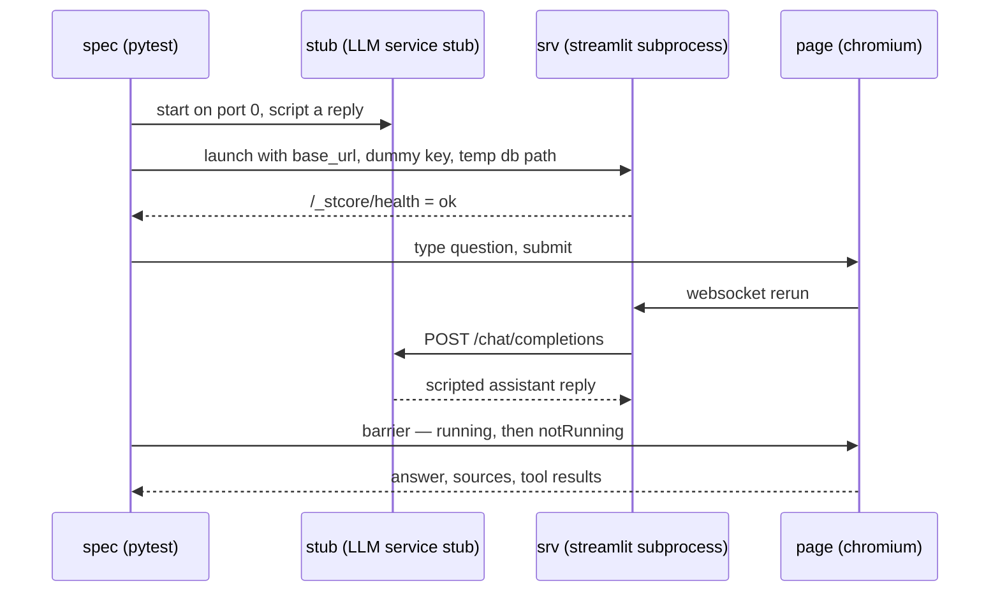

# Feature Plan: Browser end-to-end tests (Playwright)

> **Source** `docs/manual-test-findings.md` — automates the manual exploratory loop ·
> **Branch** `feature/e2e-playwright` · **Builds on** conversation memory (PR #6)
>
> Adds a **fourth** test tier. The only `src/` change is one config knob, which
> also closes open finding 10.

---

## Requirements

- **The real app under test.** `streamlit run src/cora/app/ui/streamlit_app.py` in a
  subprocess with the real `Config.from_env`, Chroma, sentence-transformers and
  LangChain adapter. Only the LLM is faked, by pointing `OPENROUTER_BASE_URL` at a
  local stub server. Rejected: a test-only entrypoint wired with in-memory fakes —
  `AppTest` already covers the shell, and every manual finding came from the real stack.
- **Live-ready specs.** One fixture yields `(base_url, api_key)`; parametrising it with
  real OpenRouter values must run the *same* specs under the existing `llm` marker.
  Consequence: assertions are **structural** — an answer appeared, each `[n]` resolves
  to a listed source, a tool expander holds a plausible number — never exact model prose.
- **Stub-only where scripting is adversarial.** Loop cap, provider failure, missing key.
  These take the stub fixture explicitly, which makes the marker machine-checkable.
- **Deterministic and key-free.** `uv run pytest -m e2e` passes with no
  `OPENROUTER_API_KEY` and no network beyond loopback.
- **Isolated.** A run must not touch the developer's `.cora/chroma`.

### Acceptance ("done")

- `uv run pytest -m e2e` green and deterministic without a real API key.
- The same specs run live by flipping the one credentials fixture.
- CI green with a separate `e2e` job (chromium only), artifacts retained on failure.
- Unit tier unchanged in scope and speed; `uv run pytest` behaviour untouched.
- Nothing under `src/` imports playwright; `tests/cora/test_architecture.py` needs no change.

---

## Design

- **Stub LLM as a Service Stub at the *network* seam, not the object seam.** The openai
  client lives in the Streamlit subprocess, so in-process doubles (`respx`, `responses`)
  cannot reach it. A stdlib `ThreadingHTTPServer` on port 0 in a daemon thread serves the
  one route the adapter uses (`POST {base_url}/chat/completions`) — no new runtime
  dependency, and the stub stays the only test-side thing that knows the OpenAI wire
  shape, mirroring the one-file confinement the adapters get.
- **Scripted on conversation state, not call count.** The client retries three times by
  default, so identical requests repeat; the stub decides from the request body (does it
  already carry a `tool` message?). It also **records** requests — that recorder is the
  assertion surface for "what the model was actually sent", one layer out from the unit
  tier's `ScriptedChatModel`.
- **Credentials fixture as the live/stub strategy.** Every other fixture depends on
  `(base_url, api_key)` alone, so retargeting the suite is a one-fixture change.
- **Server fixture, function-scoped** (revised from module-scoped once measured).
  A fresh process per spec costs ~11s of cold init — embedder load plus seed-doc ingest —
  and buys full isolation: fresh Chroma, fresh `st.cache_resource`, fresh stub script. It
  also dissolves the reason module scope was proposed, since the config-error spec needs a
  fresh process and now every spec gets one. Revisit only if CI time bites.
  Mechanics: Free port via `connect_ex`; CLI flags rather than
  env so a developer's `~/.streamlit/config.toml` cannot alter the SUT; readiness by
  polling `/_stcore/health` for `ok`; output captured to a temporary file (not `PIPE`,
  which deadlocks) and dumped on teardown — the only window into server-side tracebacks;
  teardown `terminate → wait → kill`. Module scope because `st.cache_resource` is
  process-wide: the config-error spec needs a fresh **process**, not a fresh page.
- **Locators in one module.** No `data-testid` is documented by Streamlit and they do
  churn (`stFileUploaderFile*` → `stFileChip*` in 1.60), so an upgrade must be one file
  to fix. Prefer user-visible locators (placeholder, role, text) wherever equally robust.
- **Sync barrier plus auto-retrying assertions.** The barrier waits for `running` **then**
  `notRunning` on `stApp`; a bare wait-for-`notRunning` passes stalely inside a measured
  ~30-40 ms window. Real waiting lives in `expect(...)` with generous timeouts. Counts use
  `to_have_count`, never `.count()`. Spinners are never asserted — they render only after
  500 ms.
- **Isolated store via `CORA_DB_PATH`.** `Config.from_env` gains a sixth knob and
  `build` reads it, so `streamlit_app.py` needs no change and `build`'s own `db_path`
  parameter goes away rather than becoming a second source of truth. A subprocess can only be configured by
  environment, and the hardcoded CWD-relative path is already recorded as finding 10 —
  so this is a product fix that stands without the tests. *Rejected:* launching with
  `cwd=tmp_path`, which leans on the accident that the default is relative. The
  collection name needs no knob: a temp store isolates everything.

## Testing tiers

A fourth tier alongside `webapp-overview.md` §8's three: browser + real adapters + stub
LLM. Slower than integration (chromium install, embedder warm-up) but deterministic, so it
gets its own marker, its own CI job, and a third exclusion in the default `addopts`
selector. The `llm` tier stays manual and paid, but these specs become its vehicle rather
than a hand-driven session.

Two scoping decisions taken while landing the scaffolding:

- **The stub-server tests are `integration`, not `e2e`.** They exercise the real adapter
  over real TCP but need no browser and no subprocess, so they belong in the CI job that
  already exists — the `e2e` marker stays strictly browser work, and its chromium job
  stays as small as possible.
- **`pytest-timeout` is applied per spec, not globally.** A hung websocket must not run to
  the CI job limit, but a global timeout would also cover a first-run
  sentence-transformers download in the integration tier, where it would fire as a false
  failure. The e2e specs carry it in their shared `pytestmark` beside the `e2e` marker, so
  the guard travels with the specs that need it.

---

## TDD checklist

Scaffolding (no assertion surface — minimal, lands first)

- [x] dev deps via `uv add --dev`: `pytest-playwright`, pinned `playwright`,
      `pytest-timeout`; register the `e2e` marker and exclude it from the default selector.
> The CI job moved out of scaffolding to the end of the fixtures group: `pytest` exits **5**
> on an empty selection, so a job added before the first `e2e`-marked spec exists is a job
> that fails by construction.

Stub LLM server (no browser, no subprocess)

- [x] write a test that shows the real `OpenRouterChatModel` pointed at the stub returns
      a scripted plain answer as its final text.
- [x] write a test that shows the stub replies with a tool call while the request carries
      no tool result, and with a final answer once it does.
- [x] write a test that shows repeating the *same* request does not advance the script —
      the client retries, so state and not call count drives the reply.
- [x] write a test that shows a scripted 429 surfaces as `LlmError` through the real
      adapter (one representative status; per-status mapping is already unit-tested).
- [x] write a test that shows the stub records each request, so a spec can assert what the
      model was sent — system prompt, prior turns, tool result.
- [x] *(added while landing the recorder)* write a test that shows all three retries of a
      failed request are recorded — makes the client's retry behaviour assertable rather
      than merely visible as elapsed time.
- [x] write a test that shows two overlapping requests are both served.

Config knob

- [x] write a test that shows `Config.from_env` reads `CORA_DB_PATH` and defaults to
      today's value, and that `build` stores into that path.

Harness fixtures (each proved by the smallest spec that can fail)

- [~] ~~write a test that shows the port helper returns a port that can actually be bound.~~
      **Skipped, not forgotten.** Every spec's server fixture binds the helper's port before
      anything else, so a port that cannot be bound fails the whole tier at once — a direct
      test would restate the loudest signal the suite already has.
- [x] write a test that shows the launched app answers `/_stcore/health` with `ok` inside
      the readiness budget, and that the subprocess is gone after teardown.
- [x] write a test that shows the run wrote its store under the temp path — **health does
      not imply the script ran.** `/_stcore/health` goes `ok` once the runtime accepts browser
      connections, and Streamlit executes the script per session, on websocket connect. So
      the fixture is ready in ~1.5s with `st.cache_resource` not yet built and no seed docs
      ingested; only a page load proves where the store lands.
- [x] write a test that shows the barrier returns only after the rerun finished — an
      assertion made immediately after it sees the new content. Verified by planting the
      naive wait-for-`notRunning`, which returns with 0 messages instead of 2.
- [x] write a test that shows the page loads with the chat input visible, sidebar content
      visible at the pinned wide viewport, and no `stException`.
- [x] CI `e2e` job (scaffolding, lands here because it needs one spec to select):
      `playwright install --with-deps chromium`, `-m 'e2e and not llm'` — a bare `-m`
      replaces the `addopts` selector rather than narrowing it, so the `llm` exclusion must
      be restated as the integration job already does. Screenshot/video/trace retained on
      failure; browser caching is a later optimisation. Its exact pytest invocation is
      verified locally, but the job itself is unverified until the branch is first pushed.

App specs (live-ready unless marked stub-only)

- [x] write a test that shows uploading a `samples/` file surfaces the file chip, then a
      success alert, then the document in the sidebar list.
- [x] write a test that shows re-uploading the same file reports the dedupe outcome rather
      than ingesting twice — needs the chip cleared first, since `_ingest_once`
      short-circuits an unchanged selection.
- [x] write a test that shows asking a question renders an assistant message whose every
      `[n]` resolves to an entry of the Sources expander.
- [x] write a test that shows a calculator question renders a Tool results expander
      holding a plausible number.
- [x] write a test that shows a second question reaches the model with the first exchange
      included (**stub-only**, recorder assertion) — green on arrival, since conversation
      memory already landed in PR #6, so red was proved by planting `engine.answer(prompt)`
      without history and watching the recorder see one message instead of three.
- [x] write a test that shows a medical-safety question is refused with the plugin's
      message and never reaches the model — **stub-only** after all: the "never reaches"
      half is a recorder assertion, so only the alert half could run live. Green on
      arrival like the memory spec; red proved by planting a `MedicalSafetyRule` that
      does not raise, once per assertion since the first failure masks the second.
- [ ] write a test that shows a provider failure renders one friendly error alert, no
      traceback, and the user's question still on screen (**stub-only**).
- [ ] write a test that shows exceeding the tool-round cap ends in a friendly error rather
      than a hang (**stub-only**).
- [ ] write a test that shows a fresh server started without `OPENROUTER_API_KEY` renders
      the friendly startup message and no chat input (**stub-only**, own process).

Docs (Phase 4, no test)

- [ ] `webapp-overview.md` §8: the fourth tier, what it may touch, why `llm` now reuses
      these specs.
- [ ] `README.md`: `uv run pytest -m e2e`, the one-off chromium install, and
      `CORA_DB_PATH` beside the other `CORA_*` overrides.
- [ ] `docs/manual-test-findings.md`: status note that this loop is now automated, and
      which findings the specs cover.

---

## Discovered, out of scope

- **Invalid tool-call JSON is silently dropped.** When a model returns
  `tool_calls[].function.arguments` containing invalid JSON, langchain-openai puts it in
  `AIMessage.invalid_tool_calls`, which `adapters/openrouter_chat_model.py` ignores —
  `tool_calls` comes back empty, the engine treats the reply as final, and the user gets an
  empty assistant message. Found while researching the stub. Its own branch: adapter unit
  test first, then a spec here.
- **Three branches are queued behind this one** — prompt-injection protection, hybrid
  search, logging & monitoring — and each will add its own specs. So fixtures must compose:
  no central script registry, no spec-count assumptions, scripting supplied per spec.
- Findings 4-8 stay open, and two are now visible in browser output: an answer citing
  only `[1]` still lists `[1] protein.md` and `[2] energy_balance.md` (finding 4), and a
  tool result renders as the bare `24.691358024691358` (finding 5). Both chat assertions
  were chosen to be **fix-compatible** rather than to pin the wart: `cited ⊆ listed` still
  holds once sources are narrowed to cited ones, and "the panel holds a number" still holds
  once results are labelled and rounded. The citation spec also fails loudly if the answer
  cites nothing, so a live run cannot pass it vacuously.

## Risks

- **Selector churn** — mitigated by the pinned Streamlit minor and one locator module; an
  upgrade is expected to touch exactly that file.
- **CI cost** — chromium is a multi-hundred-MB install, minutes not seconds. Its own job,
  so it never slows the quality gates.
- **Flake policy** — no retries, no `sleep`. A flake is a missing barrier or a `.count()`
  assertion, and gets fixed as one.
- **No `-n auto`** — ports would have to become worker-aware first.
