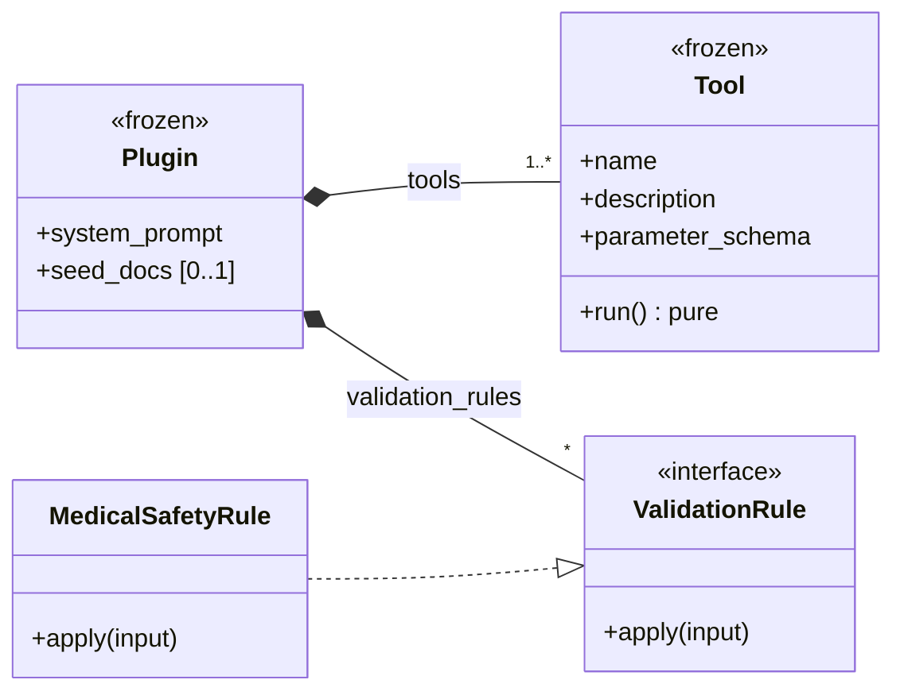
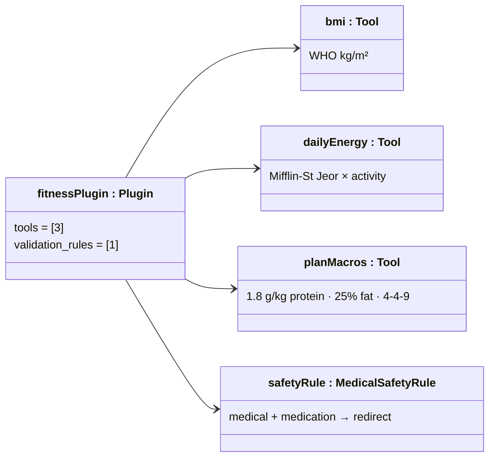

# Feature Plan: Fitness Coach Plugin

> **Roadmap** item 5 (`webapp-overview.md` §10) · **Branch** `feature/fitness-coach-plugin` · **Builds on** tools & plugin contract (item 4, done)

---

## Requirements

From the architecture plan (§4 plugin contract, §9 security, §12 acceptance) and `spec.md` (§2 requires ≥ 3 tool calls):

- Ship the **reference domain plugin**: one module exposing a `PLUGIN` bundle that the registry loads — zero core changes.
- Keep it minimal — three tools (the `spec.md` floor), the safety rule, seed docs, and a prompt, nothing speculative.
- Calculators are tested against published reference values. The safety rule redirects medical/medication questions.
- **Scope guard** — unit tier only, against the existing runtime/pipeline/registry with fakes. The orchestrator that drives the plugin is **item 6**.
- **Acceptance** — every checklist item ticked, all quality gates green.

---

## Design (architecture level)

New top-level package `docchat_plugins.fitness`. Configuration points the registry at it, and its pure data flows through item 4's runtime unchanged.

**Types** — the plugin contract this bundle fills:

**Instance** — the shipped fitness bundle:

### Key decisions (each naming the rejected alternative)

- **Three tools (BMI, TDEE, macros), not the overview's four** (Epley 1RM dropped) — three is the `spec.md` §2 floor, so a fourth adds plugin data without proving anything new. §4's tool list is updated to match.
- **Top-level `docchat_plugins.fitness`** (over `docchat.plugins.fitness`) — "plugin ≠ core" stays visible and greppable, and the import-by-name registry is path-agnostic.
- **One tool per calculation, TDEE returned with BMR** (over an operation-enum tool, or the LLM applying the multiplier) — the LLM picks by name with flat schemas, and the activity enum blocks it inventing multipliers.
- **Bounds in JSON Schema, functions raise only cross-field violations** (over duplicated range guards) — the runtime schema-validates before `run`, so out-of-range args (weight 20–300 kg, height 100–250 cm, age 18–100, kcal 1200–10000, sex/activity enums) become error `ToolResult`s for free. The kcal floor also blocks dangerous calorie targets. Only `plan_macros`' negative-carbs case — inexpressible in a schema — raises.
- **Calculators return unrounded floats** (over rounding in the tool) — avoids the banker's-vs-half-up trap on `.5` TDEEs and keeps `4P + 9F + 4C == kcal` exact. Presentation is the LLM's job.
- **One keyword rule, one redirect message** (over per-category rules and messages) — one honest redirect: acknowledge, decline medical advice, point to a professional. Case-insensitive substring matching, pure.
- **Seed docs as inline constants encoded to bytes** (over packaged files via `importlib.resources`) — import stays I/O-free, and the corpus is a couple of notes.
- **Fixed macro scheme** (over configurable ratios) — citable (ISSN 1.4–2.0 g/kg, Morton 2018 breakpoint 1.62). Configurability without a requirement is speculation.

---

## TDD checklist

#### Calculators (reference values unrounded)

- [x] BMI = kg/m²: 70 kg / 1.75 m → ≈ 22.857142…, 95 / 1.80 → ≈ 29.3209…, 50 / 1.70 → ≈ 17.3010…
- [x] male BMR: 80 kg / 180 cm / 30 y → exactly 1780.0
- [x] female BMR: 60 kg / 165 cm / 25 y → exactly 1345.25
- [x] daily energy maps the five activity labels to 1.2 / 1.375 / 1.55 / 1.725 / 1.9 — sedentary male 80/180/30 → TDEE exactly 2136.0
- [x] macros: 2500 kcal / 80 kg → protein 144 g, fat ≈ 69.444… g, carbs 324.75 g — and 1800 / 60 → 108 / 50 / 229.5
- [x] macro invariant: 4·protein + 9·fat + 4·carbs equals the input kcal exactly
- [x] macros where protein + fat exceed the kcal budget (1200 kcal / 150 kg) raise a clear error

#### Tool schemas (through the existing `ToolRuntime`)

- [x] out-of-range args yield error `ToolResult`s, never raise: BMI weight < 20 kg, energy age < 18, macros kcal < 1200
- [x] an invented activity label and a sex outside male/female are rejected by their schema enums as error `ToolResult`s
- [ ] the negative-carbs raise surfaces through the runtime as an error `ToolResult`, not an exception
- [ ] a valid call to each of the three tools returns an ok `ToolResult` with the calculator's payload

#### Safety rule

- [ ] a medication-dosage question raises `InputRejectedError` carrying the redirect message
- [ ] a medical-condition question ("do I have diabetes?") is rejected too
- [ ] matching is case-insensitive and stem-based: "DIABETES" and "pregnancy" (via "pregnan") are rejected
- [ ] a benign fitness question ("how much protein to build muscle") passes without raising

#### Seed docs

- [ ] `seed_docs` is a non-empty tuple of (markdown filename, non-empty UTF-8 bytes) pairs
- [ ] every seed doc ingests through `KnowledgeBase.add_file` with fakes, producing ≥ 1 chunk

#### Bundle assembly

- [ ] the system prompt is non-blank, sets the coach persona, and instructs: cite sources, use tools for all arithmetic, not medical advice
- [ ] `load_plugin("docchat_plugins.fitness")` returns the bundle — full registry validation passes
- [ ] wired into a `ValidationPipeline`, the plugin's rule runs after the core rules
