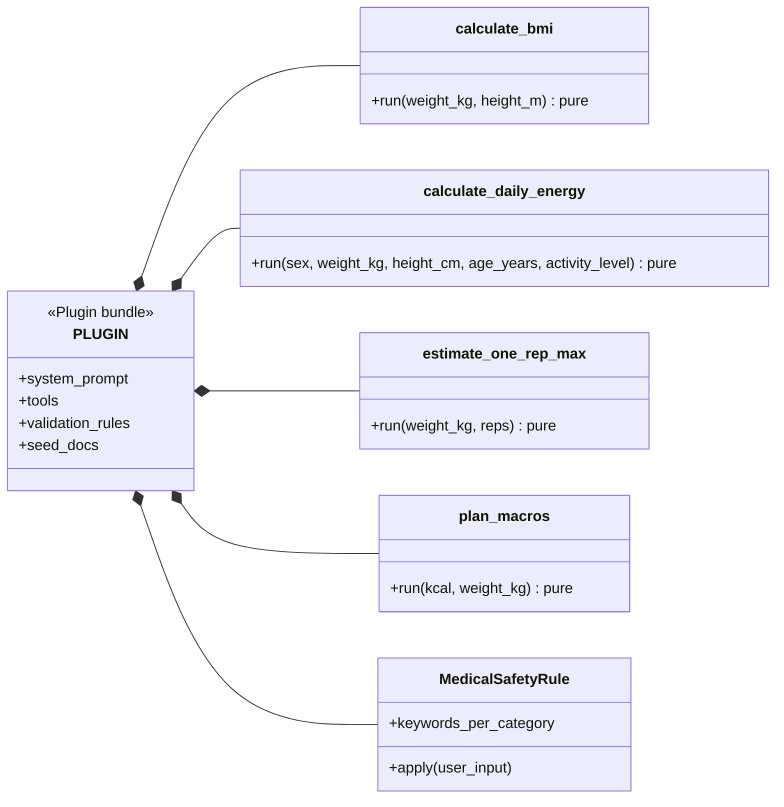

# Feature Plan: Fitness Coach Plugin

> **Roadmap** item 5 (`webapp-overview.md` §10) · **Branch** `feature/fitness-coach-plugin` · **Builds on** tools & plugin contract (item 4, done)

---

## Requirements

From the architecture plan (§4 plugin contract, §9 security, §12 acceptance):

- **Reference domain plugin**: a module exposing `PLUGIN: Plugin` that the registry loads and validates cleanly — the proof that "adding a domain = one plugin package, zero core changes".
- **Calculator tools** (pure function + JSON Schema): BMI (WHO), BMR/TDEE (Mifflin-St Jeor + activity factors), 1RM (Epley), macros (1.8 g/kg protein, 25 % kcal fat, Atwater 4/4/9) — each verified against published reference values.
- **Safety rule** (§9): medical, medication/PED-dosing, eating-disorder, and injury questions → safe redirect via `InputRejectedError`.
- **Seed docs**: training/nutrition notes as `(filename, bytes)` pairs.
- **System prompt** (outline): evidence-based coach persona · cite retrieved sources · use tools for all arithmetic · not-medical-advice disclaimer.

**Scope guard** — unit tier only, against the existing runtime/pipeline/registry with fakes. The orchestrator is **item 6**; any change in `src/docchat/` is a plan violation.

**Acceptance** — `load_plugin` resolves the bundle; calculators match reference values unrounded; bad inputs surface as error `ToolResult`s; the redirect fires through the pipeline; seed docs ingest via the KB facade; all gates green.

---

## Design (architecture level)

New top-level package `docchat_plugins.fitness` (Plugins → Core import direction only), split by reason to change: calculators, safety rule, seed docs, `PLUGIN` assembly. Configuration points the registry at it — no other wiring.

Runtime flows are unchanged from item 4 — the plugin is pure data flowing through them.

### Key decisions (each naming the rejected alternative)

- **Top-level `docchat_plugins.fitness`** (over `docchat.plugins.fitness`) — "plugin ≠ core" stays visible and greppable; the import-by-name registry is path-agnostic.
- **Four single-purpose tools** (over one tool with an operation enum) — the LLM picks by name + description; flat schemas, precise arg errors.
- **TDEE inside `calculate_daily_energy`, returned with BMR** (over the LLM applying the multiplier) — LLM arithmetic is unreliable; the activity enum blocks invented multipliers.
- **Bounds in JSON Schema; functions raise only cross-field violations** (over duplicated range guards) — the runtime schema-validates before `run`, so out-of-range args (weight 20–300 kg, height 100–250 cm, age 18–100, reps 1–10, lift 1–500 kg, kcal 1200–10000, sex/activity enums) become error `ToolResult`s for free. Only negative carbs in `plan_macros` — inexpressible in a schema — raises.
- **Calculators return unrounded floats** (over rounding in the tool) — avoids the banker's-vs-half-up trap on `.5` TDEEs, keeps `4P + 9F + 4C == kcal` exact; presentation is the LLM's job.
- **Epley reps == 1 → the weight itself** (over raw weight × 31/30) — established convention; reps schema-capped at 10 where the formula is reliable.
- **Per-category keyword tuples + one shared redirect message** (over per-category messages) — less data to maintain; one honest redirect covers all four. Case-insensitive substring matching, pure.
- **Seed docs as inline constants encoded to bytes** (over packaged files via `importlib.resources`) — import stays I/O-free; the corpus is a handful of notes.
- **Fixed macro scheme** (over configurable ratios) — one citable scheme (ISSN 1.4–2.0 g/kg; Morton 2018 breakpoint 1.62); configurability without a requirement is speculation.

---

## TDD checklist

#### Calculators (reference values unrounded)

- [ ] BMI = kg/m²: 70 kg / 1.75 m → ≈ 22.857142…, 95 / 1.80 → ≈ 29.3209…, 50 / 1.70 → ≈ 17.3010…
- [ ] Mifflin-St Jeor male BMR: 80 kg / 180 cm / 30 y → exactly 1780.0
- [ ] Mifflin-St Jeor female BMR: 60 kg / 165 cm / 25 y → exactly 1345.25
- [ ] daily energy maps the five activity labels to 1.2 / 1.375 / 1.55 / 1.725 / 1.9, returns BMR and TDEE — sedentary male 80/180/30 → TDEE exactly 2136.0
- [ ] Epley 1RM = weight × (1 + reps/30): 100 × 5 → ≈ 116.666…, 80 × 10 → ≈ 106.666…, 60 × 8 → exactly 76.0
- [ ] Epley reps == 1 returns the weight itself, not weight × 31/30
- [ ] macros: 2500 kcal / 80 kg → protein 144 g, fat ≈ 69.444… g, carbs 324.75 g; 1800 / 60 → 108 / 50 / 229.5
- [ ] macro invariant: 4·protein + 9·fat + 4·carbs equals the input kcal exactly
- [ ] macros where protein + fat exceed the kcal budget (1200 kcal / 150 kg) raise a clear error

#### Tool schemas (through the existing `ToolRuntime`)

- [ ] out-of-range args yield error `ToolResult`s, never raise: BMI weight < 20 kg, energy age < 18, Epley reps 11, macros kcal < 1200
- [ ] an invented activity label and a sex outside male/female are rejected by their schema enums as error `ToolResult`s
- [ ] the negative-carbs raise surfaces through the runtime as an error `ToolResult`, not an exception
- [ ] a valid call to each of the four tools returns an ok `ToolResult` with the calculator's payload

#### Safety rule

- [ ] "do I have diabetes?" raises `InputRejectedError` — message acknowledges, declines medical advice, points to a professional
- [ ] medication/PED dosing, eating-disorder, and injury phrasing are each rejected — one case per category
- [ ] matching is case-insensitive and stem-based: "DIABETES" and "pregnancy" (via "pregnan") are rejected
- [ ] a benign fitness question ("how much protein to build muscle") passes without raising

#### Seed docs

- [ ] `seed_docs` is a non-empty tuple of (markdown filename, non-empty UTF-8 bytes) pairs
- [ ] every seed doc ingests through `KnowledgeBase.add_file` with fakes, producing ≥ 1 chunk

#### Bundle assembly

- [ ] the system prompt is non-blank and contains: cite sources, use tools for arithmetic, not medical advice
- [ ] `load_plugin("docchat_plugins.fitness")` returns the bundle — full registry validation passes
- [ ] a `ValidationPipeline` with core + plugin rules rejects a dosage question with the redirect message and passes a benign one unchanged
