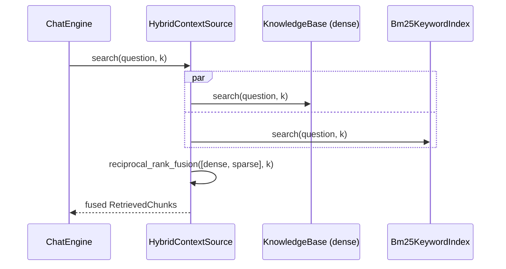

# Feature Plan: Hybrid search — dense + BM25, fused

> **Branch** `feature/hybrid-search` · **Builds on** knowledge-base (ingest + dense
> retrieval), rank-fusion (RRF), advanced-rag (context-source Strategy)

---

## Requirements

- **A third retrieval mode.** `CORA_RETRIEVAL=plain|advanced|hybrid`. In `hybrid`,
  ONE dense ranking + ONE sparse (BM25) ranking over the same corpus are fused by
  the **existing, unchanged** `reciprocal_rank_fusion`. No query planner, no
  second model call.
- **Sparse = Okapi BM25** via `rank-bm25` (pure numpy). The library lives only in
  `cora/adapters/` — the core never imports it.
- **One ingest, two stores.** Uploading a document must populate both the dense
  store and the keyword index from the *same* chunks, so a passage carries
  identical field values on both sides (RRF fuses by chunk identity).
- **No invariant regressions.** Core stays framework-free; plain/advanced behave
  bit-for-bit as today; new core logic is tested against in-memory fakes — no
  network, no model downloads.

**Acceptance** — hybrid on: a keyword-heavy question surfaces a lexically-matching
chunk that dense alone ranks lower, fused into the top_k; plain/advanced and all
existing tests unchanged; gates green; `rank_bm25` importable only under
`cora.adapters`.

---

## Design (architecture level)

Patterns: **Strategy** (context-source swap, third arm), **Facade**
(`HybridContextSource` over two indices; `KnowledgeBase` over ingest + both
stores), **Adapter** (BM25 → `Bm25KeywordIndex`), **Role interfaces**
(consumer-defined local Protocols per ISP — no new central port), **Composition
Root** (mode wiring).

- **No new port — consumer-defined role interfaces.** The dense search seam is
  already a *local* Protocol (`ContextSource` in `chat_engine`, `DocumentIndex`
  in `fusion_context_source`), not an entry in `cora.core.ports`. Hybrid follows
  that same convention, so the outward surface stays at **four ports**. A single
  `KeywordIndex` port would fuse two roles into one interface and force each
  client to depend on a method it never calls (ISP); segregating by consumer
  fixes it. `Bm25KeywordIndex` satisfies both role Protocols structurally
  (ty-verified at the root, no explicit test):
  - `HybridContextSource` consumes a *search* seam — `search(query, k) ->
    list[RetrievedChunk]` (no `list_sources`, no planner). KB and the BM25
    adapter both satisfy it.
  - `KnowledgeBase` consumes an *ingest* seam — `add(chunks, file_hash) -> None`
    — declared locally for the optional fan-out collaborator.
- **`Bm25KeywordIndex`** (`cora.adapters.bm25_keyword_index`) — the only importer
  of `rank_bm25`. Owns tokenization (lowercase + whitespace split; query and docs
  tokenized identically). `rank-bm25` has no incremental add, so `add` **rebuilds**
  the `BM25Okapi` from the full accumulated corpus; the adapter keeps the `Chunk`
  list so `search` reconstructs `RetrievedChunk`s with identical field values.
  Guards the empty corpus (`BM25Okapi([])` raises `ZeroDivisionError` → return
  `[]`) and empty query; ties break deterministically by chunk index.
- **`HybridContextSource`** (core service) — mirrors `FusionContextSource`; holds a
  dense index + a keyword index and satisfies the **unchanged**
  `ContextSource.search(query, k)`:
  `reciprocal_rank_fusion([dense.search(q,k), keyword.search(q,k)], k)`.
  `ChatEngine` is untouched.
- **Ingest fan-out (decision).** `KnowledgeBase` gains an optional
  `keyword_index` collaborator (default `None`). On a real ingest it feeds the
  keyword index the *same* chunks it just embedded; on the dedupe no-op it feeds
  neither. `None` in plain/advanced reproduces today bit-for-bit. Chosen over
  rehydrating BM25 from Chroma: one ingest path, no extra store read, and both
  sides provably share chunk identity — the RRF correctness dependency.
- **Metadata filter.** Threaded for interface symmetry but always `None` in
  hybrid (no planner) — source-narrowing stays an `advanced`-only feature.
- **Wiring + construction order (refactor).** `RETRIEVAL_HYBRID = "hybrid"`
  joins `RETRIEVAL_MODES` (`app/config.py`). Today `assemble` builds KB, then
  ingests `plugin.seed_docs`, *then* builds the context source — so a keyword
  index created inside `_context_source` would miss the seed docs on the sparse
  side. Fix the order: in hybrid, construct the keyword index and inject it into
  KB **before** the seed-doc loop, so "one ingest, two stores" holds for seed
  docs too; `_context_source` then returns `HybridContextSource` over the same
  KB + keyword index. plain/advanced keep `keyword_index=None` and are untouched.

---

## TDD checklist (red → green → refactor; commit per green)

**Legend:** **(int)** = `@pytest.mark.integration`. Everything else is unit tier
(`rank-bm25` is pure — the adapter is deterministic with no I/O or downloads).

#### Bm25KeywordIndex adapter
- [ ] over a small known corpus, `search` ranks the lexically-matching chunk first, above an unrelated one
- [ ] `search` reconstructs a `RetrievedChunk` carrying the chunk's identical `text`/`source`/`index`/`offset` (the fusion identity guard)
- [ ] a second `add` rebuilds the corpus so an earlier file's chunks stay searchable
- [ ] an empty corpus → `search` returns `[]` (guards `BM25Okapi([])` `ZeroDivisionError`)
- [ ] an empty query → `search` returns `[]`
- [ ] equal-scoring chunks come back in deterministic order (tie-break by index)

#### HybridContextSource
- [ ] `search` fuses the dense ranking and the keyword ranking via RRF — a chunk in both outranks one in a single ranking (fake dense + fake keyword) — satisfies `ContextSource`
- [ ] `search` queries each index at `k` and caps the fused result at `k`

#### KnowledgeBase fan-out
- [ ] `add_file` feeds the same chunks to the keyword index (a locally-declared `add(chunks, file_hash)` seam) after the dense store; with no keyword index it behaves bit-for-bit as today
- [ ] a duplicate-hash re-upload is a no-op for both stores — the keyword index is untouched

#### Config + composition root
- [ ] `Config` accepts `CORA_RETRIEVAL=hybrid` (`RETRIEVAL_MODES` includes it); default and unknown-value behaviour unchanged
- [ ] `assemble` in hybrid mode constructs the keyword index and injects it into KB **before** seeding, then returns a `HybridContextSource` over dense + keyword; a seed doc is searchable on the sparse side; plain/advanced unchanged
- [ ] **(int)** hybrid end-to-end over real Chroma + real BM25: a keyword-heavy question surfaces the lexical match that dense alone ranks lower

#### Invariants + docs
- [ ] architecture test still green: `HybridContextSource` and its local role Protocols import no framework (covered by the core-wide scan); `rank_bm25` lives only under `cora.adapters`; `cora.core.ports` still holds exactly four ports
- [ ] `big-picture.md` retrieve step notes plain/advanced/**hybrid** (ports table unchanged — no new port); `README` documents `CORA_RETRIEVAL=hybrid`

---

## Non-goals / YAGNI

- No stemming, stopwords, or lemmatization — tokenization is lowercase + whitespace
  split; document the richer tokenizer as a future knob, don't build it.
- No self-query / metadata filtering in hybrid — that stays `advanced`-only; the
  `metadata_filter` param is threaded for symmetry and passed `None`.
- No BM25 persistence — the index is in-memory, rebuilt per ingest; Chroma remains
  the single source of truth for chunk text/metadata.
- No `LoggingKeywordIndex` debug decorator in v1 (add later if the boundary needs it).
- No score normalization — RRF fuses by rank position, so BM25's unbounded scores
  need none against cosine.

## Risks

- **Full rebuild cost.** `rank-bm25` recomputes idf/avgdl on every `add`; fine for
  a personal KB, `O(corpus)` per upload. Revisit only if ingest latency bites.
- **Chunk-identity drift.** If the sparse side ever reconstructed a `Chunk` with a
  differing field, the same passage would double-count in fusion; the fan-out feeds
  both sides the *same* chunk objects, and a checklist item asserts the reconstruction.
- **Stale library.** `rank-bm25` last released 2022 — accepted: pure, tiny, numpy-only,
  low surface. The port isolates it; swapping to `bm25s` is one adapter.
- **Empty-corpus / empty-query crashes.** BM25 raises on an empty corpus; both edge
  cases are explicit checklist items returning `[]`.
