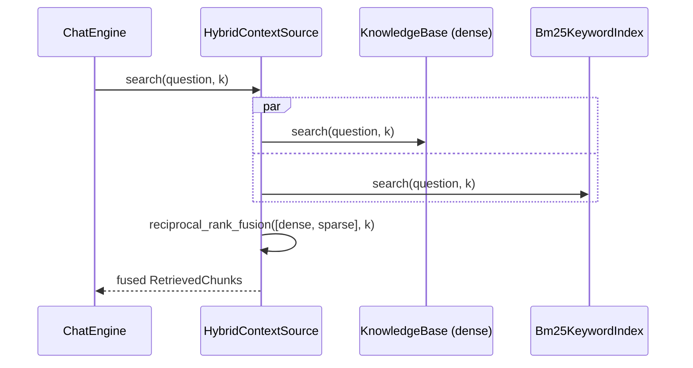

# Feature Plan: Hybrid search — dense + BM25, fused

> **Branch** `feature/hybrid-search` · **Builds on** knowledge-base (ingest + dense
> retrieval), rank-fusion (RRF), advanced-rag (context-source Strategy)

---

## Requirements

- **A third retrieval mode.** `CORA_RETRIEVAL=plain|advanced|hybrid`. In `hybrid`,
  ONE dense ranking + ONE sparse (BM25) ranking over the same corpus are fused by
  the **existing, unchanged** `reciprocal_rank_fusion`. No query planner, no
  second model call.
- **Sparse = Okapi BM25** via `rank-bm25` (pure numpy). The library lives only in
  `cora/adapters/` — the core never imports it.
- **Both stores hold the same corpus, always.** The dense store (Chroma) is
  persistent and is the single source of truth. The keyword index is in-memory and
  rebuilt from it: **rehydrated** from Chroma's full contents at startup, then kept
  fresh by a same-session fan-out on upload. Both sides carry *identical* field
  values per chunk (RRF fuses by chunk identity).
- **No invariant regressions.** Core stays framework-free; plain/advanced behave
  bit-for-bit as today; new core logic is tested against in-memory fakes — no
  network, no model downloads.

**Acceptance** — hybrid on: a keyword-heavy question surfaces a lexically-matching
chunk that dense alone ranks lower, fused into the top_k — including after a
restart, where the doc lives only in persistent Chroma (rehydration); plain/advanced
and all existing tests unchanged; gates green; `rank_bm25` importable only under
`cora.adapters`.

---

## Design (architecture level)

Patterns: **Strategy** (context-source swap, third arm), **Facade**
(`HybridContextSource` over two indices; `KnowledgeBase` over ingest + both
stores), **Adapter** (BM25 → `Bm25KeywordIndex`), **Role interfaces**
(consumer-defined local Protocols per ISP — no new central port), **Composition
Root** (mode wiring).

- **No new port — consumer-defined role interfaces.** The dense search seam is
  already a *local* Protocol (`ContextSource` in `chat_engine`, `DocumentIndex`
  in `fusion_context_source`), not an entry in `cora.core.ports`. Hybrid follows
  that same convention, so the outward surface stays at **four ports**. A single
  `KeywordIndex` port would fuse two roles into one interface and force each
  client to depend on a method it never calls (ISP); segregating by consumer
  fixes it. `Bm25KeywordIndex` satisfies both role Protocols structurally
  (ty-verified at the root, no explicit test):
  - `HybridContextSource` consumes a *search* seam — `search(query, k) ->
    list[RetrievedChunk]` (no `list_sources`, no planner). KB and the BM25
    adapter both satisfy it.
  - `KnowledgeBase` consumes an *ingest* seam — `add(chunks) -> None` — declared
    locally for the optional fan-out collaborator. No `file_hash`: KB has already
    deduped against Chroma before it calls this, so the sparse side never needs it
    — threading it would be symmetry the parameter doesn't earn.
- **`Bm25KeywordIndex`** (`cora.adapters.bm25_keyword_index`) — the only importer
  of `rank_bm25`. Owns tokenization (lowercase + whitespace split; query and docs
  tokenized identically). `rank-bm25` has no incremental add, so it **rebuilds**
  the `BM25Okapi` from the full accumulated corpus on every change; it keeps the
  `Chunk` list so `search` reconstructs `RetrievedChunk`s with identical field
  values. Seeded from the same source of truth two ways: `from_chunks(corpus)` for
  the startup rehydration, `add(chunks)` for the same-session fan-out.
  `search` sorts by an explicit `(-score, position)` key where `position` is the
  chunk's **corpus index** (unique, stable per build) — **not** `Chunk.index`, a
  per-document sequence number that collides across sources, and **not**
  `get_top_n`, whose `np.argsort` is unstable — so ties are deterministic. Guards
  the empty corpus
  (`BM25Okapi([])` raises `ZeroDivisionError` → `[]`) and the empty query
  (`get_scores([])` is all-zeros, not a crash → `[]`).
- **`HybridContextSource`** (core service) — mirrors `FusionContextSource`; holds a
  dense index + a keyword index and satisfies the **unchanged**
  `ContextSource.search(query, k)`:
  `reciprocal_rank_fusion([dense.search(q,k), keyword.search(q,k)], k)`.
  `ChatEngine` is untouched.
- **Rehydrate at startup (primary correctness fix).** Chroma is persistent, so on
  every launch after the first the seed docs (and every prior upload) already live
  there and `add_file` short-circuits on the hash — a fan-out-only keyword index
  would be **empty after a restart**, silently collapsing hybrid to dense-only
  while every fresh-store test stays green. So the keyword index is rebuilt from
  Chroma's full contents at startup. Reading the corpus back is a new
  `all_chunks() -> list[Chunk]` on the **concrete** `ChromaRetriever`
  (reconstructing each `Chunk` from its stored document text + metadata), consumed
  only by the composition root — **not** added to the `Retriever` port, so the
  outward surface stays at four ports (ISP).
- **Same-session fan-out.** `KnowledgeBase` gains an optional `keyword_index`
  collaborator (default `None`). A freshly uploaded doc enters Chroma *this
  session*, which startup rehydration can't see, so on a real ingest KB also feeds
  the keyword index the *same* chunks it just embedded; the dedupe no-op feeds
  neither. Rehydration + fan-out together keep both stores consistent across
  restarts and within a session, with Chroma the single source of truth. `None` in
  plain/advanced reproduces today bit-for-bit. This makes KB a *dual*-store write
  coordinator (dense + optional sparse) — a deliberate SRP call, not drift: dedupe
  lives in KB and the fan-out must respect it, so splitting the write across KB and
  the root would scatter one decision. KB keeps a single "own the corpus writes"
  responsibility; the sparse side is one more thing it coordinates, not a second
  reason to change.
- **No metadata filter on this path.** The sparse search role is
  `search(query, k)`, full stop — the same rule that drops `file_hash` from the
  `add` seam. Hybrid has no planner, so a filter would be unconditionally `None`;
  `ContextSource.search` is two-arg anyway and BM25 has no metadata index to
  filter on. Source-narrowing stays an `advanced`-only feature by not existing
  here, not by threading an always-`None` param.
- **Wiring + construction order (refactor).** `RETRIEVAL_HYBRID = "hybrid"` joins
  `RETRIEVAL_MODES` (`app/config.py`). In hybrid, `build` — which knows the
  concrete `ChromaRetriever` — rehydrates `Bm25KeywordIndex.from_chunks(
  retriever.all_chunks())` and passes it into `assemble`. `assemble` injects the
  keyword index into KB **before** the seed-doc loop (so a genuinely new seed doc
  fans out to the sparse side too; docs already in Chroma are covered by
  rehydration and correctly skipped by dedupe), then returns `HybridContextSource`
  over the same KB + keyword index. plain/advanced pass `keyword_index=None` and
  are untouched. One object satisfies both role seams (KB's `add`, the source's
  `search`); the root genuinely uses both, so its own view of the parameter is the
  *intersection* of the two roles — not an ISP violation, and expressible as a
  root-local `KeywordStore(Protocol)` listing `add` + `search`. The consumer
  Protocols stay segregated where they're declared; the root gets a third, local
  view. Typing the parameter as the concrete `Bm25KeywordIndex | None` instead
  would drag `cora.adapters.bm25_keyword_index` (hence `rank_bm25`) into
  `assembly`'s import graph at module load — regressing the deliberate deferral of
  heavy adapters into `build`. So: a root-local `KeywordStore` Protocol, or if the
  concrete name is preferred, reference it under `TYPE_CHECKING` with `from
  __future__ import annotations` so it stays type-only.

---

## TDD checklist (red → green → refactor; commit per green)

**Legend:** **(int)** = `@pytest.mark.integration`. Everything else is unit tier
(`rank-bm25` is pure — the adapter is deterministic with no I/O or downloads).
**Prerequisite (not a test):** `uv add rank-bm25`.

#### Bm25KeywordIndex adapter
- [x] over a small known corpus, `search` ranks the lexically-matching chunk first, above an unrelated one
- [x] `search` reconstructs a `RetrievedChunk` carrying the chunk's identical `text`/`source`/`index`/`offset` (the fusion identity guard)
- [x] `from_chunks(corpus)` seeds the whole corpus searchable in one build (the rehydration entry point)
- [x] a second `add` rebuilds the corpus so an earlier file's chunks stay searchable
- [x] an empty corpus → `search` returns `[]` (guards `BM25Okapi([])` `ZeroDivisionError`)
- [x] an empty query → `search` returns `[]` (`get_scores([])` is zeros, not a crash)
- [x] equal-scoring chunks come back in deterministic order, tie-broken by **corpus position** — not `Chunk.index` (collides across sources) and not `get_top_n`'s unstable `argsort`

#### HybridContextSource
- [x] `search` fuses the dense ranking and the keyword ranking via RRF — a chunk in both outranks one in a single ranking (fake dense + fake keyword) — satisfies `ContextSource`
- [ ] `search` queries each index at `k` and caps the fused result at `k`

#### KnowledgeBase fan-out
- [ ] `add_file` feeds the same chunks to the keyword index (a locally-declared `add(chunks)` seam) after the dense store; with no keyword index it behaves bit-for-bit as today
- [ ] a duplicate-hash re-upload is a no-op for both stores — the keyword index is untouched

#### Config + composition root
- [ ] `Config` accepts `CORA_RETRIEVAL=hybrid` (`RETRIEVAL_MODES` includes it); default and unknown-value behaviour unchanged
- [ ] `assemble` in hybrid mode returns a `HybridContextSource` over the dense KB + the given `keyword_index`
- [ ] `assemble` injects `keyword_index` into KB **before** the seed loop, so a genuinely new seed doc is searchable on the sparse side
- [ ] `assemble` with `keyword_index=None` (plain/advanced) is bit-for-bit unchanged
- [ ] **(int)** `ChromaRetriever.all_chunks()` round-trips every stored chunk with identical `text`/`source`/`index`/`offset`
- [ ] **(int)** rehydration across a restart: a second `build` over an already-populated persistent Chroma path finds a prior doc on the sparse side **exactly once** — corpus size unchanged after the dedupe-skipped seed loop (guards the fan-out-only regression *and* rehydrate/fan-out double-counting)
- [ ] **(int)** hybrid end-to-end over real Chroma + real BM25: a keyword-heavy question surfaces the lexical match that dense alone ranks lower — fixture tokens must match under lowercase + whitespace split (e.g. `fitness.` ≠ `fitness`), so the pass is for the right reason

#### Invariants + docs
- *(note, not an increment)* `HybridContextSource` and its local role Protocols import no framework — already covered by the existing core-wide scan; nothing new to write
- [ ] `rank_bm25` is added to `FORBIDDEN_FRAMEWORKS` and a planted core import of it is caught (mirrors the Streamlit / outer-layer planted-violation tests — the scan does *not* cover `rank_bm25` today)
- [ ] `big-picture.md` retrieve step notes plain/advanced/**hybrid** (ports table unchanged — no new port); `README` (line ~46, currently "must be `plain` or `advanced`") documents `CORA_RETRIEVAL=hybrid`

---

## Non-goals / YAGNI

- No stemming, stopwords, or lemmatization — tokenization is lowercase + whitespace
  split; document the richer tokenizer as a future knob, don't build it.
- No self-query / metadata filtering in hybrid — that stays `advanced`-only, and
  by *not existing* on this path: the sparse search seam is `search(query, k)`,
  with no always-`None` `metadata_filter` param threaded for symmetry.
- No *persisted* BM25 artifact — the index is in-memory, rehydrated from Chroma at
  startup and rebuilt per ingest; Chroma remains the single source of truth for
  chunk text/metadata. Rehydration itself is not optional (see the primary fix
  above); only on-disk BM25 persistence is out of scope.
- No `LoggingKeywordIndex` debug decorator in v1 (add later if the boundary needs it).
- No score normalization — RRF fuses by rank position, so BM25's unbounded scores
  need none against cosine.

## Risks

- **Full rebuild cost.** `rank-bm25` recomputes idf/avgdl on every `add` and once
  at startup to rehydrate the full corpus; fine for a personal KB, `O(corpus)`.
  Revisit only if ingest/startup latency bites.
- **Chunk-identity drift.** RRF double-counts a passage if the sparse side ever
  reconstructs a `Chunk` with a differing field. There are now two reconstruction
  paths — the fan-out (the same chunk objects KB embedded) and `all_chunks()`
  (rebuilt from Chroma's stored text + metadata) — and both must yield identical
  fields; checklist items assert each.
- **Stale library.** `rank-bm25` last released 2022 — accepted: pure, tiny,
  numpy-only, low surface. The adapter isolates it; swapping to `bm25s` is one file.
- **Empty corpus.** `BM25Okapi([])` raises `ZeroDivisionError`; an empty query does
  *not* raise (`get_scores([])` returns zeros). Both return `[]` via explicit
  guards, and both are checklist items.
