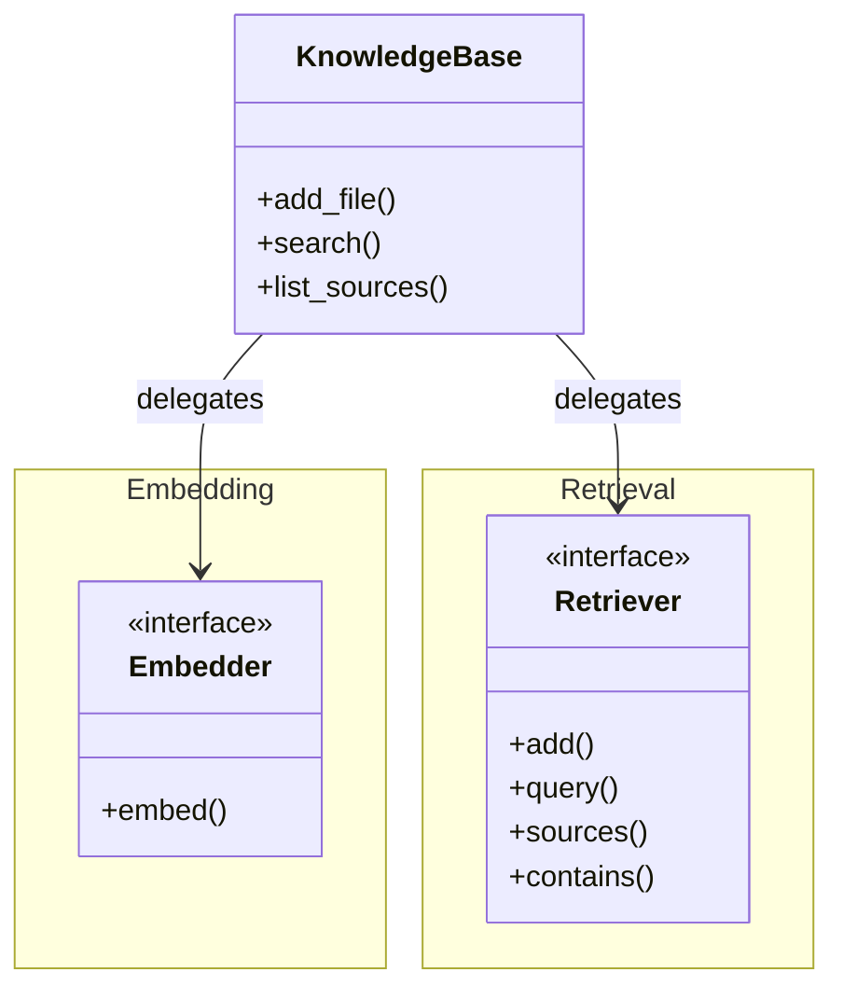
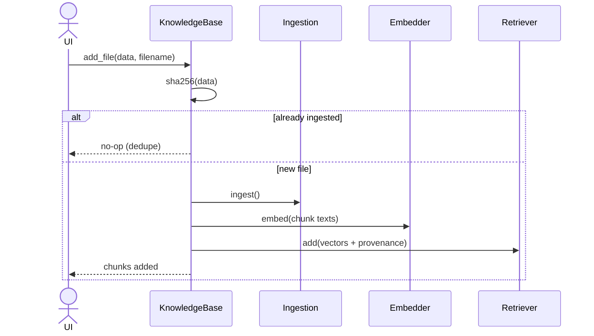
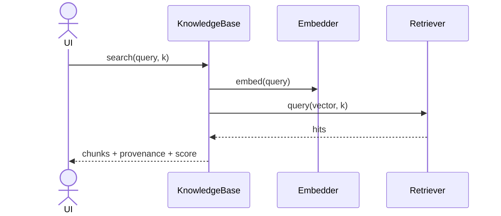

# Feature Plan: Knowledge Base

> **Roadmap** item 3 (`webapp-overview.md` §10) · **Branch** `feature/knowledge-base` · **Builds on** ingestion (item 2, done)

---

## Requirements

From the architecture plan (§3 ports, §4 Knowledge Base, §6 flows, §8 tiers):

- Introduce the **embedder** and **retriever** ports (narrow, core-owned). The chat-model port is deferred to item 6, where its first consumer appears.
- Provide **in-memory fakes** for both, so all core logic runs in the unit tier — no network, no model downloads, no vector store. The fakes double as proof the ports suffice.
- Provide the two real **adapters**, one volatile dependency each: **Chroma** (embedded + persistent) retriever, and lazy-loaded **sentence-transformers** embedder. Exercised only in the integration tier.
- Provide the **Knowledge Base facade** (`add_file`, `list_sources`, `search`), reusing `docchat.ingestion.ingest` for the ingest step.
- **Dedupe re-uploads** by content hash — re-adding a file is idempotent.
- Adapter failures surface as typed `DocChatError`s with user messages — no `chromadb` / `sentence-transformers` exception escapes its adapter.

**Acceptance** — the facade ingests a doc, lists it, and returns relevant chunks with provenance:

- against fakes in the unit tier, and end-to-end with the real adapters in the integration tier
- re-uploads change nothing
- all quality gates green

---

## Design (architecture level)

### Structure

The facade *delegates* to the two ports:

Each port is provided by a unit-tier **fake** and an integration-tier **real adapter** (Chroma, sentence-transformers) implementing the identical interface — the hexagonal seam that keeps the core vendor-free and unit-testable.

### Runtime flows

**`add_file`**:

**`search`**:

### Key decisions

Each decision names the alternative it was chosen over.

- **Two ports** (Ports & Adapters / Strategy) — each is a separate, independently fakeable interface:
    - the retriever also exposes read operations (`sources`, `contains`) so the facade can list sources and dedupe by reading the store back, with no second persistence layer
- **Embedding lives in the facade**, not inside the retriever adapter (which would couple both dependencies, force the fake to embed, and risk documents and queries using different models):
    - the facade owns both embed calls, so documents and queries share one embedder
    - the retriever stays a thin store over Chroma's precomputed-`embeddings=` path, so Chroma's own model never runs
- **Ports speak relevance scores**, not raw distances (which are metric-specific — a normalized score, higher = more relevant, keeps core, fake, and UI on one convention):
    - the fake computes cosine similarity directly
    - the Chroma adapter translates its distance metric into the same convention
    - cosine space with unit-normalized vectors, chosen deliberately
- **Retrieved chunk = value object** — a `Chunk` plus a relevance `score`, immutable (a richer provenance or a separate store-record type is unnecessary, as `Chunk` already maps straight to metadata):
    - equality by content
    - the direct input to citation rendering
    - composes `Chunk` rather than repeating its provenance fields
- **Facade holds no technology** — depends only on the two ports:
    - tests wire the fakes
    - the composition root (item 6) wires the real adapters
- **Dedupe via stdlib `hashlib`**, first-write-wins with `add` rather than `upsert` (content-hash ids already make re-adds idempotent, so `add` is the simpler contract):
    - hash the file bytes
    - chunk ids = hash + index (deterministic)
    - skip before embedding when the retriever already `contains` that hash
    - store the hash as a string metadata field
    - keyed on content, so identical bytes under a different filename are the same document (first filename wins)
- **Confinement**, never via Chroma's own embedding function (which would download a second model, split the embedding source, and break confinement):
    - `chromadb` and `sentence-transformers` each live in exactly one module
    - the embedder lazy-loads its model on first use, so import stays cheap and the model stays out of the unit tier
    - adapters catch their library's exceptions and re-raise typed errors
- **Testing tiers** — this branch introduces the integration tier and the first `conftest.py` (per-test temp dir + unique collection name, so Chroma state never leaks).

---

## TDD checklist

Each item is one red → green → refactor cycle. Commit each green step. Ordered bottom-up.
**Legend:** **(int)** = `@pytest.mark.integration` (real infrastructure, CI tier). Everything else is unit tier.

#### Retrieved-chunk value object
- [x] a retrieved chunk is immutable: text + provenance + score, equal by content, mutation fails

#### Fake embedder
- [x] maps texts to deterministic fixed-dim vectors: identical text → identical vector, different texts differ, a batch embeds element-wise

#### Fake retriever
- [x] querying an empty retriever yields no hits, no error
- [x] returns stored records ordered most-relevant-first by cosine similarity, capped at k, each hit carrying provenance + score
- [x] k larger than the store returns every record, and the closest vector ranks first
- [x] `sources` lists each stored source once, and `contains` reports whether a content hash is present (drives `list_sources` and dedupe)

#### Facade (against both fakes)
- [x] `add_file` ingests, embeds every chunk once, and stores one record per chunk with provenance, reporting how many chunks were added
- [x] `search` returns the top-k relevant chunks, ordered, with provenance + score (a query equal to a chunk's text retrieves that chunk first — proves query and docs share one embedder)
- [x] `search` on an empty KB returns no hits, no error
- [x] `list_sources` returns each source once across multiple files
- [x] re-adding identical bytes is a no-op: no duplicate chunks, source listed once, embedder not called again
- [x] a rejected ingestion (unsupported / empty / oversized) propagates its typed error unchanged

#### Errors
- [x] the adapter error categories (embedding failed, retrieval failed) are `DocChatError` subtypes with user messages

#### Chroma adapter — `uv add 'chromadb>=1.5,<2'` at the first red step
- [x] **(int)** a `conftest.py` fixture gives each test a temp dir + unique collection, so Chroma state never leaks
- [x] **(int)** round-trips with our own precomputed embeddings (no Chroma embedding function): query returns records ordered by relevance with provenance + scores
- [x] **(int)** `sources` and `contains` read stored metadata back (drive `list_sources` and dedupe against real Chroma)
- [x] **(int)** records persist across a fresh client on the same directory
- [x] **(int)** content-hash ids make re-adds idempotent (no duplication)
- [x] **(int)** a Chroma failure surfaces as the typed retrieval error

#### sentence-transformers adapter — `uv add 'sentence-transformers>=5.3,<6'` at the first red step
- [x] **(int)** lazy-loaded: importing the module loads nothing, and the model is built on first embed
- [x] **(int)** encodes texts to 384-dim unit vectors, and identical text → identical vector

#### End-to-end
- [x] **(int)** the facade wired with both real adapters ingests a doc and retrieves the relevant chunk, provenance intact

#### Post-review fixes
- [x] **(int)** the sentence-transformers adapter re-raises library failures as `EmbeddingError` (no raw exception escapes)
- [ ] **(int)** `ChromaRetriever` construction failures surface as `RetrievalError`
