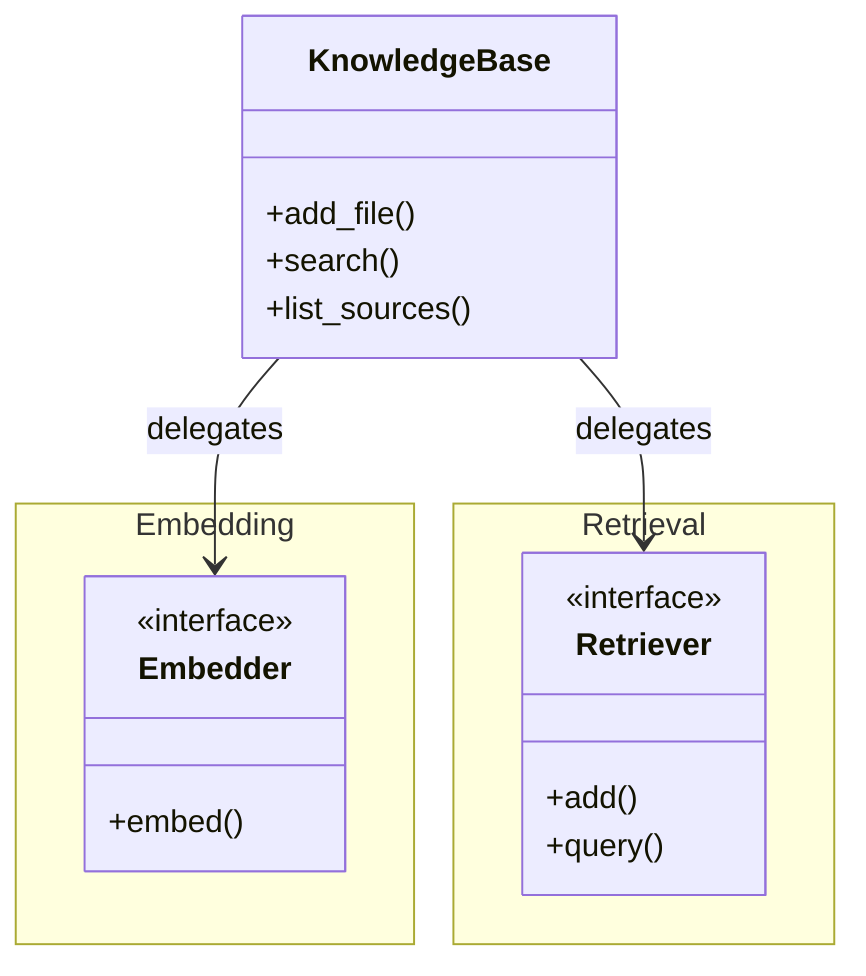
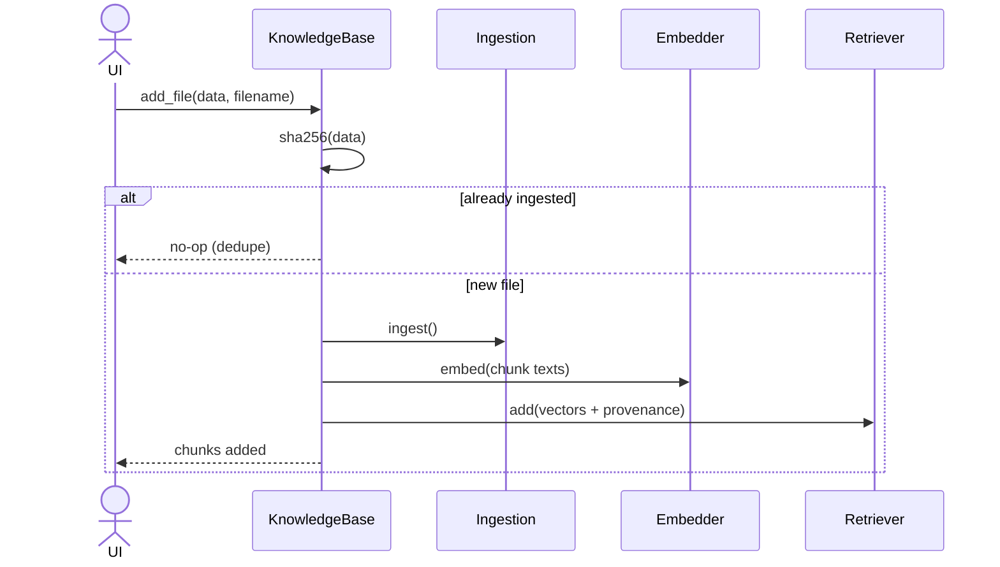
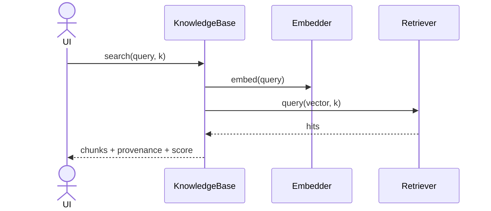

# Feature Plan: Knowledge Base

> **Roadmap** item 3 (`webapp-overview.md` §10) · **Branch** `feature/knowledge-base` · **Builds on** ingestion (item 2, done)

---

## Requirements

From the architecture plan (§3 ports, §4 Knowledge Base, §6 flows, §8 tiers):

- Introduce the **embedder** and **retriever** ports (narrow, core-owned). The chat-model port is deferred to item 6, where its first consumer appears.
- Provide **in-memory fakes** for both, so all core logic runs in the unit tier — no network, no model downloads, no vector store. The fakes double as proof the ports suffice.
- Provide the two real **adapters**, one volatile dependency each: **Chroma** (embedded + persistent) retriever and lazy-loaded **sentence-transformers** embedder. Exercised only in the integration tier.
- Provide the **Knowledge Base facade**: `add_file` (ingest via `docchat.ingestion.ingest` → embed → store with provenance), `list_sources`, `search`.
- **Dedupe re-uploads** by content hash: re-adding a file is idempotent and short-circuits before the embed step.
- Adapter failures surface as typed `DocChatError`s with user messages; no `chromadb` / `sentence-transformers` exception escapes its adapter.

> **Acceptance** — the facade ingests a doc, lists it, and returns relevant chunks with provenance: in the unit tier against fakes *and* end-to-end with the real adapters in the integration tier; re-uploads change nothing; all gates green.

---

## Design (architecture level)

### Structure

The facade *delegates* to two ports; each is a narrow interface with a unit-tier fake and an integration-tier real adapter. The core imports no vendor library.

Each port is provided by a unit-tier **fake** and an integration-tier **real adapter** (Chroma, sentence-transformers) implementing the identical interface — the hexagonal seam that keeps the core vendor-free and unit-testable.

### Runtime flows

**`add_file`** — hash, dedupe-check, ingest, embed, store:

**`search`** — embed the query, retrieve the top-k:

### Key decisions

| Decision | Rationale |
|---|---|
| **Two ports** (Ports & Adapters / Strategy) — embedder: text→vectors; retriever: a vector index (store records, query top-k) | each is independently fakeable and confines one volatile dependency |
| **Embedding lives in the facade**, above the retriever port | the facade owns both embed calls, so documents and queries share one embedder; the retriever stays a thin store mapping onto Chroma's precomputed-`embeddings=` path (its own model never runs) |
| **Ports speak relevance scores**, not raw distances (higher = more relevant) | the fake computes cosine similarity; the Chroma adapter translates its distance metric — core, fake, and UI share one convention. Cosine space + unit-normalized vectors |
| **Retrieved chunk = value object** — text + provenance (source, index, offset) + score, immutable | equality by content; the direct input to citation rendering; extends the `Chunk` pattern |
| **Facade holds no technology** | depends only on the two ports, so tests wire fakes and the composition root (item 6) wires the real adapters |
| **Dedupe via stdlib `hashlib`** | hash the file bytes; deterministic chunk ids = hash + index; skip before embedding if the hash is present; first-write-wins (`add`); hash stored as a string metadata field |
| **Confinement** | `chromadb` and `sentence-transformers` each live in one module; the embedder lazy-loads its model on first use (import stays cheap, model out of the unit tier); adapters re-raise typed errors |
| **Testing tiers** | this branch introduces the integration tier and the first `conftest.py` (per-test temp dir + unique collection name so Chroma state never leaks) |

---

## TDD checklist

Each item is one red → green → refactor cycle; commit each green step; ordered bottom-up.
**Legend:** **(int)** = `@pytest.mark.integration` (real infrastructure, CI tier); everything else is unit tier.

#### Retrieved-chunk value object
- [ ] a retrieved chunk is immutable: text + provenance + score, equal by content, mutation fails

#### Fake embedder
- [ ] maps texts to deterministic fixed-dim vectors: identical text → identical vector, different texts differ, a batch embeds element-wise

#### Fake retriever
- [ ] querying an empty retriever yields no hits, no error
- [ ] returns stored records ordered most-relevant-first by cosine similarity, capped at k, each hit carrying provenance + score
- [ ] k larger than the store returns every record; the closest vector ranks first

#### Facade (against both fakes)
- [ ] `add_file` ingests, embeds every chunk once, stores one record per chunk with provenance; reports chunks added
- [ ] `search` returns the top-k relevant chunks, ordered, with provenance + score (a query equal to a chunk's text retrieves that chunk first — proves query and docs share one embedder)
- [ ] `search` on an empty KB returns no hits, no error
- [ ] `list_sources` returns each source once across multiple files
- [ ] re-adding identical bytes is a no-op: no duplicate chunks, source listed once, embedder not called again
- [ ] a rejected ingestion (unsupported / empty / oversized) propagates its typed error unchanged

#### Errors
- [ ] the adapter error categories (embedding failed, retrieval failed) are `DocChatError` subtypes with user messages

#### Chroma adapter — `uv add 'chromadb>=1.5,<2'` at the first red step
- [ ] **(int)** round-trips with our own precomputed embeddings (no Chroma embedding function): query returns records ordered by relevance with provenance + scores
- [ ] **(int)** records persist across a fresh client on the same directory
- [ ] **(int)** content-hash ids make re-adds idempotent (no duplication)
- [ ] **(int)** a Chroma failure surfaces as the typed retrieval error

#### sentence-transformers adapter — `uv add 'sentence-transformers>=5.3,<6'` at the first red step
- [ ] **(int)** lazy-loaded: importing the module loads nothing; the model is built on first embed
- [ ] **(int)** encodes texts to 384-dim unit vectors; identical text → identical vector

#### End-to-end
- [ ] **(int)** the facade wired with both real adapters ingests a doc and retrieves the relevant chunk, provenance intact

---

## Rejected alternatives

| Rejected | Why not |
|---|---|
| Embedding inside the retriever adapter | couples both dependencies, forces the fake to embed, risks documents and queries using different models |
| `upsert` over `add` | content-hash ids make both idempotent; first-write-wins is the simpler contract |
| Chroma's own embedding function | downloads a second model, splits the embedding source, breaks confinement |
| Raw distances through the port | metric-specific; a normalized score keeps core, fake, and UI on one convention |
| Richer provenance / a distinct store-record type | `source, index, offset` already suffice and map straight to metadata |
