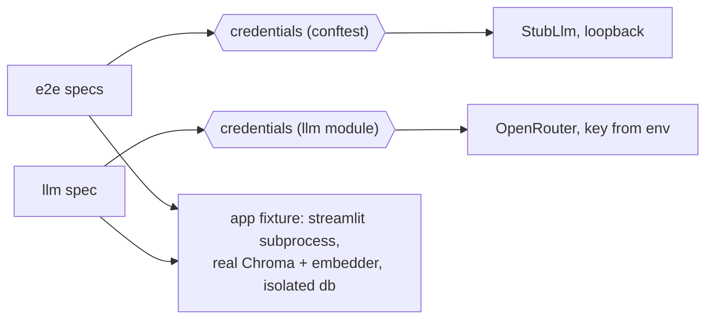

# Feature Plan: llm-acceptance-tier

## Goal

Make the documented fourth test tier real. `pyproject.toml` registers the `llm`
marker and the README advertises `uv run pytest -m llm`, but no test carries the
marker — the command selects nothing. After this branch, one spec performs a
genuine OpenRouter round-trip including a tool call, asserted structurally, and
skips cleanly without a key.

## Acceptance criteria

- With a key (`uv run --env-file .env pytest -m llm`): at least one real
  round-trip through the full stack — chromium → Streamlit subprocess →
  composition root → real Chroma/embedder → OpenRouter — with at least one
  successful tool call; assertions structural, never model prose.
- Without the key: `-m llm` reports a skip whose reason names
  `OPENROUTER_API_KEY` — never a failure, never a silent pass.
- `uv run pytest`, `-m integration`, `-m e2e`, and both CI jobs select exactly
  what they select today; nothing new in the default tier touches the network.

## Design

Only the test harness changes; production code is untouched. The seam already
exists: the e2e `credentials` fixture (`tests/e2e/conftest.py`) is the one point
where the app's LLM endpoint is chosen.

- **Strategy at the fixture seam** — `credentials` is the harness-level port;
  the stub binding (conftest) and a live binding (new llm module) are its two
  strategies. This mirrors the ports-and-fakes design one level up.
- **Signature convention extended** — specs taking `stub` are stub-only; the
  live module takes neither `stub` nor scripts, so live-ness is visible in the
  module, and no stub server ever boots for a live run.
- **Harness fallback** — `running_app` currently pins `CORA_MODEL=stub-model`;
  the live path omits the override so the composition root's shipped default
  model is exercised, as in production.

## Decisions

1. **Vehicle: hybrid** — reuse the browser harness (`app` fixture, page
   objects, real composition root through the UI) in a dedicated llm-marked
   module, not a rebind of all e2e specs: scripted-prose specs can never pass
   live. Rejected: engine-level test without a browser (contradicts the
   recorded "e2e specs are the vehicle" design, bypasses the shell);
   parametrising conftest `credentials` (burns paid calls on guaranteed
   failures).
2. **Selection: module-local `credentials` override**, module marked `llm`
   only — one marker, one meaning; `-m e2e` and CI untouched by construction.
   Rejected: also marking it `e2e` (correctness would rest on CI's `not llm`
   guard instead of selection semantics).
3. **Key: process environment only.** `uv run --env-file .env` stays the user's
   explicit act; missing key → fixture-level skip with a clear reason.
   Rejected: auto-loading `.env` in conftest (new dependency plus ambient
   behaviour in every tier for one manual command).
4. **Nondeterminism: one question, structural assertions.** "What is my BMI at
   80 kg and 1.80 m?" reliably triggers `calculate_bmi` (confirmed by a manual
   acceptance run). Assert: an answer appeared, the tool panel holds a number
   and no tool-error text, no exception rendered. Tolerate extra tool calls and
   absent citations; keep the 180 s timeout.
5. **CI: no change needed.** `addopts` deselects `llm` by default and `ci.yml`
   restates `not llm` in both jobs; the checklist carries verification only.

## TDD checklist

- [x] Write a test that shows `app_env` sets no `CORA_MODEL` when the caller
      gives no model override, so a launched app falls back to the composition
      root's default model (unit tier, fake env).
- [ ] Write a test that shows the live-credentials helper returns the real
      OpenRouter base URL and the key when `OPENROUTER_API_KEY` is set in a
      fake env (unit tier).
- [ ] Write a test that shows the helper raises pytest's skip, with a reason
      naming `OPENROUTER_API_KEY`, when the key is absent (unit tier).
- [ ] Write the llm module skeleton — marked `llm`, module-local `credentials`
      fixture built on the helper, no stub: red is today's `-m llm` collecting
      nothing; green is a key-less run reporting exactly one skip with the
      helper's reason.
- [ ] Write the live acceptance spec body — ask the BMI question; assert an
      assistant answer appeared, the tool panel holds a number and no
      tool-error text, and no exception element rendered: red is the wired-up
      spec failing against a dummy key for the right reason; green is
      `uv run --env-file .env pytest -m llm` passing end-to-end.
- [ ] Verify selection is unchanged: default, `-m integration`, and `-m e2e`
      runs collect the same counts as trunk; ci.yml's two `not llm` exclusions
      still stand.
- [ ] Update README: working invocation with `--env-file`, skip behaviour, one
      line that the run costs real tokens.
- [ ] Update `docs/plans/webapp-overview.md` §8: retargeting is now a dedicated
      llm-marked module keyed by the environment, not a source edit.

## Out of scope

- Retry/flake machinery for the live spec — revisit only if the single
  question proves flaky in practice.
- Live variants of adversarial specs (loop cap, 429, missing key) — stub-only
  by design.
- CI changes of any kind; the deferred test-layout migration.
