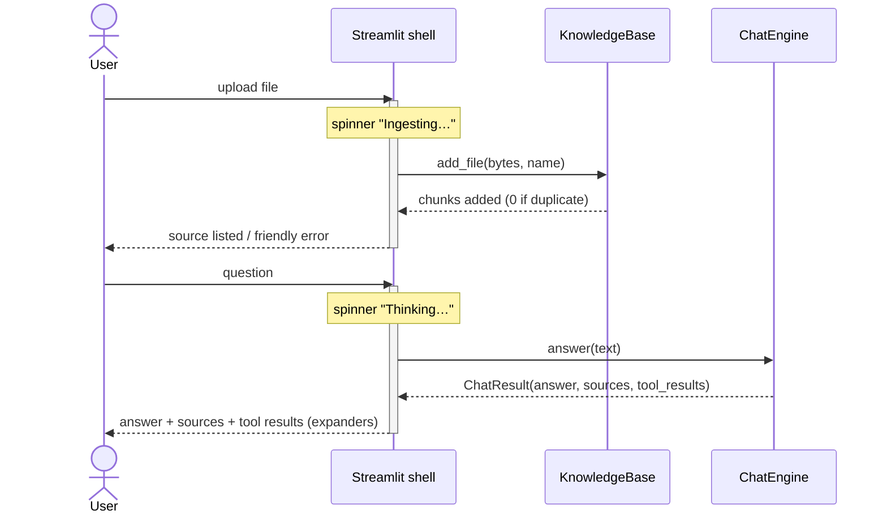

# Feature Plan: Streamlit UI

> **Roadmap** item 7 (`webapp-overview.md` §10, final item) · **Branch** `feature/streamlit-ui` · **Builds on** chat engine (item 6) + composition root, done
>
> Design spec (brainstorming). The TDD checklist is added by the writing-plans step.

---

## Requirements

From the architecture plan (§4 UI-shell role, §6 runtime flows, §8 testing tiers, §9 security) and the brainstorming decisions:

- Build the **replaceable frontend**: a thin Streamlit shell — widgets only, no business logic — over the existing `ChatEngine` + `KnowledgeBase`.
- **Streamlit confined to one place** (`cora/app/ui/`); the architecture test already forbids `streamlit` in `cora.core`. Extend it to keep `streamlit` out of everywhere but the UI shell.
- **Composition root exposes both services** — `build_engine` returns an `App` facade `{engine, knowledge_base}`; the UI depends on that single object.
- **Progress** via Streamlit spinners around the coarse calls (ingest, answer) — no core Observer this round.
- **Errors as friendly messages** — every `CoreError` surfaces as `err.user_message`; no stack traces. Missing API key (`ConfigurationError`) shows a friendly startup message, no chat thread.
- **Secrets** only from env via `Config.from_env`; the UI never reads env directly, never logs the key.
- **Acceptance** — upload a doc → ask → answer with visible sources + tool results; spinners during ingest/answer; all quality gates green; one headless smoke test passes.

---

## Design (architecture level)

`<<existing>>` = reused unchanged.

- **`App` facade** (`cora.app.composition`) — frozen dataclass `{engine: ChatEngine, knowledge_base: KnowledgeBase}`. `assemble` builds the KB once and returns it inside `App`; `build_engine(Config) -> App` wires real adapters. `ChatEngine` `<<existing>>` stays a pure orchestrator (no ingestion role).
- **UI shell** (`cora.app.ui`) — the sole `import streamlit`:
  - `main()` — resolves the `App` from an **injectable factory** (`@st.cache_resource`, built once), then renders. Injectable so the smoke test wires fakes without env/adapters.
  - **Sidebar** — file uploader (txt/md/pdf); on upload `st.spinner("Ingesting…")` → `kb.add_file(bytes, name)` (dedupe is free — KB hashes); below it, source list from `kb.list_sources()`.
  - **Main** — chat thread from `st.session_state` history; on submit `st.spinner("Thinking…")` → `engine.answer(text)`; render answer with **sources** and **tool results** each in an `st.expander`.
  - **Errors** — wrap service calls; `CoreError` → `st.error(user_message)`. Startup `ConfigurationError` → friendly message, no thread.
- **Pure helpers** (framework-free, unit-tested) — map a `ChatResult` → display parts (answer, source lines, tool-result lines) and format a `ToolResult`. Keeps rendering logic out of Streamlit calls.
- **State** — `App` cached as a resource (built once across reruns); chat history in `st.session_state`; uploads deduped by content hash in the KB.

---

## Testing (§8 tiers)

- **Unit (default)** — pure helpers: `ChatResult`/`ToolResult` → display parts; no Streamlit, no network.
- **Integration (CI)** — one **headless `streamlit.testing.v1.AppTest`** smoke test with a **fake-wired `App`**: upload a doc, ask a question, assert answer + sources render and no exception surfaces.
- **Architecture** — extend `test_architecture.py`: `streamlit` importable only from `cora.app.ui`.

---

## Entry point & docs

- `streamlit run` target — a module under `cora/app/ui/` that calls `main()` (builds the real `App` via `build_engine(Config.from_env())`).
- **README** — run command, required env (`OPENROUTER_API_KEY`, optional `CORA_*`), and a one-line "upload → ask" walkthrough.

---

## Open questions / risks

- **AppTest fake injection** — the shell must let the smoke test supply a fake `App` (factory override / module seam) without touching env or real adapters; keep that seam minimal.
- **Streamlit rerun model** (§11) — engine cached as a resource, history in session state, upload dedupe by hash; all already covered above.
- **PDF upload in tests** — smoke test uses a txt/md fixture to avoid PDF/model weight in CI; PDF path exercised by ingestion's own tests.
- **`streamlit` version churn** — pin a minor version; confined to the one shell.

---

## Verification (end-to-end)

- Unit tier: `uv run pytest` — new helper tests green; no network/models/UI.
- Integration tier: `uv run pytest -m integration` — AppTest smoke test green.
- Gates: `ruff format --check`, `ruff check`, `ty check` all clean.
- Manual (`-m llm`, real key): `streamlit run …` → upload a PDF → ask → cited answer; a fitness question runs tools; spinners visible.
