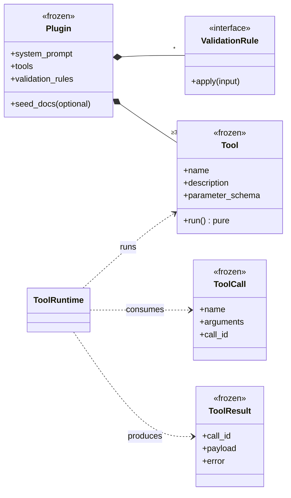
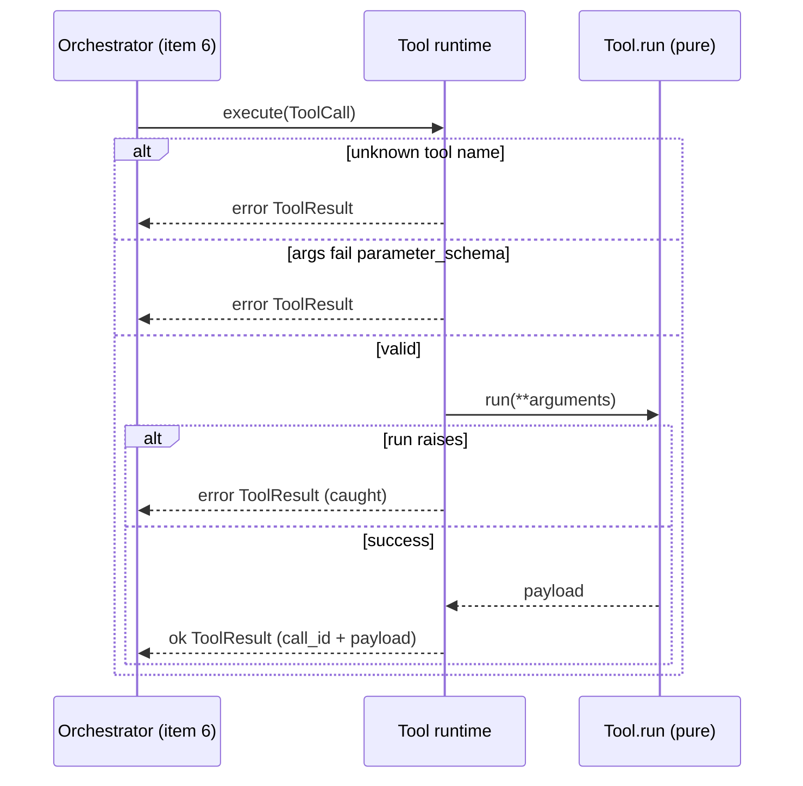

# Feature Plan: Tools & Plugin Contract

> **Roadmap** item 4 (`webapp-overview.md` §10) · **Branch** `feature/tools-and-plugin-contract` · **Builds on** knowledge base (item 3, done)

---

## Requirements

From the architecture plan (§4 component table + plugin-contract classDiagram, §6 chat flow, §9 security):

- Define the **plugin contract** value objects (`Plugin`, `Tool`, `ToolCall`, `ToolResult`) and a `ValidationRule` port — a plugin is *data, not behaviour*, so adding a domain needs zero core changes.
- Provide the **Tool Runtime**: execute an LLM-requested `ToolCall`, turning unknown tool / invalid args / a raising tool all into error `ToolResult` data, never an exception.
- Provide the **Validation Pipeline**: chain core rules (empty, too long) then plugin rules, raising the first rejection or passing valid input through.
- Provide the **Plugin Registry**: resolve a configured name to a loaded `Plugin` by import-by-name, failing loudly with typed errors on any bad plugin.

**Scope guard** — this branch is unit-tier only, tested against plain in-memory `Tool`/rule stubs. The chat orchestrator and the LangChain/OpenRouter LLM adapter that *drive* these parts are **item 6** — not built here.

**Acceptance** — the runtime, pipeline, and registry each behave correctly against stubs, every failure mode is covered, and all quality gates are green.

---

## Design (architecture level)

### Structure

The core owns the contract; runtime, pipeline, and registry consume it.

### Runtime flows

**Tool execution:**

### Key decisions

Each decision names the alternative it was chosen over.

- **Value objects = `@dataclass(frozen=True)`, ports = `typing.Protocol`** (over ABCs) — matches house idiom (`Chunk`, `RetrievedChunk`, `Retriever`). Protocol conformance is verified by `ty`, so no conformance tests.
- **`parameter_schema` is a raw JSON-Schema dict** `{type, properties, required}` (over a bespoke schema type) — the same dict serves runtime arg-validation *and*, in item 6, the verbatim `function.parameters` shipped to OpenRouter's OpenAI-compatible tool-calling. The wire format **is** the contract, so item 6 slots in with zero rework.
- **Two separate failure channels** (over uniform raising) — load-bearing:
    - plugin/registry problems **raise** loud typed `DocChatError`s at load time — config bugs must be caught early
    - tool arg/exec failures are **returned** as error `ToolResult` data (§6/§9) — the LLM can recover, the chat never crashes
- **The tool stays a pure calculation** (over the tool building its own `ToolResult`) — the runtime validates args, calls a plain `run(**args)`, and wraps success/failure itself. The tool is unaware of `ToolResult`.
- **Chain of Responsibility for validation** (over one monolithic validator) — core rules and plugin rules compose in order, and the reserved prompt-injection guard (§9) slots in later as one more rule. One contract every rule honors: `apply(input)` raises the input-rejection error to reject and otherwise returns nothing — a rule checks, it never transforms, so any rule substitutes for any other.
- **Import-by-name registry** (over pip entry-points) — `importlib.import_module` + `getattr` for a module-level `PLUGIN` bundle. A convention, not packaging ceremony (§5). Loading and bundle validation stay separate steps — the import convention and the contract shape change for different reasons.
- **jsonschema 4.26 as the validator** (over a hand-rolled one, which could drift from the shipped schema) — `Draft202012Validator` for both runtime arg-validation and load-time `check_schema`.
- **New errors extend `DocChatError` directly** (over `AdapterError`/`IngestionError`) — a plugin-loading error and an input-rejection error, matching the `errors.py` idiom (class-level user-presentable message, `raise ... from exc` like `loaders.py`).

---

## TDD checklist

Each item is one red → green → refactor cycle. Commit each green step. Ordered bottom-up so each stands on tested ground.

#### Plugin contract value objects
- [ ] a `Tool` is immutable: name, description, parameter_schema, and a pure `run` — equal by value, mutation fails
- [ ] a `ToolCall` is immutable: tool name, arguments dict, and call id
- [ ] a `ToolResult` is immutable: originating call id, and either a payload or an error, never both
- [ ] a `Plugin` is immutable: system_prompt, tools, validation_rules, and optional seed_docs defaulting to empty

#### Errors
- [ ] a plugin-loading error and an input-rejection error are `DocChatError` subtypes carrying user-presentable messages

#### Tool runtime
- [ ] executing a valid `ToolCall` looks up the tool, calls its pure `run`, and returns an ok `ToolResult` carrying the originating call id and payload
- [ ] `uv add 'jsonschema>=4.26,<5'` — arguments that fail the tool's parameter_schema yield an error `ToolResult` naming the problem, never raised
- [ ] an unknown tool name yields an error `ToolResult`, never raised
- [ ] a tool whose `run` raises is caught and wrapped into an error `ToolResult`, never crashing the runtime

#### Validation pipeline
- [ ] the empty-input core rule rejects blank / whitespace-only input with a friendly input-rejection error
- [ ] the too-long core rule rejects input beyond the length cap and accepts input within it
- [ ] the pipeline runs core rules before the active plugin's rules and raises the first rejection encountered
- [ ] the pipeline returns the input unchanged when every rule accepts

#### Plugin registry
- [ ] resolving a configured name imports the module and returns its module-level `PLUGIN` bundle
- [ ] a missing plugin module raises a typed plugin-loading error (`raise ... from` the import failure)
- [ ] a module lacking a `PLUGIN` attribute raises a typed plugin-loading error
- [ ] a bundle missing its system_prompt, or carrying fewer than three tools, raises a typed plugin-loading error
- [ ] a bundle with a tool whose `run` is not callable, or whose parameter_schema is not valid JSON Schema, raises a typed plugin-loading error
