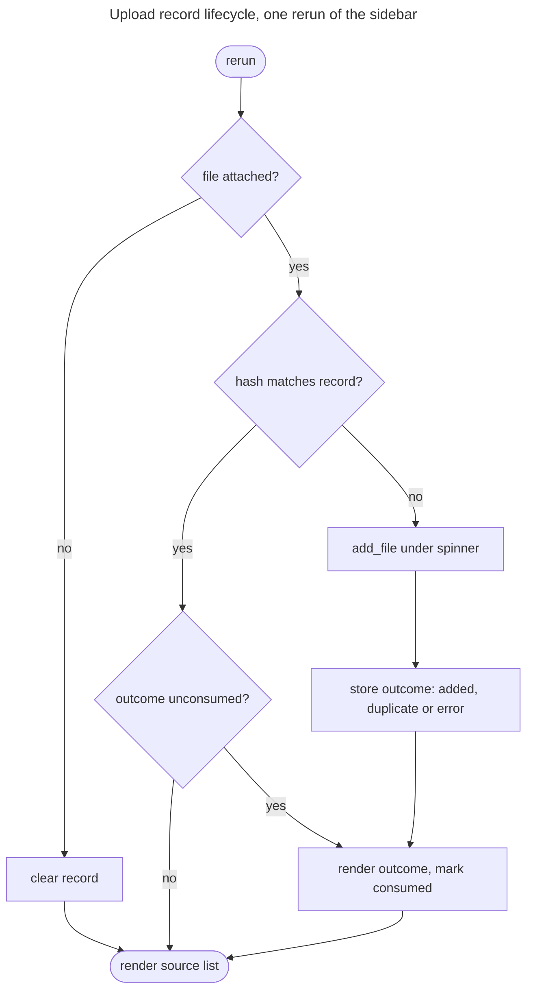

# Feature Plan: UI error handling

> **Source** `docs/manual-test-findings.md` findings 2, 3, 9 · **Branch** `fix/ui-error-handling` · **Builds on** streamlit UI (roadmap item 7), done
>
> Design spec (brainstorming) + TDD checklist. Fix branch, not a roadmap item.

---

## Requirements

- **Failed turns stay in the thread** (#2) — a `CoreError` from `engine.answer`
  leaves question *and* reason visible after any later rerun; no orphaned
  bubble, no explanation that evaporates.
- **Upload outcomes are shown once** (#3) — a file is ingested once per
  selection, not per rerun, and its outcome does not linger through unrelated
  chat turns.
- **Successful uploads confirm** (#9) — the discarded chunk count becomes a
  message; a dedup no-op reads differently from a fresh ingest.
- **Shell-only** — no core changes: `add_file` already returns a chunk count
  (`0` = duplicate) and `CoreError.user_message` already carries the text.
- **Acceptance** — reject a message, rerun, and see the question with its reason
  still in place; attach a bad file and see its error clear on the next rerun
  without re-ingesting; attach a good file and read its chunk count.

---

## Design (architecture level)

Everything lives in `cora.app.ui.chat`, the layer that owns Streamlit's rerun
semantics. `<<existing>>` = reused unchanged.

- **Thread entry model** — `ThreadEntry` gains an error variant carrying the
  `user_message` in place of `content`/`sources`/`tool_results`. `_show` keeps
  one render path: an error entry renders `st.error` inside its
  `st.chat_message`, everything else renders as today. `_answer` stops returning
  early on `CoreError` and appends an error entry instead, making the failure
  part of the persisted thread rather than a transient banner. The entry is
  typed, so conversation memory (finding #1) can later decide for itself whether
  failed turns reach the model — out of scope here.
- **Upload record** — one `st.session_state` entry holding the content hash of
  the handled file plus a **one-shot outcome** (added / duplicate / error)
  consumed on first render. Two roles in one record: the guard that keeps
  `add_file` from firing every rerun, and the carrier of the confirmation.
  Detaching the file clears it. Comparison still hashes per rerun (cheap); what
  is skipped is the retriever round-trip and the re-raise.
- **Outcome wording** — success names file and chunk count, duplicate says the
  file is already in the knowledge base, failure shows `error.user_message`. The
  sidebar source list `<<existing>>` stays the durable signal that a file landed.
- **Startup errors** `<<existing>>` — `main` keeps rendering a top-level
  `st.error` with no thread.

---

## Testing (§8 tiers)

Integration tier (`AppTest`) throughout — every behaviour here is a rerun
behaviour, which is precisely what the pure helpers cannot express. Fakes for
the three ports `<<existing>>`; the upload tests need a knowledge-base double
that counts `add_file` calls.

---

## TDD checklist (red → green → refactor; commit per green)

Failed turns (#2)

- [x] a `CoreError` from `engine.answer` appends an error entry: question and
      `user_message` are both visible, and both survive a plain rerun.
- [x] a successful turn after a failed one appends normally — thread keeps
      growing, the earlier error entry stays intact. *(Passed on the first run:
      item 1's fix already covered it. Kept as regression coverage — verified it
      fails with that fix reverted — and folded the older, now-subsumed
      engine-error test into the rerun test.)*

Upload record (#3, #9)

- [x] a rejected file shows its error once; a plain rerun shows no error and
      does not call `add_file` again. *(The record needs only the hash — the
      outcome is rendered at ingest time and never re-rendered, so there is
      nothing to store and consume.)*
- [ ] a successful upload confirms with its chunk count; the same bytes
      re-attached report a duplicate, not a fresh ingest.
- [ ] detaching the file clears the record, so re-selecting it ingests again
      (and hits knowledge-base dedup).
- [ ] refactor: extract the record handling so `_documents` stays a reading of
      the flow above, not a nest of conditionals.

---

## Open questions / risks

- **Blank input** — whitespace-only prompts now persist as an empty user bubble
  above "Please enter a question.". Accepted: the alternative has the shell
  second-guessing `EmptyInputRule`.
- **AppTest file_uploader identity** — the guard keys on a hash of the bytes,
  not on Streamlit's `file_id`, so it behaves the same under `AppTest` and a
  real browser.
- **One-shot outcomes are easy to miss** — the next interaction wipes the
  confirmation. Mitigated by the source list; revisit only if manual testing
  says otherwise.

---

## Verification (end-to-end)

- `uv run pytest` and `uv run pytest -m integration` green.
- Gates: `ruff format --check`, `ruff check`, `ty check` clean.
- Manual (real key): reject a message → rerun → question and reason still
  there; upload `latin.txt` → error once, gone next rerun; upload a sample →
  chunk count, re-upload → duplicate notice.
