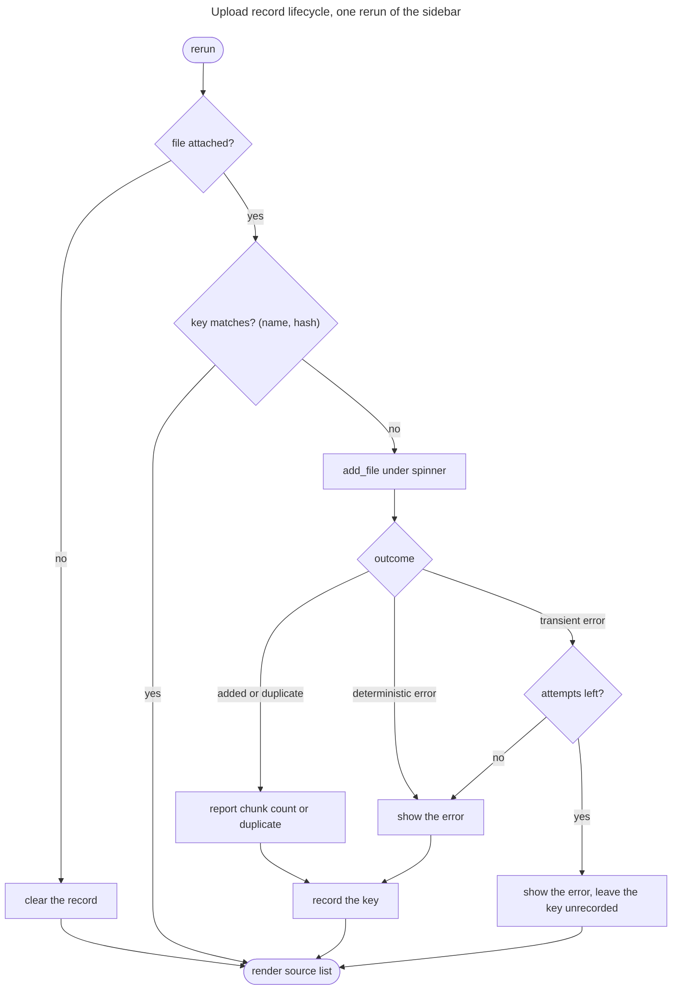

# Feature Plan: UI error handling

> **Source** `docs/manual-test-findings.md` findings 2, 3, 9 · **Branch** `fix/ui-error-handling` · **Builds on** streamlit UI (roadmap item 7), done
>
> Design spec (brainstorming) + TDD checklist. Fix branch, not a roadmap item.

---

## Requirements

- **Failed turns stay in the thread** (#2) — a `CoreError` from `engine.answer`
  leaves question *and* reason visible after any later rerun; no orphaned
  bubble, no explanation that evaporates.
- **Upload outcomes are shown once** (#3) — a file is ingested once per
  selection, not per rerun, and its outcome does not linger through unrelated
  chat turns.
- **Successful uploads confirm** (#9) — the discarded chunk count becomes a
  message; a dedup no-op reads differently from a fresh ingest.
- **Shell-only** — no core changes: `add_file` already returns a chunk count
  (`0` = duplicate) and `CoreError.user_message` already carries the text.
- **Acceptance** — reject a message, rerun, and see the question with its reason
  still in place; attach a bad file and see its error clear on the next rerun
  without re-ingesting; attach a good file and read its chunk count.

---

## Design (architecture level)

Everything lives in `cora.app.ui.chat`, the layer that owns Streamlit's rerun
semantics. `<<existing>>` = reused unchanged.

- **Thread entry model** — `ThreadEntry` gains an error variant carrying the
  `user_message` in place of `content`/`sources`/`tool_results`. `_show` keeps
  one render path: an error entry renders `st.error` inside its
  `st.chat_message`, everything else renders as today. `_answer` stops returning
  early on `CoreError` and appends an error entry instead, making the failure
  part of the persisted thread rather than a transient banner. The entry is
  typed, so conversation memory (finding #1) can later decide for itself whether
  failed turns reach the model — out of scope here.
- **Upload record** — one `st.session_state` entry identifying the handled
  selection as `(filename, sha256)`. It is only a guard: the outcome is rendered
  as the ingest happens and never re-rendered, so there is nothing to store and
  consume. Detaching the file clears it; a transient failure declines to record
  it, leaving the next rerun free to retry. Comparison still hashes per rerun
  (cheap); what is skipped is the retriever round-trip and the re-raise.
- **Outcome wording** — success names file and chunk count, duplicate says the
  file is already in the knowledge base, failure shows `error.user_message`. The
  sidebar source list `<<existing>>` stays the durable signal that a file landed.
- **Startup errors** `<<existing>>` — `main` keeps rendering a top-level
  `st.error` with no thread.

---

## Testing (§8 tiers)

Integration tier (`AppTest`) throughout — every behaviour here is a rerun
behaviour, which is precisely what the pure helpers cannot express. Fakes for
the three ports `<<existing>>`; the upload tests add two `FakeRetriever`
subclasses, one counting `contains` calls (an ingest attempt asks before doing
any work) and one failing `add` a set number of times. Both go in through
`assemble`, so the `App` under test is wired exactly as the real one is.
Unit tier covers `ingest_message` — the only framework-free piece.

---

## TDD checklist (red → green → refactor; commit per green)

Failed turns (#2)

- [x] a `CoreError` from `engine.answer` appends an error entry: question and
      `user_message` are both visible, and both survive a plain rerun.
- [x] a successful turn after a failed one appends normally — thread keeps
      growing, the earlier error entry stays intact. *(Passed on the first run:
      item 1's fix already covered it. Kept as regression coverage — verified it
      fails with that fix reverted — and folded the older, now-subsumed
      engine-error test into the rerun test.)*

Upload record (#3, #9)

- [x] a rejected file shows its error once; a plain rerun shows no error and
      does not call `add_file` again. *(The record needs only the hash — the
      outcome is rendered at ingest time and never re-rendered, so there is
      nothing to store and consume.)*
- [x] a successful upload confirms with its chunk count; content already
      indexed reports a duplicate, not a fresh ingest. *(Two tests. Within one
      session the hash guard catches a re-attach before the knowledge base
      does, so the duplicate path is reached via already-indexed content —
      seed docs here, a previous session in real use.)*
- [x] detaching the file clears the record, so re-selecting it ingests again
      (and hits knowledge-base dedup). *(Item 3's green step had already written
      this branch untested; deleted it, watched this test go red, restored it.)*
- [x] refactor: extract the record handling so `_documents` stays a reading of
      the flow above, not a nest of conditionals. *(`_ingest_once` now holds only
      the rerun guard and `_ingest` the work; the outcome strings moved to
      `formatting.ingest_message`, which gave the 1-vs-many wording unit-tier
      coverage the AppTest layer never had.)*

Review findings (PR #5 AI review, routed back through the TDD loop)

- [x] a transient `AdapterError` during ingest leaves the file retryable — the
      next rerun attempts it again and succeeds once the retriever recovers.
      *(The guard was armed before the ingest ran, so "please try again" was a
      promise the code broke: only settled outcomes record the hash now.)*
- [x] an error entry with an empty message still renders as an error, never a
      `KeyError` — `_show` tests presence, not truthiness. *(A plugin rule
      raising `InputRejectedError("")` put a traceback on screen, which the
      shell exists to prevent. Rejected a `TypedDict` for `ThreadEntry`: with
      `total=False` it would not have caught this access anyway.)*
- [x] a new selection whose bytes are already indexed reports the duplicate
      instead of staying silent — the record keys on name + hash. *(Content
      alone was the wrong key: the record guards a selection, not a document,
      and knowledge-base dedup already owns "is this content known?".)*
- [x] the upload-error test pins what the sidebar says after the rerun, not
      just the absence of an error.
- [x] the test doubles sit at the retriever port, so `assemble` wires one
      knowledge base into both `App` fields. *(Better than repairing the
      `replace()` wiring: counting `contains` calls measures the wasted
      round-trip finding #3 named, instead of counting a level above it.)*

Second review round (PR #5, after the fixes above)

- [x] a persistent `AdapterError` stops retrying after `MAX_INGEST_ATTEMPTS`.
      *(Self-inflicted by the retry fix: every rerun re-attempted — and
      `add_file` embeds before it writes, so a real outage re-ran the embedder
      over the whole file on every unrelated chat turn, recreating finding #3's
      complaint for the transient class.)*
- [x] the plan's diagram and testing notes match the shipped design.
      *(The prose was corrected earlier but the flowchart under it still drew
      the abandoned store-and-consume record.)*

---

## Follow-up (deliberately not on this branch)

- **`list_sources()` is outside all error handling.** `_documents` calls it
  unguarded (`chat.py:43`), `render` does not catch, and `main`'s `try` covers
  only the factory — so when `ChromaRetriever.sources()` raises `RetrievalError`
  on an unreachable collection, the user gets a traceback. Pre-existing, but
  this branch makes it look handled: `_FlakyRetriever` fails only writes, so the
  retry test simulates "writes fail while reads work" rather than the ordinary
  outage, where the same rerun dies two lines later. Fixing it means one `try`
  around the source listing plus a double that fails reads too — which would
  also make the retry test realistic.

- **Retryability belongs in `core.errors`, not the shell.** `_ingest` infers
  "worth retrying" from the class hierarchy — `AdapterError` transient,
  every other `CoreError` settled. The mapping is right today, but it is a
  domain judgment made in a layer `CLAUDE.md` reserves for widgets, and it is
  implicit: a future transient error that does not subclass `AdapterError`
  would be silently treated as permanent, with no test or gate objecting.
  State it on the hierarchy instead (a `retryable` class attribute, `False` on
  `CoreError`, `True` on `AdapterError`) and have the shell ask. Left out here
  to keep this branch shell-only; it needs its own branch and a core test.

---

## Open questions / risks

- **Blank input** — whitespace-only prompts now persist as an empty user bubble
  above "Please enter a question.". Accepted: the alternative has the shell
  second-guessing `EmptyInputRule`.
- **Upload key vs `file_id`** — the record keys on `(name, sha256)` rather than
  Streamlit's `file_id`, so it behaves the same under `AppTest` (which mints a
  fresh id per `set_value`) and in a browser. Cost: a second place in the
  codebase hashes content, the other being knowledge-base dedup.
- **`UploadedFile` type hint** — imported from
  `streamlit.runtime.uploaded_file_manager`, a runtime-internal path. Inside the
  permitted tree, but an upgrade hazard for a hint only; a two-method Protocol
  would avoid it.
- **One-shot outcomes are easy to miss** — the next interaction wipes the
  confirmation. Mitigated by the source list; revisit only if manual testing
  says otherwise.

---

## Verification (end-to-end)

- `uv run pytest` and `uv run pytest -m integration` green.
- Gates: `ruff format --check`, `ruff check`, `ty check` clean.
- Manual (real key): reject a message → rerun → question and reason still
  there; upload `latin.txt` → error once, gone next rerun; upload a sample →
  chunk count, re-upload → duplicate notice.
