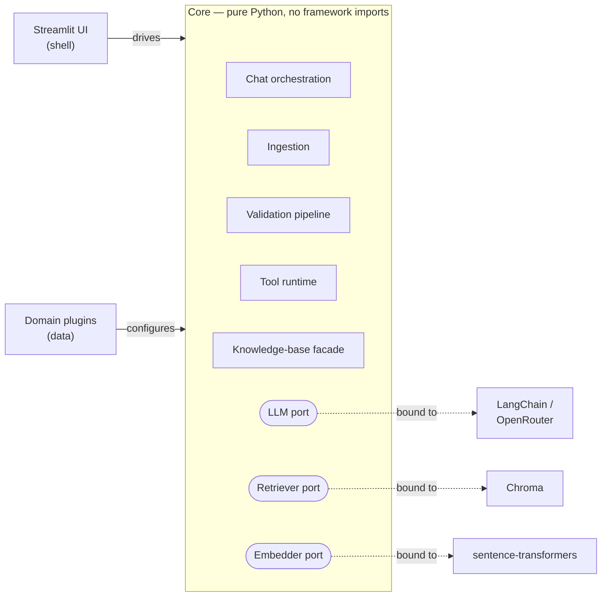
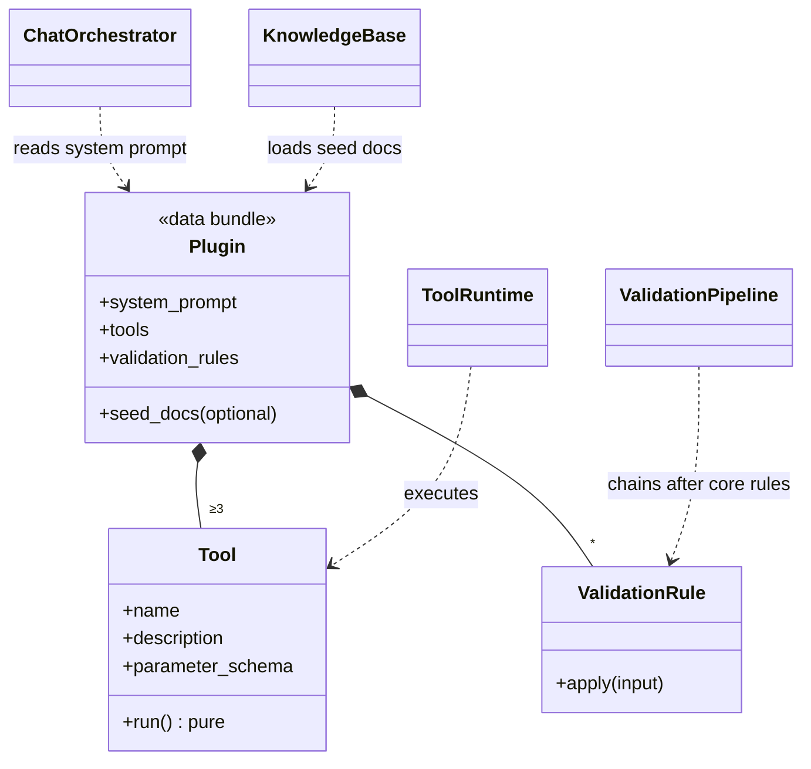
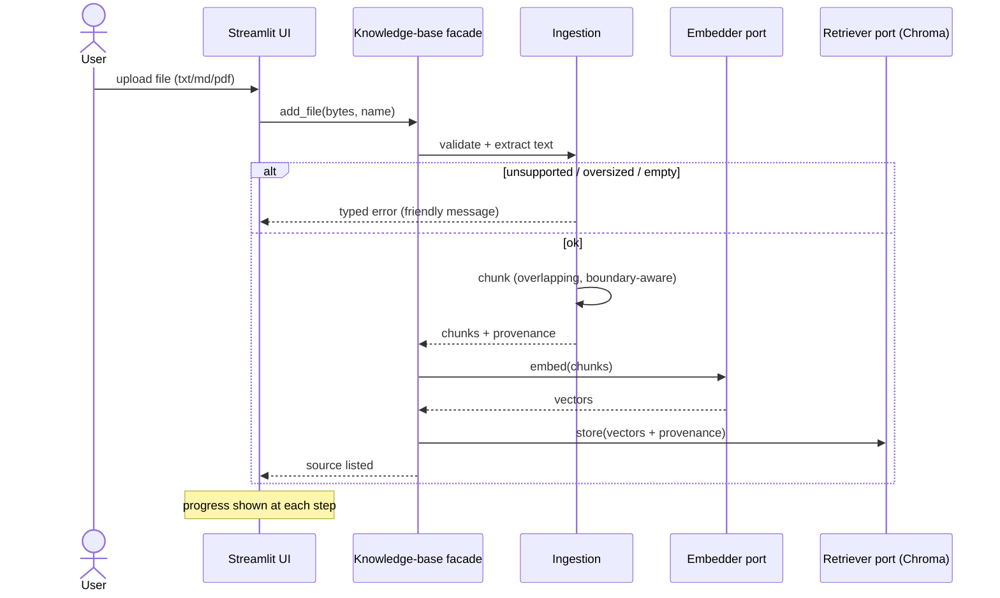
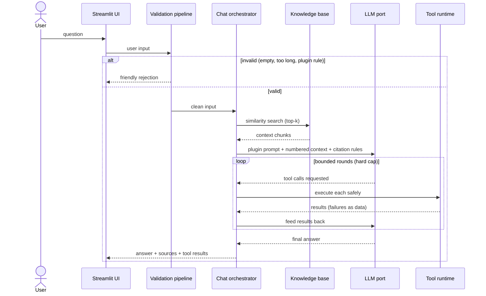

# Architecture Plan: NotebookLM-style RAG Chatbot with Domain Plugins

## 1. Vision

A minimal "chat with your documents" web application. The core is **domain-agnostic**: users upload documents, the app answers questions about
them with sources. Domain specialisation is achieved exclusively through **plugins** — a
plugin turns the generic app into a specialist (reference plugin: **fitness coach**).

## 2. Guiding principles

1. **Simplicity first** — only core features; every abstraction must earn its place.
2. **Domain-agnostic core, domains as plugins** — the core never knows about fitness.
3. **Replaceable frontend** — Streamlit is a thin shell; all logic lives in the backend
   package. Swapping to Next.js later must not touch business logic.
4. **TDD-conform by construction** — every component is designed to be testable in
   isolation without network, model downloads, or a running UI (see `docs/workflow.md`).
5. **Isolate volatile dependencies** — LangChain, Chroma, sentence-transformers, and
   Streamlit each touch exactly one adapter at the edge of the system.

## 3. Architectural style: Ports & Adapters (Hexagonal)

The system is a hexagon: pure domain logic in the middle, technology at the edges.

*Driving side (left) drives the core; the core owns the three ports; driven adapters
(right) implement them and are swapped for in-memory fakes in tests.*

- **Ports** are narrow interfaces owned by the core (chat model, retriever, embedder).
- **Adapters** implement them with real technology and are swappable: the UI adapter
  (Streamlit) and the infrastructure adapters (OpenRouter, Chroma, local embeddings).
- Tests replace adapters with in-memory fakes; the core cannot tell the difference.

**Dependency rule (enforced by review + import direction):**
UI → Core ← Plugins. The core imports neither the UI nor any plugin.
LangChain appears in exactly one adapter — nowhere else.

## 4. Component architecture

| Component | Responsibility | Knows about |
|---|---|---|
| **Chat Orchestrator** | The single use-case driver: validate input → retrieve context → prompt LLM → run requested tools (bounded loop) → assemble answer with sources & tool results | all ports, active plugin |
| **Ingestion** | Turn an uploaded file (txt/md/pdf) into clean text, then into overlapping chunks with provenance metadata; reject unsupported/oversized/empty files | nothing external |
| **Knowledge Base** | Facade over ingestion + embedding + vector store: "add file", "list sources", "find relevant chunks"; deduplicates re-uploads | ingestion, embedder & retriever ports |
| **Validation Pipeline** | Ordered chain of rules applied to user input: core rules (empty, length, file type/size) first, then the active plugin's domain security rules | plugin contract |
| **Tool Runtime** | Executes an LLM-requested tool safely: schema-checks arguments, captures all failures as tool-error results (never crashes the chat) | plugin contract |
| **Plugin Registry** | Resolves a configured plugin name to a loaded plugin; fails loudly and clearly on bad plugins | plugin contract |
| **Composition Root** | The one place where real adapters are chosen, configured (env-driven) and wired together | everything |
| **UI Shell (Streamlit)** | Widgets only: upload control, chat thread, sources panel, tool-result display, progress indicator, friendly error display | core public API only |

### The plugin contract (the centrepiece)

A domain plugin is **data, not behaviour**: a declarative bundle the core consumes.

| Plugin provides | Used by | Fulfils requirement |
|---|---|---|
| Domain system prompt(s) | Chat Orchestrator | domain-specific prompts & responses |
| ≥3 domain tools (name, description, parameter schema, pure function) | Tool Runtime | tool calling |
| Domain security/validation rules | Validation Pipeline | domain security measures |
| Optional seed documents | Knowledge Base | focused knowledge base |

Adding a new domain = writing one new plugin package and pointing configuration at it.
Zero core changes. The reference **fitness coach** plugin ships: fitness system prompt,
pure-calculation tools (BMI, TDEE via Mifflin-St Jeor, 1RM via Epley, macro planning),
safety rules (e.g. medical/medication questions get a safe redirect), and a small seed
knowledge base of training/nutrition notes.

## 5. Design patterns employed

| Pattern | Where | Why | Reference |
|---|---|---|---|
| **Ports & Adapters** | whole system | testability, replaceable frontend, swappable infra | [Cockburn (original)](https://alistair.cockburn.us/hexagonal-architecture/) |
| **Plugin architecture** (registry + declarative contract) | domain specialisation | extensibility requirement; domains without core changes | [Fowler, P of EAA](https://martinfowler.com/eaaCatalog/plugin.html) |
| **Strategy** | embedder / retriever / chat-model ports | swap Chroma↔in-memory, real↔fake LLM per environment | [Refactoring.Guru](https://refactoring.guru/design-patterns/strategy) |
| **Facade** | knowledge base | one simple entry point over load→chunk→embed→store | [Refactoring.Guru](https://refactoring.guru/design-patterns/facade) |
| **Chain of Responsibility** | validation pipeline | composable core + plugin rules; future prompt-injection guard slots in as one more rule | [Refactoring.Guru](https://refactoring.guru/design-patterns/chain-of-responsibility) |
| **Composition Root / Factory** | app assembly | single wiring point; tests wire fakes instead | [Seemann (original)](https://blog.ploeh.dk/2011/07/28/CompositionRoot/) |
| **Value Objects** (immutable data) | messages, chunks, tool calls/results, responses | predictable, trivially assertable in tests | [Fowler, bliki](https://martinfowler.com/bliki/ValueObject.html) |
| **Observer (callback)** | progress events from orchestrator | UI progress indicators without the core knowing Streamlit | [Refactoring.Guru](https://refactoring.guru/design-patterns/observer) |
| **Adapter** | OpenRouter/LangChain, Chroma, embeddings | quarantine version churn; one file per volatile dependency | [Refactoring.Guru](https://refactoring.guru/design-patterns/adapter) |

Deliberately **not** used: LangChain chains/agents/LCEL (the LLM adapter is the whole
LangChain surface), pip entry-points for plugins (import-by-name convention is enough),
streaming responses, async (no concurrency need at this scale).

## 6. Runtime flows

**Ingestion flow** (with UI progress at each step):

**Chat flow:**

**Error philosophy:** one small exception hierarchy; every failure category
(invalid input, bad file, provider/auth/rate-limit errors, broken plugin, tool crash)
maps to a typed error with a user-presentable message. Tool failures are *data* returned
to the LLM (it can recover); everything else surfaces as a friendly UI error. Nothing
ever reaches the user as a stack trace.

## 7. Technology decisions (fixed)

| Concern | Choice | Rationale |
|---|---|---|
| Language / packaging | Python + uv | spec requirement; fast modern tooling |
| LLM access | LangChain over OpenRouter (OpenAI-compatible) | spec requirement; pinned minor version, confined to one adapter |
| Vector store | Chroma, embedded & persistent | no server to run; persists across restarts |
| Embeddings | local sentence-transformers | free, offline, deterministic tests; only paid dependency stays OpenRouter chat |
| Frontend | Streamlit | spec requirement; thin shell by design |
| Quality gates | ruff (format+lint), ty (types), pytest | TDD workflow toolchain |
| Config | environment variables (.env) | 12-factor; API keys never in code or repo |

## 8. Testing architecture (TDD backbone)

Three tiers, cleanly separated by what they may touch:

1. **Unit (default, seconds, runs on every save & pre-commit):** all core logic and all
   plugin calculators, exercised against in-memory fakes of the three ports (scripted
   fake LLM, deterministic fake embedder, in-memory retriever). No network, no model
   downloads, no UI.
2. **Integration (CI):** real Chroma round-trip & persistence, real embedding model
   smoke test, one headless Streamlit smoke test with a fake-wired engine.
3. **LLM (manual only):** a single real OpenRouter round-trip incl. one tool call —
   skipped without an API key; used for final acceptance, never in CI.

The fakes are first-class design artifacts: the in-memory retriever doubles as proof the
retriever port is sufficient, and the scripted LLM makes the tool-calling loop fully
deterministic to test (happy path, unknown tool, malformed arguments, runaway loop cap).

## 9. Security measures

- **Input validation** at the boundary: length limits, file type/size allow-list,
  rejection before any LLM or retrieval work happens.
- **Domain safety rules** via plugin (fitness: medical/medication questions → safe
  redirect, no dosage or diagnosis advice).
- **Tool sandboxing by design**: tools are pure functions with schema-validated
  arguments; no shell, no filesystem, no eval.
- **Secrets hygiene**: API keys only via environment; never logged, never in the repo.
- **Bounded autonomy**: hard cap on tool-call rounds prevents runaway LLM loops.
- **Seam reserved** for prompt-injection guarding: the validation pipeline can later be
  applied to retrieved document content, not just user input.

## 10. Delivery roadmap (feature branches, per docs/workflow.md)

Each feature is one branch with its own TDD checklist in `docs/plans/`, built strictly
red → green → refactor. Order is bottom-up so every branch stands on tested ground:

1. **Project setup** — scaffold, toolchain, git hooks, CI, CLAUDE.md, AI subagents.
2. **Document ingestion** — loaders + chunker (pure logic, ideal TDD warm-up).
3. **Knowledge base** — ports, fakes, Chroma adapter, facade with dedupe.
4. **Tools & plugin contract** — tool runtime, validation pipeline, plugin registry.
5. **Fitness coach plugin** — calculators vs. published reference values, prompt, rules, seed docs.
6. **Chat engine** — orchestrator against fakes; OpenRouter adapter; composition root.
7. **Streamlit UI** — thin shell, progress/sources/tool-result display, README.

## 11. Risks & mitigations

| Risk | Mitigation |
|---|---|
| LangChain version churn (known v1 interface breakage) | pin minor version; single-adapter confinement; translation logic unit-tested |
| OpenRouter quirks (model tool-call support, 402/429, malformed tool JSON) | configurable known-good default model; defensive parsing; typed friendly errors |
| Streamlit rerun model breaking chat state | engine cached as a resource; history in session state; upload dedupe by content hash |
| Heavy embedding model slowing the TDD loop | lazy loading; fakes in unit tier; model tests marked slow |
| Chroma state leaking between tests | integration tier only; temp dirs + unique collections |
| Scope creep | core requirements only; bonus features have reserved seams, not built code |

## 12. Acceptance (definition of done)

With a real API key: upload a PDF → ask a question → answer cites visible sources;
ask "I'm 30, 80 kg, 180 cm, moderately active — calories to cut?" → TDEE/macro tools
run and their results are displayed; a medication-dosage question triggers the safety
redirect; progress indicators appear during ingestion and tool runs; all quality gates
(format, lint, types, full test suite, CI) are green; swapping the plugin via
configuration visibly changes the app's domain behaviour.
