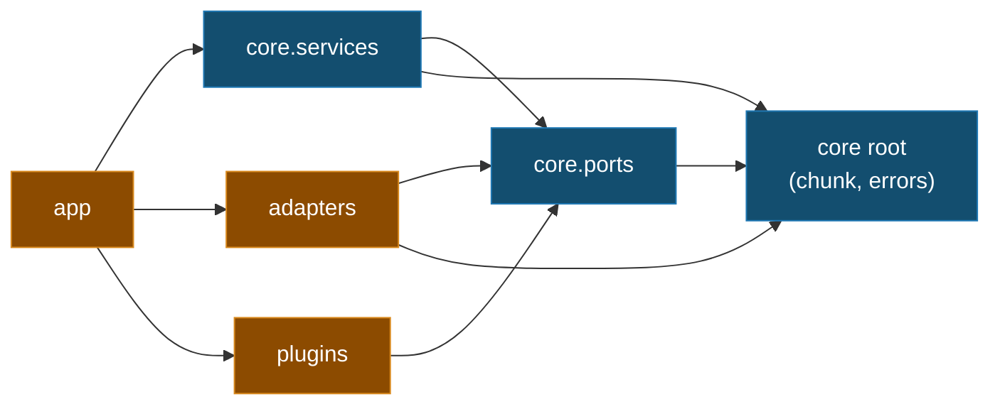

# Feature Plan: Package Layout Refactor

> **Type** structural refactor (behavior-preserving) · **Branch** `refactor/package-layout` · **Realises** the §3 hexagon in the source tree · **Builds on** everything merged to `main` (roadmap 1–6)

---

## Requirements

- **Single top-level namespace.** Collapse the three sibling import packages (`core`, `plugins`, `cora`) into one `cora` package; `module-name` in `pyproject.toml` becomes `["cora"]`.
- **Structural core purity.** Adapters (LangChain / Chroma / sentence-transformers) leave `core`, so `cora.core.*` imports zero frameworks
- **Tree = hexagon.** Pure center = value objects + error hierarchy at the `core` root, plus `ports` and `services`; framework edge in `adapters`; driving side (config, composition, future UI) in `app`; domains in `plugins`.
- **Behavior-preserving.** No production behavior changes. Safety net = the existing suite staying green after each batch; the one *new* artifact is an automated architecture-guard test.
- **Absorbs** the deferred mirrored-test-layout migration: `tests/` mirrors the new tree under importlib mode.
- **Scope.** Layout only. No new features; the `app/ui/` package is created empty (Streamlit is roadmap 7).
- **Acceptance.** All gates green (`ruff format --check`, `ruff check`, `ty`, full `pytest`); guard test passes; docs reference the new paths.

---

## Design (architecture level)

### Target tree

```
src/cora/
├── __init__.py
├── py.typed
├── core/                          # PURE center — zero framework imports
│   ├── errors.py                  #   CoreError hierarchy (owned by core)
│   ├── chunk.py                   #   Chunk value object
│   ├── ports/
│   │   ├── chat_model.py          #   Message, ModelReply, ChatModel        (driven)
│   │   ├── retrieval.py           #   RetrievedChunk, Retriever              (driven)
│   │   ├── embedding.py           #   Embedder                              (driven)
│   │   └── plugin.py              #   Plugin, Tool, ValidationRule,
│   │                              #     ToolCall, ToolResult                (driving)
│   └── services/                  #   chat_engine, ingestion, knowledge_base,
│                                  #     validation, tool_runtime, plugin_registry,
│                                  #     cleaning, chunker, loaders
├── adapters/                      # framework EDGE
│   ├── openrouter_chat_model.py   
    ├── chroma_retriever.py 
    ├── sentence_transformer_embedder.py
├── plugins/fitness/               # calculators, safety, seed_docs, tools  (internals unchanged)
└── app/
    ├── config.py   composition.py
    └── ui/                        # empty — Streamlit shell (roadmap 7)
```

### Dependency direction (must stay acyclic; enforced by guard test)



*Arrows point at dependencies; nothing under `core` points outward. `chunk.py` and `errors.py` sit at the `core` root (shared across services + adapters), so `core` stays self-contained.*

### Import rewrite (mechanical)

| Old | New |
|---|---|
| `core.chunk` | `cora.core.domain.chunk` |
| `core.{chat_model,retrieval,embedding,plugin}` | `cora.core.ports.*` |
| `core.errors` | `cora.core.domain.errors` |
| `core.{chat_engine,ingestion,knowledge_base,validation,tool_runtime,plugin_registry,cleaning,chunker,loaders}` | `cora.core.service_layer.*` |
| `core.{openrouter_chat_model,chroma_retriever,sentence_transformer_embedder}` | `cora.adapters.*` |
| `plugins.fitness.*` | `cora.plugins.fitness.*` |
| `cora.{config,composition}` | `cora.app.*` |

Engine-local ports (`ContextSource`, `InputValidator`, `ToolExecutor` Protocols in `chat_engine.py`) stay in `services` — they are private collaborators, not shared ports.

### Enforcement (the one new test)

An architecture-guard test walks every module under `cora.core`, parses imports (AST), and asserts none resolve to a **volatile framework** (`langchain*`, `chromadb`, `sentence_transformers`, `streamlit` — the four §2/§5 isolates whose adapters left core) or to `cora.adapters` / `cora.plugins` / `cora.app`. `pypdf` and `jsonschema` are lightweight utilities the core services use directly and are intentionally *not* forbidden. This is the fitness function that makes the §3 dependency rule automatic instead of review-only.

---

## Migration checklist (ordered; each item ends green + one commit)

- [x] **1 · Reshuffle `core` internals** (package still top-level `core`). Create `core/{ports,services,adapters}/` with `__init__.py` (`chunk.py` + `errors.py` stay at the `core` root); `git mv` each module to its target; rewrite intra-repo imports; mirror the moves under `tests/core/`. Gate green. Commit `refactor(core): group modules into ports/services/adapters`.
- [x] **2 · Collapse to the `cora` namespace.** `git mv core → cora/core`, `core/adapters → cora/adapters`, `plugins → cora/plugins`, `cora/{config,composition}.py → cora/app/`; move `py.typed` to `cora/`; create empty `cora/app/ui/`; delete stale `src/docchat/`; set `module-name = ["cora"]`; `uv sync`; rewrite all remaining imports (src + tests + `conftest.py`); mirror `tests/` to `tests/cora/**`. Gate green. Commit `refactor: collapse core/plugins/cora into single cora namespace`.
- [x] **3 · Architecture-guard test** (TDD — write it red against a deliberate violation, then green). Asserts no `cora.core.*` module imports a framework or an outer layer. Gate green. Commit `test: add core-purity architecture guard`.
- [x] **4 · Docs & metadata.** Update CLAUDE.md ("two import packages" → one `cora` package with sub-layers), `webapp-overview.md` component paths, `README.md`, and `docs/plans/` cross-refs; tick this checklist. Gate green. Commit `docs: align docs with cora package layout`.

---

## Risks & mitigations

- **Half-moved tree breaks imports mid-refactor** → each checklist item is a complete, independently-green slice; `module-name` flips only in item 2 when every module already lives under `cora`.
- **Editable install stale after the namespace move** → run `uv sync` immediately after the `module-name` change (item 2) before running the suite.
- **importlib test mode + duplicate basenames** → the mirrored `tests/cora/**` layout gives every test module a unique dotted path; `pythonpath = ["tests"]` keeps `fakes` / `conftest` importable.
- **Silent leftover `from core...` imports** → after item 2, `grep -rE '(^|[^.])\b(core|plugins)\.' src tests` must return nothing; the guard test (item 3) then locks the rule.

---

## Verification (end-to-end)

- Gates after every item: `uv run ruff format --check`, `uv run ruff check`, `uv run ty`, `uv run pytest`.
- Post-move sanity: `uv run python -c "import cora, cora.core, cora.adapters, cora.plugins, cora.app"`; `uv build` succeeds with a single `cora` wheel.
- Full behavior parity: the complete unit suite (all pre-existing tests) is green with only import paths changed — no assertions touched.
