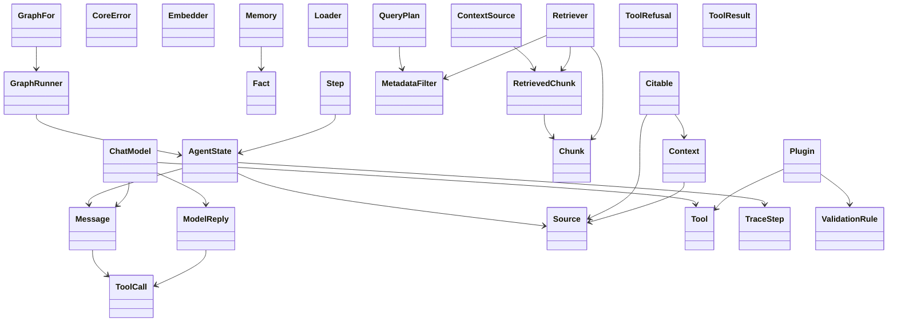

# Diagrams

## The classes, read off the source

```mermaid
classDiagram
  class AgentState
  class ChatModel
  class Chunk
  class Citable
  class Context
  class ContextSource
  class CoreError
  class Embedder
  class Fact
  class GraphFor
  class GraphRunner
  class Loader
  class Memory
  class Message
  class MetadataFilter
  class ModelReply
  class Plugin
  class QueryPlan
  class RetrievedChunk
  class Retriever
  class Source
  class Step
  class Tool
  class ToolCall
  class ToolRefusal
  class ToolResult
  class TraceStep
  class ValidationRule
  AgentState --> Message
  AgentState --> Source
  AgentState --> TraceStep
  ChatModel --> Message
  ChatModel --> ModelReply
  ChatModel --> Tool
  Citable --> Context
  Citable --> Source
  Context --> Source
  ContextSource --> RetrievedChunk
  GraphFor --> GraphRunner
  GraphRunner --> AgentState
  Memory --> Fact
  Message --> ToolCall
  ModelReply --> ToolCall
  Plugin --> Tool
  Plugin --> ValidationRule
  QueryPlan --> MetadataFilter
  RetrievedChunk --> Chunk
  Retriever --> Chunk
  Retriever --> MetadataFilter
  Retriever --> RetrievedChunk
  Step --> AgentState
```
