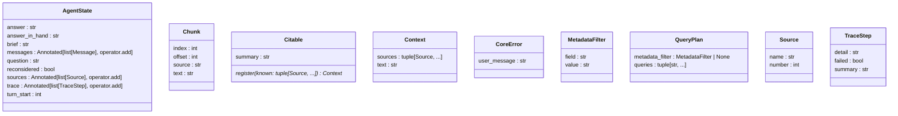

# Diagrams

## The domain classes, read off the source

```mermaid
classDiagram
  class AgentState {
    answer : str
    answer_in_hand : str
    brief : str
    messages : Annotated[list[Message], operator.add]
    question : str
    reconsidered : bool
    sources : Annotated[list[Source], operator.add]
    trace : Annotated[list[TraceStep], operator.add]
    turn_start : int
  }
  class Chunk {
    index : int
    offset : int
    source : str
    text : str
  }
  class Citable {
    summary : str
    register(known: tuple[Source, ...])* Context
  }
  class Context {
    sources : tuple[Source, ...]
    text : str
  }
  class CoreError {
    user_message : str
  }
  class MetadataFilter {
    field : str
    value : str
  }
  class QueryPlan {
    metadata_filter : MetadataFilter | None
    queries : tuple[str, ...]
  }
  class Source {
    name : str
    number : int
  }
  class TraceStep {
    detail : str
    failed : bool
    summary : str
  }
```
