# Diagrams

## The engine, read off the source

```dot
digraph engine {
  graph [rankdir=LR, fontname=Helvetica, labeljust=l];
  node [shape=box, fontname=Helvetica, margin=0.12];
  edge [fontname=Helvetica, fontsize=10, labeldistance=1.8, arrowhead=vee];
  subgraph cluster_domain {
    label="domain";
    labeljust=l;
    AgentState [label=<AgentState>];
    Chunk [label=<Chunk>];
    MetadataFilter [label=<MetadataFilter>];
    QueryPlan [label=<QueryPlan>];
    Source [label=<Source>];
    TraceStep [label=<<I>TraceStep</I>>];
  }
  subgraph cluster_engine {
    label="engine";
    labeljust=l;
    Agent [label=<<TABLE BORDER="0" CELLBORDER="1" CELLSPACING="0" CELLPADDING="4"><TR><TD>Agent</TD></TR><TR><TD ALIGN="LEFT" BALIGN="LEFT">runner : GraphRunner</TD></TR><TR><TD ALIGN="LEFT" BALIGN="LEFT">answer(question, thread_id, on_step) ChatResult</TD></TR></TABLE>>, shape=plaintext];
    ChatResult [label=<<TABLE BORDER="0" CELLBORDER="1" CELLSPACING="0" CELLPADDING="4"><TR><TD>ChatResult</TD></TR><TR><TD ALIGN="LEFT" BALIGN="LEFT">answer : str<BR/>sources : tuple[Source, ...]<BR/>trace : tuple[TraceStep, ...]</TD></TR></TABLE>>, shape=plaintext];
    DocumentSearch [label=<<TABLE BORDER="0" CELLBORDER="1" CELLSPACING="0" CELLPADDING="4"><TR><TD>DocumentSearch</TD></TR><TR><TD ALIGN="LEFT" BALIGN="LEFT">context_source : ContextSource<BR/>top_k : int</TD></TR><TR><TD ALIGN="LEFT" BALIGN="LEFT">__call__(query) CitableHits</TD></TR></TABLE>>, shape=plaintext];
    EmptyInputRule [label=<<TABLE BORDER="0" CELLBORDER="1" CELLSPACING="0" CELLPADDING="4"><TR><TD>EmptyInputRule</TD></TR><TR><TD ALIGN="LEFT" BALIGN="LEFT">apply(user_input) None</TD></TR></TABLE>>, shape=plaintext];
    FusionContextSource [label=<<TABLE BORDER="0" CELLBORDER="1" CELLSPACING="0" CELLPADDING="4"><TR><TD>FusionContextSource</TD></TR><TR><TD ALIGN="LEFT" BALIGN="LEFT">planner : Planner<BR/>index : SelfQueryIndex</TD></TR><TR><TD ALIGN="LEFT" BALIGN="LEFT">search(query, k) list[RetrievedChunk]</TD></TR></TABLE>>, shape=plaintext];
    GroundStep [label=<<TABLE BORDER="0" CELLBORDER="1" CELLSPACING="0" CELLPADDING="4"><TR><TD>GroundStep</TD></TR><TR><TD ALIGN="LEFT" BALIGN="LEFT">scope : str<BR/>context_source : ContextSource<BR/>top_k : int<BR/>floor : float</TD></TR><TR><TD ALIGN="LEFT" BALIGN="LEFT">__call__(state) AgentState</TD></TR></TABLE>>, shape=plaintext];
    HybridContextSource [label=<<TABLE BORDER="0" CELLBORDER="1" CELLSPACING="0" CELLPADDING="4"><TR><TD>HybridContextSource</TD></TR><TR><TD ALIGN="LEFT" BALIGN="LEFT">dense : ContextSource<BR/>keyword : ContextSource</TD></TR><TR><TD ALIGN="LEFT" BALIGN="LEFT">search(query, k) list[RetrievedChunk]</TD></TR></TABLE>>, shape=plaintext];
    KeywordIndex [label=<<TABLE BORDER="0" CELLBORDER="1" CELLSPACING="0" CELLPADDING="4"><TR><TD>&#171;interface&#187;<BR/>KeywordIndex</TD></TR><TR><TD ALIGN="LEFT" BALIGN="LEFT">add(chunks) None</TD></TR></TABLE>>, shape=plaintext];
    KnowledgeBase [label=<<TABLE BORDER="0" CELLBORDER="1" CELLSPACING="0" CELLPADDING="4"><TR><TD>KnowledgeBase</TD></TR><TR><TD ALIGN="LEFT" BALIGN="LEFT">embedder : Embedder<BR/>retriever : Retriever<BR/>loaders : Mapping[str, Loader]<BR/>keyword_index : KeywordIndex | None</TD></TR><TR><TD ALIGN="LEFT" BALIGN="LEFT">add_file(data, filename) int<BR/>search(query, k, metadata_filter) list[RetrievedChunk]<BR/>list_sources() list[str]</TD></TR></TABLE>>, shape=plaintext];
    LoggingChatModel [label=<<TABLE BORDER="0" CELLBORDER="1" CELLSPACING="0" CELLPADDING="4"><TR><TD>LoggingChatModel</TD></TR><TR><TD ALIGN="LEFT" BALIGN="LEFT">inner : ChatModel</TD></TR><TR><TD ALIGN="LEFT" BALIGN="LEFT">complete(messages, tools) ModelReply</TD></TR></TABLE>>, shape=plaintext];
    LoggingEmbedder [label=<<TABLE BORDER="0" CELLBORDER="1" CELLSPACING="0" CELLPADDING="4"><TR><TD>LoggingEmbedder</TD></TR><TR><TD ALIGN="LEFT" BALIGN="LEFT">inner : Embedder</TD></TR><TR><TD ALIGN="LEFT" BALIGN="LEFT">embed(texts) list[list[float]]</TD></TR></TABLE>>, shape=plaintext];
    LoggingRetriever [label=<<TABLE BORDER="0" CELLBORDER="1" CELLSPACING="0" CELLPADDING="4"><TR><TD>LoggingRetriever</TD></TR><TR><TD ALIGN="LEFT" BALIGN="LEFT">inner : Retriever</TD></TR><TR><TD ALIGN="LEFT" BALIGN="LEFT">add(chunks, vectors, file_hash) None<BR/>query(query_vector, k, metadata_filter) list[RetrievedChunk]<BR/>sources() list[str]<BR/>contains(file_hash) bool</TD></TR></TABLE>>, shape=plaintext];
    MaxLengthRule [label=<<TABLE BORDER="0" CELLBORDER="1" CELLSPACING="0" CELLPADDING="4"><TR><TD>MaxLengthRule</TD></TR><TR><TD ALIGN="LEFT" BALIGN="LEFT">max_chars : int</TD></TR><TR><TD ALIGN="LEFT" BALIGN="LEFT">apply(user_input) None</TD></TR></TABLE>>, shape=plaintext];
    ModelStep [label=<<TABLE BORDER="0" CELLBORDER="1" CELLSPACING="0" CELLPADDING="4"><TR><TD>ModelStep</TD></TR><TR><TD ALIGN="LEFT" BALIGN="LEFT">chat_model : ChatModel<BR/>tools : tuple[Tool, ...]<BR/>max_history_turns : int</TD></TR><TR><TD ALIGN="LEFT" BALIGN="LEFT">__call__(state) AgentState</TD></TR></TABLE>>, shape=plaintext];
    Planner [label=<<TABLE BORDER="0" CELLBORDER="1" CELLSPACING="0" CELLPADDING="4"><TR><TD>&#171;interface&#187;<BR/>Planner</TD></TR><TR><TD ALIGN="LEFT" BALIGN="LEFT">plan(question, sources) QueryPlan</TD></TR></TABLE>>, shape=plaintext];
    PluginSet [label=<<TABLE BORDER="0" CELLBORDER="1" CELLSPACING="0" CELLPADDING="4"><TR><TD>PluginSet</TD></TR><TR><TD ALIGN="LEFT" BALIGN="LEFT">entries : tuple[tuple[str, Plugin], ...]</TD></TR><TR><TD ALIGN="LEFT" BALIGN="LEFT">tools() tuple[Tool, ...]<BR/>rules() tuple[ValidationRule, ...]<BR/>instructions() str<BR/>scope() str</TD></TR></TABLE>>, shape=plaintext];
    PrepareStep [label=<<TABLE BORDER="0" CELLBORDER="1" CELLSPACING="0" CELLPADDING="4"><TR><TD>PrepareStep</TD></TR><TR><TD ALIGN="LEFT" BALIGN="LEFT">rules : tuple[ValidationRule, ...]<BR/>instructions : str<BR/>memory : Memory | None</TD></TR><TR><TD ALIGN="LEFT" BALIGN="LEFT">__call__(state) AgentState</TD></TR></TABLE>>, shape=plaintext];
    QueryPlanner [label=<<TABLE BORDER="0" CELLBORDER="1" CELLSPACING="0" CELLPADDING="4"><TR><TD>QueryPlanner</TD></TR><TR><TD ALIGN="LEFT" BALIGN="LEFT">chat_model : ChatModel<BR/>num_queries : int</TD></TR><TR><TD ALIGN="LEFT" BALIGN="LEFT">plan(question, sources) QueryPlan</TD></TR></TABLE>>, shape=plaintext];
    RememberFact [label=<<TABLE BORDER="0" CELLBORDER="1" CELLSPACING="0" CELLPADDING="4"><TR><TD>RememberFact</TD></TR><TR><TD ALIGN="LEFT" BALIGN="LEFT">memory : Memory</TD></TR><TR><TD ALIGN="LEFT" BALIGN="LEFT">__call__(fact) str</TD></TR></TABLE>>, shape=plaintext];
    Router [label=<<TABLE BORDER="0" CELLBORDER="1" CELLSPACING="0" CELLPADDING="4"><TR><TD>Router</TD></TR><TR><TD ALIGN="LEFT" BALIGN="LEFT">max_tool_rounds : int<BR/>grounded : bool</TD></TR><TR><TD ALIGN="LEFT" BALIGN="LEFT">__call__(state) str</TD></TR></TABLE>>, shape=plaintext];
    SelfQueryIndex [label=<<TABLE BORDER="0" CELLBORDER="1" CELLSPACING="0" CELLPADDING="4"><TR><TD>&#171;interface&#187;<BR/>SelfQueryIndex</TD></TR><TR><TD ALIGN="LEFT" BALIGN="LEFT">search(query, k, metadata_filter) list[RetrievedChunk]<BR/>list_sources() list[str]</TD></TR></TABLE>>, shape=plaintext];
    ToolExecutor [label=<<TABLE BORDER="0" CELLBORDER="1" CELLSPACING="0" CELLPADDING="4"><TR><TD>&#171;interface&#187;<BR/>ToolExecutor</TD></TR><TR><TD ALIGN="LEFT" BALIGN="LEFT">execute(call) ToolResult</TD></TR></TABLE>>, shape=plaintext];
    ToolRuntime [label=<<TABLE BORDER="0" CELLBORDER="1" CELLSPACING="0" CELLPADDING="4"><TR><TD>ToolRuntime</TD></TR><TR><TD ALIGN="LEFT" BALIGN="LEFT">tools : tuple[Tool, ...]</TD></TR><TR><TD ALIGN="LEFT" BALIGN="LEFT">execute(call) ToolResult</TD></TR></TABLE>>, shape=plaintext];
    ToolStep [label=<<TABLE BORDER="0" CELLBORDER="1" CELLSPACING="0" CELLPADDING="4"><TR><TD>ToolStep</TD></TR><TR><TD ALIGN="LEFT" BALIGN="LEFT">tool_runtime : ToolExecutor</TD></TR><TR><TD ALIGN="LEFT" BALIGN="LEFT">__call__(state) AgentState</TD></TR></TABLE>>, shape=plaintext];
  }
  subgraph cluster_ports {
    label="ports";
    labeljust=l;
    ChatModel [label=<&#171;interface&#187;<BR/>ChatModel>];
    ContextSource [label=<&#171;interface&#187;<BR/>ContextSource>];
    Embedder [label=<&#171;interface&#187;<BR/>Embedder>];
    GraphRunner [label=<&#171;interface&#187;<BR/>GraphRunner>];
    Loader [label=<&#171;interface&#187;<BR/>Loader>];
    Memory [label=<&#171;interface&#187;<BR/>Memory>];
    Message [label=<Message>];
    ModelReply [label=<ModelReply>];
    Plugin [label=<Plugin>];
    RetrievedChunk [label=<RetrievedChunk>];
    Retriever [label=<&#171;interface&#187;<BR/>Retriever>];
    Step [label=<&#171;interface&#187;<BR/>Step>];
    Tool [label=<Tool>];
    ToolCall [label=<ToolCall>];
    ToolResult [label=<ToolResult>];
    ValidationRule [label=<&#171;interface&#187;<BR/>ValidationRule>];
  }
  Agent -> GraphRunner [headlabel="1"];
  Agent -> ChatResult [headlabel="1", style=dashed];
  Agent -> TraceStep [headlabel="1", style=dashed];
  ChatResult -> Source [headlabel="*"];
  ChatResult -> TraceStep [headlabel="*"];
  DocumentSearch -> ContextSource [headlabel="1"];
  EmptyInputRule -> ValidationRule [style=dashed, arrowhead=empty];
  FusionContextSource -> Planner [headlabel="1"];
  FusionContextSource -> SelfQueryIndex [headlabel="1"];
  FusionContextSource -> RetrievedChunk [headlabel="*", style=dashed];
  FusionContextSource -> ContextSource [style=dashed, arrowhead=empty];
  GroundStep -> ContextSource [headlabel="1"];
  GroundStep -> AgentState [headlabel="1", style=dashed];
  GroundStep -> Step [style=dashed, arrowhead=empty];
  HybridContextSource -> ContextSource [headlabel="1"];
  HybridContextSource -> RetrievedChunk [headlabel="*", style=dashed];
  HybridContextSource -> ContextSource [style=dashed, arrowhead=empty];
  KeywordIndex -> Chunk [headlabel="*", style=dashed];
  KnowledgeBase -> Embedder [headlabel="1"];
  KnowledgeBase -> KeywordIndex [headlabel="0..1"];
  KnowledgeBase -> Loader [headlabel="*"];
  KnowledgeBase -> Retriever [headlabel="1"];
  KnowledgeBase -> MetadataFilter [headlabel="0..1", style=dashed];
  KnowledgeBase -> RetrievedChunk [headlabel="*", style=dashed];
  KnowledgeBase -> ContextSource [style=dashed, arrowhead=empty];
  KnowledgeBase -> SelfQueryIndex [style=dashed, arrowhead=empty];
  LoggingChatModel -> ChatModel [headlabel="1"];
  LoggingChatModel -> Message [headlabel="*", style=dashed];
  LoggingChatModel -> ModelReply [headlabel="1", style=dashed];
  LoggingChatModel -> Tool [headlabel="*", style=dashed];
  LoggingChatModel -> ChatModel [style=dashed, arrowhead=empty];
  LoggingEmbedder -> Embedder [headlabel="1"];
  LoggingEmbedder -> Embedder [style=dashed, arrowhead=empty];
  LoggingRetriever -> Retriever [headlabel="1"];
  LoggingRetriever -> Chunk [headlabel="*", style=dashed];
  LoggingRetriever -> MetadataFilter [headlabel="0..1", style=dashed];
  LoggingRetriever -> RetrievedChunk [headlabel="*", style=dashed];
  LoggingRetriever -> Retriever [style=dashed, arrowhead=empty];
  MaxLengthRule -> ValidationRule [style=dashed, arrowhead=empty];
  ModelStep -> ChatModel [headlabel="1"];
  ModelStep -> Tool [headlabel="*"];
  ModelStep -> AgentState [headlabel="1", style=dashed];
  ModelStep -> Step [style=dashed, arrowhead=empty];
  Planner -> QueryPlan [headlabel="1", style=dashed];
  PluginSet -> Plugin [headlabel="*"];
  PluginSet -> Tool [headlabel="*"];
  PluginSet -> ValidationRule [headlabel="*"];
  PrepareStep -> Memory [headlabel="0..1"];
  PrepareStep -> ValidationRule [headlabel="*"];
  PrepareStep -> AgentState [headlabel="1", style=dashed];
  PrepareStep -> Step [style=dashed, arrowhead=empty];
  QueryPlanner -> ChatModel [headlabel="1"];
  QueryPlanner -> QueryPlan [headlabel="1", style=dashed];
  QueryPlanner -> Planner [style=dashed, arrowhead=empty];
  RememberFact -> Memory [headlabel="1"];
  Router -> AgentState [headlabel="1", style=dashed];
  SelfQueryIndex -> MetadataFilter [headlabel="0..1", style=dashed];
  SelfQueryIndex -> RetrievedChunk [headlabel="*", style=dashed];
  ToolExecutor -> ToolCall [headlabel="1", style=dashed];
  ToolExecutor -> ToolResult [headlabel="1", style=dashed];
  ToolRuntime -> Tool [headlabel="*"];
  ToolRuntime -> ToolCall [headlabel="1", style=dashed];
  ToolRuntime -> ToolResult [headlabel="1", style=dashed];
  ToolRuntime -> ToolExecutor [style=dashed, arrowhead=empty];
  ToolStep -> ToolExecutor [headlabel="1"];
  ToolStep -> AgentState [headlabel="1", style=dashed];
  ToolStep -> Step [style=dashed, arrowhead=empty];
}
```

`make diagram` draws this into `classes.svg` beside this page — open that for the laid-out picture. It is not committed; graphviz draws it again whenever you ask.
